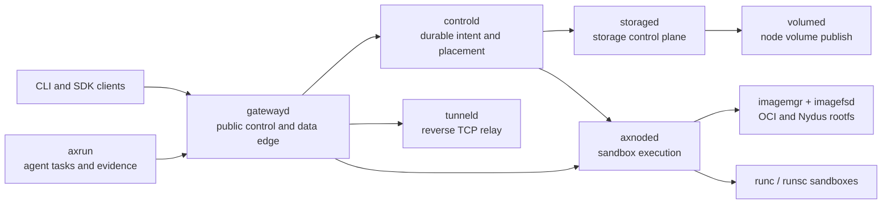

# Axern

[](https://github.com/cofy-x/axern/actions/workflows/ci.yml)
[](https://github.com/cofy-x/axern/actions/workflows/axrun-ci.yml)
[](./LICENSE)

[Documentation](https://axern.cofy-x.space) · [Quickstart](https://axern.cofy-x.space/getting-started/compose/) · [SDKs](https://axern.cofy-x.space/sdk/)

Axern is an open-source sandbox platform for AI agents. It isolates untrusted
agent-generated code with runsc and runs trusted long-lived services with runc
through one resource and lifecycle model.

The CLI and Go, Python, and TypeScript SDKs expose the same public APIs for
environments, processes, files, services, storage, tunnels, lifecycle state,
and task evidence. The control plane, gateway, node runtime, and agent harness
share identity, lease, cleanup, and observability contracts.

> **Project status:** Axern is pre-1.0 and under active development. It is
> suitable for evaluation and contribution, but operators should review the
> security and production boundaries before deploying multi-tenant workloads.

## What You Can Build

- **Agent Sandbox:** execute agent-generated code behind a runsc isolation
  boundary while retaining process, file, terminal, and output APIs.
- **Durable Service:** run trusted, performance-sensitive processes with runc
  while the control plane owns replicas, health, storage, and rollouts.
- **Reproducible agent execution:** use Axrun to coordinate immutable tasks,
  verification, trajectories, usage, and typed artifacts.

## Local Quickstart

The supported local path runs the complete stack with Docker Compose. It needs
Docker with Compose v2, GNU Make, curl, OpenSSL, and SSH tooling. Linux is the
primary runtime platform; Docker Desktop provides the supported macOS path.

```bash
git clone https://github.com/cofy-x/axern.git
cd axern
make quickstart
```

The command downloads the versioned CLI and multi-architecture images, starts
PostgreSQL, MinIO, the control and node services, waits for readiness, and runs
a smoke through the public gateway. It does not require a local Go, Rust,
Python, or Node.js toolchain.

Use the generated local CLI context:

```bash
AXERN_CLI=deploy/local/state/releases/v$(cat VERSION)/axern
"${AXERN_CLI}" context current
"${AXERN_CLI}" run create \
  --image-ref docker.io/library/python:3.12-slim \
  --runtime-class runsc \
  --argv python \
  --argv -c \
  --argv 'print("hello from Axern")' \
  --wait
```

Inspect or remove the environment:

```bash
make local-compose-status
make local-compose-purge
```

The local environment uses generated development credentials and loopback
listeners. Do not reuse them in a shared or production deployment.

Source development remains a first-class, separate path. It builds the current
checkout into local `:dev` images and exercises the same Compose contract:

```bash
make quickstart-source
```

For local Helm development, build the images with `make local-images-build`
and pass
[`values-local-development.yaml`](./deploy/helm/axern/values-local-development.yaml)
to the chart. Provider and regional values stay outside this repository.

## Why Axern

- **Sandbox as the primitive:** runs, services, functions, coding workspaces,
  and agent tasks compose the same execution and lifecycle APIs.
- **Durable control plane:** PostgreSQL-backed intent, placement, leases,
  retries, health, cleanup, and storage state remain authoritative across
  process or node restarts.
- **Runtime choice behind one model:** runc and runsc workloads use the same
  public APIs; OCI and Nydus image paths converge at the node runtime. The
  resource model remains independent of a single sandbox backend.
- **Real data-plane access:** process streams, files, archives, HTTP services,
  SSH-compatible terminals, and reverse TCP tunnels are explicit capabilities.
- **Agent execution with evidence:** Axrun runs external agent bundles, verifies
  results, records trajectories and usage, and preserves typed artifacts.
- **Local-to-cluster continuity:** Docker Compose, kind, and the cloud-neutral
  Helm chart exercise the same service boundaries.

## Architecture



`controld` is the authority for product state. `gatewayd` resolves and forwards
public traffic without owning placement. Node services own host-local runtime,
image, network, and volume operations. See the
[runtime architecture](./docs/architecture/runtime-architecture.md) and
[resource model](./docs/architecture/resource-model.md) for the detailed
contracts.

## Kubernetes Install

Axern publishes its cloud-neutral chart as an OCI artifact and the CLI as
checksummed release archives. Install the chart into the current Kubernetes
context:

```bash
helm install axern oci://ghcr.io/cofy-x/charts/axern \
  --version "$(cat VERSION)" \
  --namespace axern-system \
  --create-namespace \
  --wait \
  --timeout 15m
```

After installing the CLI archive for your operating system, keep the gateway
port-forward open and import the chart-generated mTLS identity:

```bash
kubectl --namespace axern-system port-forward svc/gatewayd \
  25100:25000 25101:25080 25122:25022

axern context import-kubernetes local \
  --namespace axern-system \
  --current
axern catalog list
```

The bundled PostgreSQL and single-node defaults are intended for evaluation.
Durable or shared deployments must provide persistent storage, externalized
secrets, ingress, and scheduling values described by the Helm chart.

## Components

| Component | Responsibility |
| --- | --- |
| `controld` | Durable control-plane state, placement, leases, lifecycle, rollout, and reconciliation |
| `storaged` | Storage classes, claims, bindings, and topology-aware resolution |
| `gatewayd` | Public gRPC, HTTP, SSH, terminal, tunnel, service, and sandbox data edge |
| `axnoded` | Node-local sandbox lifecycle, execution, files, process streams, and cleanup |
| `volumed` | Node-local volume publish, unpublish, and reconciliation |
| `imagemgr` / `imagefsd` | OCI and Nydus image resolution, mount lifecycle, and read-only data plane |
| `tunneld` | Internal reverse TCP relay and sandbox-local tunnel binding |
| `axern` | Product CLI for platform resources and access |
| `axrun` | Agent task harness, rollout worker, verifier, trajectory, usage, and evidence capture |

Public clients are available in Go, Python, and TypeScript under [`sdk/`](./sdk/README.md).
Shared wire contracts are defined in [`sdk/proto`](./sdk/proto/README.md).

## Development

Bootstrap and verify all language workspaces:

```bash
make bootstrap
make build
make test
make lint
make proto-generated-check
make agent-doc-check
make open-source-check
```

Use `make help` for the complete command surface. Module ownership and focused
validation live in the [module guide](./.x/module-guide.md). Automated coding
agents and contributors should begin with the [agent contract](./AGENTS.md) and
the nearest module-local contract.

## Deployment

- [Docker Compose and kind](./deploy/local/README.md) are the repository-owned
  local truth environments.
- The [Axern Helm chart](./deploy/helm/axern/README.md) is cloud-neutral and
  accepts operator-owned image registries, certificates, storage classes, and
  secrets.
- Provider account setup, cluster creation, credentials, and regional release
  automation intentionally live outside this repository.

Axern does not claim that a default local or example deployment is safe for an
untrusted multi-tenant environment. Review authentication, TLS, network policy,
runtime isolation, image trust, secret storage, resource limits, and persistent
storage before production use. Report vulnerabilities according to
[SECURITY.md](./SECURITY.md).

## Documentation

- [Official documentation](https://axern.cofy-x.space)
- [Long-term product direction](./docs/product/product-direction.md)
- [Runtime architecture](./docs/architecture/runtime-architecture.md)
- [Storage architecture](./docs/architecture/storage-architecture.md)
- [Durable rollout control plane](./docs/architecture/durable-rollout-control-plane.md)
- [Local verification](./docs/verification/local-full-verification.md)
- [Documentation index](./docs/README.md)

## Contributing

Contributions are welcome. Read [CONTRIBUTING.md](./CONTRIBUTING.md), follow the
[Code of Conduct](./CODE_OF_CONDUCT.md), and sign every commit under the
[Developer Certificate of Origin](./DCO). Project decisions follow the
[governance model](./GOVERNANCE.md).

## License

Copyright 2026 Chen Yingwei.

Licensed under the [Apache License, Version 2.0](./LICENSE).
