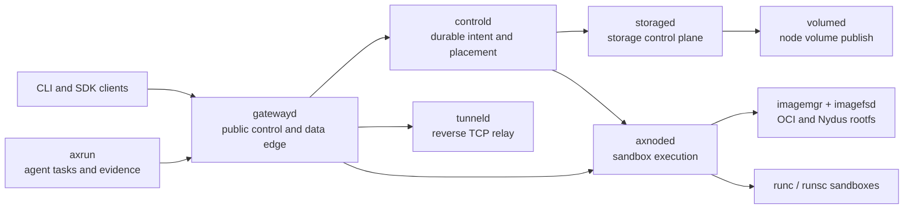

# Axern

[](https://github.com/cofy-x/axern/actions/workflows/ci.yml)
[](https://github.com/cofy-x/axern/actions/workflows/axrun-ci.yml)
[](./LICENSE)

Axern is an open-source programmable execution platform for AI agents, coding
workloads, and isolated remote sandboxes. It provides one resource model for
creating environments, executing processes, exposing services, attaching
storage, opening reverse tunnels, observing lifecycle state, and retaining
task evidence.

Axern is designed for teams that need more than a code-execution RPC: the
control plane, node runtime, gateway, image path, SDKs, and agent harness share
the same identity, lease, cleanup, and observability contracts.

> **Project status:** Axern is pre-1.0 and under active development. It is
> suitable for evaluation and contribution, but operators should review the
> security and production boundaries before deploying multi-tenant workloads.

## Why Axern

- **Sandbox as the primitive:** runs, services, functions, coding workspaces,
  and agent tasks compose the same execution and lifecycle APIs.
- **Durable control plane:** PostgreSQL-backed intent, placement, leases,
  retries, health, cleanup, and storage state remain authoritative across
  process or node restarts.
- **Runtime choice behind one model:** runc and runsc workloads use the same
  public APIs; OCI and Nydus image paths converge at the node runtime.
- **Real data-plane access:** process streams, files, archives, HTTP services,
  SSH-compatible terminals, and reverse TCP tunnels are explicit capabilities.
- **Agent execution with evidence:** Axrun runs external agent bundles, verifies
  results, records trajectories and usage, and preserves typed artifacts.
- **Local-to-cluster continuity:** Docker Compose, kind, and the cloud-neutral
  Helm chart exercise the same service boundaries.

## Architecture



`controld` is the authority for product state. `gatewayd` resolves and forwards
public traffic without owning placement. Node services own host-local runtime,
image, network, and volume operations. See the
[runtime architecture](./docs/architecture/runtime-architecture.md) and
[resource model](./docs/architecture/resource-model.md) for the detailed
contracts.

## Local Quickstart

The supported local path runs the complete stack with Docker Compose. It needs
Docker with Compose v2, GNU Make, curl, OpenSSL, SSH tooling, and Go 1.25.12.
Linux is the primary runtime platform; Docker Desktop provides the supported
macOS development path.

```bash
git clone https://github.com/cofy-x/axern.git
cd axern
make quickstart
```

The command builds the local images, starts PostgreSQL, MinIO, the control and
node services, waits for readiness, and runs a service smoke through the public
gateway. Cold image builds can take longer than ten minutes; subsequent runs
reuse the local cache.

Use the generated local CLI context:

```bash
make axern-cli-build
bin/axern context current
bin/axern catalog list
bin/axern run create \
  --template-id python311 \
  --runtime-class runsc \
  --argv python \
  --argv -c \
  --argv 'print("hello from Axern")'
```

Inspect or remove the environment:

```bash
make local-compose-status
make local-compose-purge
```

The local environment uses generated development credentials and loopback
listeners. Do not reuse them in a shared or production deployment.

## Components

| Component | Responsibility |
| --- | --- |
| `controld` | Durable control-plane state, placement, leases, lifecycle, rollout, and reconciliation |
| `storaged` | Storage classes, claims, bindings, and topology-aware resolution |
| `gatewayd` | Public gRPC, HTTP, SSH, terminal, tunnel, service, and sandbox data edge |
| `axnoded` | Node-local sandbox lifecycle, execution, files, process streams, and cleanup |
| `volumed` | Node-local volume publish, unpublish, and reconciliation |
| `imagemgr` / `imagefsd` | OCI and Nydus image resolution, mount lifecycle, and read-only data plane |
| `tunneld` | Internal reverse TCP relay and sandbox-local tunnel binding |
| `axern` | Product CLI for platform resources and access |
| `axrun` | Agent task harness, rollout worker, verifier, trajectory, usage, and evidence capture |

Public clients are available in Go, Python, and TypeScript under [`sdk/`](./sdk/README.md).
Shared wire contracts are defined in [`sdk/proto`](./sdk/proto/README.md).

## Development

Bootstrap and verify all language workspaces:

```bash
make bootstrap
make build
make test
make lint
make proto-generated-check
make agent-doc-check
make open-source-check
```

Use `make help` for the complete command surface. Module ownership and focused
validation live in the [module guide](./.x/module-guide.md). Automated coding
agents and contributors should begin with the [agent contract](./AGENTS.md) and
the nearest module-local contract.

## Deployment

- [Docker Compose and kind](./deploy/local/README.md) are the repository-owned
  local truth environments.
- The [Axern Helm chart](./deploy/helm/axern/README.md) is cloud-neutral and
  accepts operator-owned image registries, certificates, storage classes, and
  secrets.
- Provider account setup, cluster creation, credentials, and regional release
  automation intentionally live outside this repository.

Axern does not claim that a default local or example deployment is safe for an
untrusted multi-tenant environment. Review authentication, TLS, network policy,
runtime isolation, image trust, secret storage, resource limits, and persistent
storage before production use. Report vulnerabilities according to
[SECURITY.md](./SECURITY.md).

## Documentation

- [Long-term product direction](./docs/product/product-direction.md)
- [Runtime architecture](./docs/architecture/runtime-architecture.md)
- [Storage architecture](./docs/architecture/storage-architecture.md)
- [Durable rollout control plane](./docs/architecture/durable-rollout-control-plane.md)
- [Local verification](./docs/verification/local-full-verification.md)
- [Documentation index](./docs/README.md)

## Contributing

Contributions are welcome. Read [CONTRIBUTING.md](./CONTRIBUTING.md), follow the
[Code of Conduct](./CODE_OF_CONDUCT.md), and sign every commit under the
[Developer Certificate of Origin](./DCO). Project decisions follow the
[governance model](./GOVERNANCE.md).

## License

Copyright 2026 Chen Yingwei.

Licensed under the [Apache License, Version 2.0](./LICENSE).
