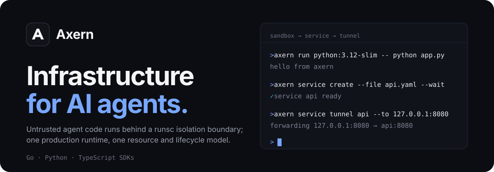
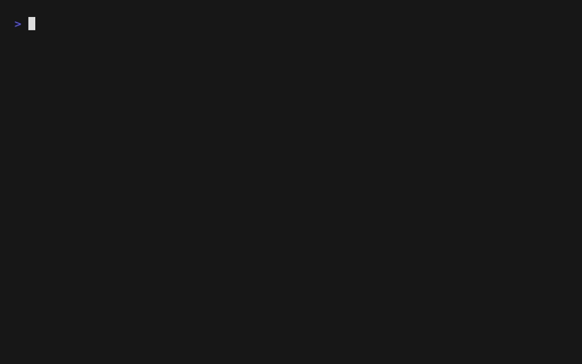
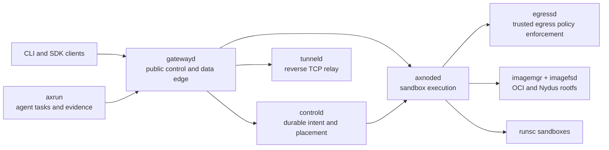

<p align="center">
  
</p>

<p align="center">
  <a href="https://github.com/cofy-x/axern/actions/workflows/ci.yml"></a>
  <a href="https://github.com/cofy-x/axern/actions/workflows/axrun-ci.yml"></a>
  <a href="./LICENSE"></a>
</p>

<p align="center">
  <a href="https://axern.cofy-x.space">Documentation</a> ·
  <a href="https://axern.cofy-x.space/getting-started/">Quickstart</a> ·
  <a href="https://axern.cofy-x.space/sdk/">SDKs</a> ·
  <a href="./README.zh-CN.md">简体中文</a>
</p>

Axern is an open-source environment execution platform for agent evaluation, training, and data synthesis. It isolates agent-generated code with gVisor (`runsc`) through one resource and lifecycle model. Runsc is the supported execution runtime, with no runtime fallback. The CLI and the Go, Python, and TypeScript SDKs expose the same public APIs for Environments, Runs, sandbox processes and files, Tunnels, lifecycle state, and allocation-scoped access.

> **Project status:** Axern is pre-1.0 and under active development. It is suitable for evaluation and contribution, but operators should review the security and production boundaries before deploying multi-tenant workloads.

<p align="center">
  
</p>

## Quickstart

The supported local path runs the complete stack with Docker Compose. It needs only the `axern` CLI and Docker Compose v2 — no source checkout, Make, Helm, or language toolchains.

```bash
brew install cofy-x/tap/axern
```

Without Homebrew, use the standalone checksummed installer:

```bash
curl -fsSL https://raw.githubusercontent.com/cofy-x/axern/main/install.sh | sh
```

Then start Axern and run the first workload:

```bash
axern local up
axern local image load python:3.12-slim --pull
axern run python:3.12-slim -- python -c 'print("hello from axern")'
```

`local up` starts PostgreSQL and the Axern control, tunnel, node, and gateway components, waits for readiness, and creates the `local` context. `local image load` streams the selected host Docker image into that local node without a temporary archive:

```bash
axern context current
axern run list
axern local status
axern local down
```

The local environment uses generated development credentials and loopback listeners. Do not reuse them in a shared or production deployment.

Source development is a separate contributor path. It builds the current checkout into local `:dev` images and exercises the same public contract:

```bash
make quickstart-source
```

For repository development, `make verify-changed` is the normal fast feedback entrypoint. Linux correctness, full regression, and release qualification are separate tiers. Every `main` commit receives an unattended, commit-bound full regression without delaying pull-request feedback; see the [verification tiers](./docs/verification/local-full-verification.md).

## What You Can Build

- **Agent sandboxes:** execute agent-generated code behind a runsc isolation boundary while retaining process, file, terminal, and output APIs.
- **Evaluation and synthesis batches:** execute isolated work concurrently through Runs, with explicit inputs, outputs, and lifecycle evidence.
- **Reproducible agent execution:** use Axrun to coordinate immutable tasks, verification, trajectories, usage, and typed artifacts.

## Why Axern

- **Sandbox as the primitive:** evaluation, training, data synthesis, coding workspaces, and agent tasks compose the same Run execution model.
- **Durable control plane:** PostgreSQL-backed intent, placement, leases, allocation-scoped status, health, and cleanup state remain authoritative across process or node restarts.
- **One production runtime:** runsc workloads use the same public APIs; OCI and Nydus image paths converge at the node runtime.
- **Real data-plane access:** process streams, files, archives, SSH-compatible terminals, and reverse TCP tunnels are explicit allocation capabilities.
- **Local-to-cluster continuity:** Docker Compose, kind, and the cloud-neutral Helm chart exercise the same component boundaries.

## Architecture



`gatewayd` is the unified external gateway for public control and Allocation-scoped data-plane traffic; `controld` and PostgreSQL remain authoritative for product state, while node services own host-local execution, images, networking, and Allocation-local writable storage. Sandbox files are not reusable persistent volumes, so callers export required outputs before cleanup. See the [runtime architecture](./docs/architecture/runtime-architecture.md) and [resource model](./docs/architecture/resource-model.md) for the detailed contracts.

Public clients are available in Go, Python, and TypeScript under [`sdk/`](./sdk/README.md). Shared wire contracts are defined in [`sdk/proto`](./sdk/proto/README.md).

## Kubernetes Install

Follow the [Kubernetes installation guide](./apps/docs/src/content/docs/getting-started/kubernetes.md) to provision signing material, supply qualified node memory reserves, bind explicit Node identities, install the control plane, and admit nodes before waiting for runtime readiness. SSH is optional and uses Principal Credentials. Do not skip the identity and admission steps by running a bare Helm install.

This branch contains coordinated breaking changes beyond the published release; review the [unreleased upgrade boundary](./docs/releases/unreleased.md) before selecting matching chart, image, CLI, and SDK builds.

## Deployment

- [Docker Compose and kind](./deploy/local/README.md) are the repository-owned local truth environments.
- The [Axern Helm chart](./deploy/helm/axern/README.md) is cloud-neutral and accepts operator-owned image registries, certificates, storage classes, and secrets.
- Provider account setup, cluster creation, credentials, and regional release automation intentionally live outside this repository.

Axern does not claim that a default local or example deployment is safe for an untrusted multi-tenant environment. Review authentication, TLS, network policy, runtime isolation, image trust, secret storage, resource limits, and persistent storage before production use. Report vulnerabilities according to [SECURITY.md](./SECURITY.md).

## Contributing

Contributions are welcome. Read [CONTRIBUTING.md](./CONTRIBUTING.md), follow the [Code of Conduct](./CODE_OF_CONDUCT.md), and sign every commit under the [Developer Certificate of Origin](./DCO). Project decisions follow the [governance model](./GOVERNANCE.md).

## License

Copyright 2026 cofy-x.

Licensed under the [Apache License, Version 2.0](./LICENSE).
