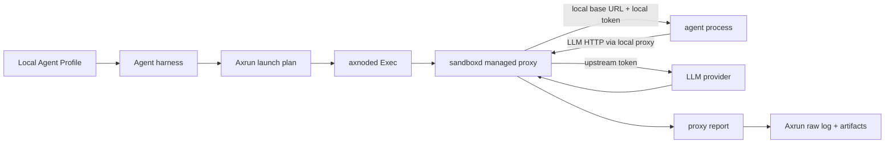

# Axrun Managed Proxy

Profile-backed agents use sandboxd managed proxy for LLM telemetry. Axrun reads
the selected local profile, passes a managed-proxy specification through the
public Axern SDK, and imports the bounded proxy report after the agent command
exits.

Axern tunnel sessions are not part of this path. Tunnels are for generic
sandbox networking; managed proxy is the Axrun path for provider credentials,
LLM lifecycle telemetry, usage accounting, and raw telemetry import.

## Flow

The agent process receives only sandbox-local proxy settings. The upstream
provider token stays inside sandboxd's managed proxy session.

## Responsibilities

- Agent harnesses write runtime config that points their CLI at the
  sandbox-local proxy.
- Axrun owns local profile resolution, launch metadata, proxy report import,
  artifact shaping, usage/cost finalization, and trajectory summaries.
- Sandboxd owns proxy lifecycle, local auth, upstream auth injection, bounded
  request/response capture, incremental SSE usage extraction, and report
  export. The unary process result contains aggregate usage and bounded
  lifecycle metadata only; response bodies and per-chunk events never cross
  the sandboxd gRPC boundary. Capture or transport truncation is emitted as a
  typed `llm.telemetry_truncated` raw event with dropped counts, so evidence
  loss is explicit while usage/cost remains available.

Managed proxy supports OpenAI-compatible and Anthropic HTTP API families.
Codex profile runs require an upstream compatible with Codex's configured wire
API; Axrun does not translate Chat Completions into Responses.

Provider probing is a client-side preflight concern. Controld never stores the
profile or becomes the provider HTTP client.
