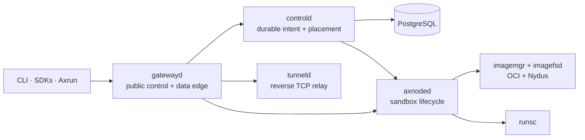

Axern separates durable product intent from node-local execution. Public clients address `gatewayd`; `controld` remains the authority for placement, lifecycle, leases, health, and resource state. Runtime services own the host operations needed to turn that intent into an isolated workload.

## Stable ownership

- **Gateway:** authenticates public clients and forwards control, process, file, terminal, artifact, and tunnel traffic.
- **Control plane:** persists resources and coordinates placement, leases, health, attempt-fenced status, and cleanup.
- **Node runtime:** owns sandbox processes, filesystems, images, networking (an eBPF NAT dataplane with an explicit iptables rollback; see [Node Networking](/architecture/networking/)), probes, and node-local reconciliation.
- **SDKs and Axrun:** compose public APIs without depending on node-private or database internals.

This page intentionally stays conceptual. The repository's [runtime architecture](https://github.com/cofy-x/axern/blob/main/docs/architecture/runtime-architecture.md), [resource model](https://github.com/cofy-x/axern/blob/main/docs/architecture/resource-model.md), and [workload lifecycle](https://github.com/cofy-x/axern/blob/main/docs/architecture/workload-lifecycle-sequence.md) are the engineering sources of truth.
