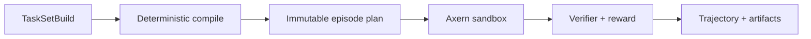

Axrun is Axern's reference agent harness, task compiler, verifier, and
trajectory exporter. It stays above the sandbox platform and consumes only the
public Axern SDK. Provider accounts, evaluation queues, and training workflows
remain client-side concerns rather than Axern control-plane resources.




## Build and inspect a TaskSet

```bash
axrun task init --output-dir tasks/demo
axrun task build --file tasks/demo/taskset.yaml --output .axrun/tasksets/demo
axrun task inspect .axrun/tasksets/demo
```

TaskSets can run through Axrun's local backend or through the Axern backend.
Published inputs should use immutable `repository@sha256:...` references so
the same environment and task selection can be rebuilt later.

The [local workflow guide](/axrun/local-workflows/) covers validation and
training-data exports. The [complete usage contract](https://github.com/cofy-x/axern/blob/main/apps/axrun/docs/usage.md)
documents the CLI and native run-directory model.
