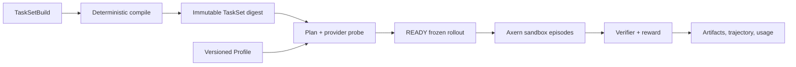

Axrun is Axern's native agent harness, task compiler, rollout client, verifier,
and trajectory exporter. It stays above the sandbox platform and consumes only
public Axern APIs.



## Build and inspect a TaskSet

```bash
axrun task init --output-dir tasks/demo
axrun task build --file tasks/demo/taskset.yaml --output .axrun/tasksets/demo
axrun task inspect .axrun/tasksets/demo
```

Local bundles support compiler development. Managed Rollouts require an
immutable `repository@sha256:...` reference.

## Configure a managed profile

Pass credentials on stdin so they do not enter shell history, YAML, or generic
Secret APIs:

```bash
axrun profile create production \
  --agent codex \
  --provider openai \
  --wire-api responses \
  --base-url https://api.openai.com/v1 \
  --max-concurrency 16 \
  --token-stdin

axrun profile doctor production --model <model>
```

## Plan, start, and inspect

```bash
axrun rollout plan --file rollout.yaml
axrun rollout start <ready-rollout-id>
axrun rollout watch <rollout-id> --until terminal
axrun rollout artifact list <rollout-id>
axrun rollout artifact download-all <rollout-id> --output-dir evidence
```

Planning freezes task selection, payloads, agent image, Profile version, hidden
credential version, and model contract. Managed artifact bytes return through
gatewayd's mTLS streaming API; Axrun never receives object-store credentials.


Read the [complete Axrun usage contract](https://github.com/cofy-x/axern/blob/main/apps/axrun/docs/usage.md)
for exit codes, streaming JSON, cancellation, retry, and worker behavior.
