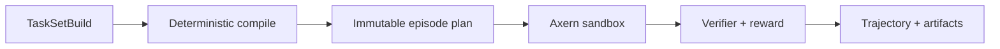

Axrun is moving to an independent thin-layer project above Axern. It consumes only released public SDKs and owns agent policy, task compilation, CandidateBundle and verifier schemas, trajectories, scoring, and durable publication. The in-repository implementation is frozen and is not the source of new public Axern contracts.




## Build and inspect a TaskSet

```bash
axrun task init --output-dir tasks/demo
axrun task build --file tasks/demo/taskset.yaml --output .axrun/tasksets/demo
axrun task inspect .axrun/tasksets/demo
```

External runners create a new inference Run/Allocation, download its sealed declared output, then create a fresh verification Run/Allocation. Published inputs should use immutable `repository@sha256:...` references so the same environment and task selection can be rebuilt later.

The [local workflow guide](/axrun/local-workflows/) covers validation and training-data exports. The [complete usage contract](https://github.com/cofy-x/axern/blob/main/apps/axrun/docs/usage.md) documents the CLI and native run-directory model.
