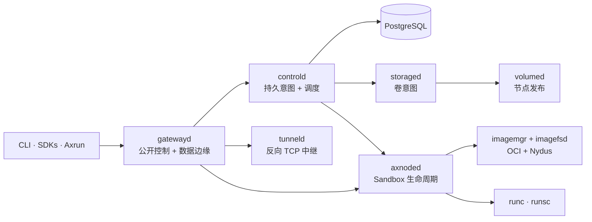

Axern 把持久的产品意图与节点本地执行分离。公开客户端访问 `gatewayd`；`controld` 是调度、生命周期、租约、健康和资源状态的权威。运行时服务负责把意图变成隔离工作负载所需的主机操作。

## 稳定的职责划分

- **Gateway：** 认证公开客户端，转发控制、进程、文件、Service、终端、Artifact 和隧道流量。
- **控制面：** 持久化资源，协调调度、租约、重试、健康、清理、滚动更新和存储意图。
- **节点运行时：** 掌管 Sandbox 进程、文件系统、镜像、网络、卷、探针和节点本地的 reconcile。
- **SDK 和 Axrun：** 组合公开 API，不依赖节点私有接口或数据库内部。

本页刻意保持概念层。仓库的 [运行时架构](https://github.com/cofy-x/axern/blob/main/docs/architecture/runtime-architecture.md)、[资源模型](https://github.com/cofy-x/axern/blob/main/docs/architecture/resource-model.md)和 [工作负载生命周期](https://github.com/cofy-x/axern/blob/main/docs/architecture/workload-lifecycle-sequence.md) 是工程层面的权威来源。
