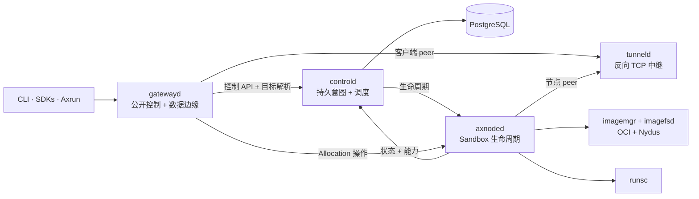

Axern 把持久的产品意图与节点本地执行分离。公开客户端访问 `gatewayd`，它是公共控制流量和 Allocation 范围数据面流量的统一外部网关。`controld` 是调度、生命周期、租约、健康和资源状态的权威。运行时服务负责把意图变成隔离工作负载所需的主机操作；内部生命周期和状态流量不经过 `gatewayd`。

## 稳定的职责划分

- **Gateway：** 认证公开客户端，转发控制、进程、文件、归档、终端、SSH 和 Tunnel 流量，但不拥有持久状态。
- **控制面：** 持久化资源，协调调度、租约、健康、Allocation 级状态和清理。
- **节点运行时：** 掌管 Sandbox 进程、文件系统、镜像、网络（eBPF NAT 数据面，可显式回退 iptables，见[节点网络](/zh-cn/architecture/networking/)）、探针和节点本地的 reconcile。
- **SDK：** 在持久的 `Environment -> Run -> Allocation` 链之上提供 Sandbox 易用接口，不创建另一套工作负载模型。
- **Axrun 和更高层系统：** 在执行平台之上管理 agent 任务、验证、轨迹、reward、评测和数据合成工作流。

本页刻意保持概念层。仓库的 [运行时架构](https://github.com/cofy-x/axern/blob/main/docs/architecture/runtime-architecture.md)、[资源模型](https://github.com/cofy-x/axern/blob/main/docs/architecture/resource-model.md)和 [工作负载生命周期](https://github.com/cofy-x/axern/blob/main/docs/architecture/workload-lifecycle-sequence.md) 是工程层面的权威来源。
