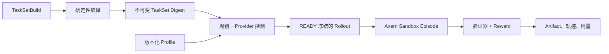

Axrun 是 Axern 原生的 Agent Harness、任务编译器、Rollout 客户端、验证器和轨迹导出器。它位于 Sandbox 平台之上，只消费公开的 Axern API。


## 开始前

托管 Rollout 需要：

- 一个运行中的 Axern 控制面，以及一个在目标命名空间有工作负载创建权限的活跃 CLI Context；
- 与 Axern Gateway 同一 Release 的 `axrun` 二进制；
- 发布为不可变 `repository@sha256:...` 引用的 TaskSet 仓库，且 Rollout Worker 能拉取它；
- 版本化的 Provider Profile 和 Rollout 所需的命名空间策略。

本地 TaskSet Bundle 适合编译器开发，但它不是托管 Rollout 的产物，不能替代仓库发布。



## 构建和检查 TaskSet

```bash
axrun task init --output-dir tasks/demo
axrun task build --file tasks/demo/taskset.yaml --output .axrun/tasksets/demo
axrun task inspect .axrun/tasksets/demo
```

本地 Bundle 支持编译器开发。托管 Rollout 要求通过配置的产物路径发布为不可变的 `repository@sha256:...` 引用。

## 配置托管 Profile

凭据走 stdin，避免进入 argv、YAML 或通用 Secret API。从已有环境变量或受保护的输入源读取，而不是把值写进命令历史：

```bash
axrun profile create production \
  --agent codex \
  --provider openai \
  --wire-api responses \
  --base-url https://api.openai.com/v1 \
  --max-concurrency 16 \
  --token-stdin

axrun profile doctor production --model <model>
```

## 规划、启动和查看

```bash
axrun rollout plan --file rollout.yaml
axrun rollout start <ready-rollout-id>
axrun rollout watch <rollout-id> --until terminal
axrun rollout artifact list <rollout-id>
axrun rollout artifact download-all <rollout-id> --output-dir evidence
```

规划会冻结任务选择、Payload、Agent 镜像、Profile 版本、隐藏凭据版本和模型契约。托管 Artifact 字节通过 gatewayd 的 mTLS 流式 API 返回；Axrun 从不接触对象存储凭据。

退出码、流式 JSON、取消、重试和 Worker 行为见 [完整的 Axrun 使用约定](https://github.com/cofy-x/axern/blob/main/apps/axrun/docs/usage.md)。
