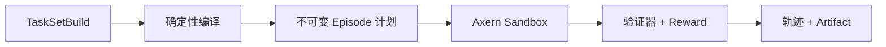

Axrun 是 Axern 的参考 Agent Harness、任务编译器、验证器和轨迹导出器。
它位于 Sandbox 平台之上，只使用公开 Axern SDK。Provider 账户、评测队列和
训练工作流属于客户端或上层系统，而不是 Axern 控制面资源。




## 构建和检查 TaskSet

```bash
axrun task init --output-dir tasks/demo
axrun task build --file tasks/demo/taskset.yaml --output .axrun/tasksets/demo
axrun task inspect .axrun/tasksets/demo
```

TaskSet 可以通过 Axrun 本地后端或 Axern 后端执行。发布后的输入应使用不可变
`repository@sha256:...` 引用，以便后续重建同一环境和任务选择。

CLI 与原生运行目录约定见 [完整 Axrun 使用文档](https://github.com/cofy-x/axern/blob/main/apps/axrun/docs/usage.md)。
