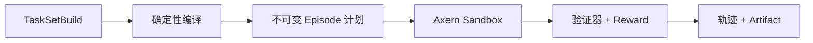

Axrun 将作为 Axern 之上的独立薄层项目演进。它只消费正式发布的公共 SDK，并负责 agent policy、任务编译、CandidateBundle 与 verifier schema、trajectory、评分和持久发布。仓库内现有实现已经冻结，不再作为新 Axern 公共契约的来源。




## 构建和检查 TaskSet

```bash
axrun task init --output-dir tasks/demo
axrun task build --file tasks/demo/taskset.yaml --output .axrun/tasksets/demo
axrun task inspect .axrun/tasksets/demo
```

外部 runner 创建全新的 inference Run/Allocation，下载其封存声明输出，再创建新的 verification Run/Allocation。发布后的输入应使用不可变 `repository@sha256:...` 引用，以便后续重建同一环境和任务选择。

CLI 与原生运行目录约定见 [完整 Axrun 使用文档](https://github.com/cofy-x/axern/blob/main/apps/axrun/docs/usage.md)。
