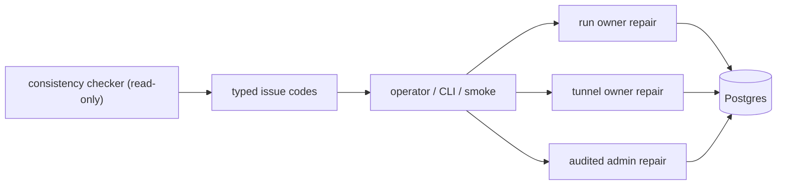
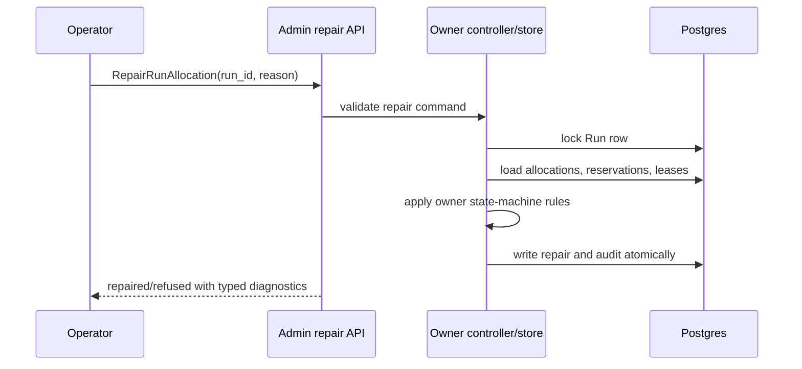

# Consistency Repair Boundaries

This document defines the long-term boundary between consistency diagnostics
and repair writes. The checker is a read model. It finds mismatches across
Runs, Allocations, reservations, leases, tunnel sessions, and lifecycle
retry queue state, but it does not own mutation.

## Principle

Consistency repair must go through the owner that owns the state transition:

- Run controllers repair Run-owned Allocations, reservations, and leases;
- tunnel controllers repair tunnel session lifecycle state;
- audited admin operations repair durable lifecycle retry queue state when an
  operator chooses an explicit action.

The checker can classify and report. It must not silently release
reservations, revoke leases, delete tunnel sessions, or edit Run/Allocation
references.

## Issue Ownership

The admin consistency API attaches a repair plan to every issue as typed
`repair_owner`, `repair_action`, `repair_target_type`, `repair_target_id`, and
`automatic_repair` fields. The first version intentionally reports
`automatic_repair=false` for every issue.

| Issue family | `repair_owner` | `repair_action` | target |
| --- | --- | --- | --- |
| active reservation missing allocation | `admin_operator_triage` | `admin_triage` | `allocation/<allocation_id>` |
| active reservation on ended allocation | `run_controller` | `workload_cleanup` | `run/<owner_id>` or `allocation/<allocation_id>` |
| active reservation allocation mismatch | `run_controller` | `workload_cleanup_and_readmit` | `run/<owner_id>` or `allocation/<allocation_id>` |
| active lease missing allocation | `node_lifecycle` | `node_lifecycle_reconcile` | `allocation/<allocation_id>` |
| active lease on ended allocation | `node_lifecycle` | `node_lifecycle_reconcile` | `allocation/<allocation_id>` |
| active lease allocation node mismatch | `node_lifecycle` | `node_lifecycle_reconcile` | `allocation/<allocation_id>` |
| active tunnel missing allocation | `tunnel_controller` | `tunnel_lifecycle_reconcile` | `tunnel_session/<session_id>` or `allocation/<allocation_id>` |
| active tunnel on ended allocation | `tunnel_controller` | `tunnel_lifecycle_reconcile` | `tunnel_session/<session_id>` or `allocation/<allocation_id>` |
| active tunnel allocation node mismatch | `tunnel_controller` | `tunnel_lifecycle_reconcile` | `tunnel_session/<session_id>` or `allocation/<allocation_id>` |

The first implementation keeps every issue as manual or owner-reconciled. That
is intentional: the same physical row may be part of an in-flight transaction,
a retry, or an operator-visible failure state. A generic checker cannot infer
the correct owner-aware transition without duplicating controller logic.

## Future Auto Repair

Auto repair can be added only as owner-scoped commands, not as checker writes.
For example, a future `RepairRunAllocation` operation may lock the Run, validate
its Allocation, reservation, and lease state, record an audit event, and then
repair those references in one transaction.

An auto repair operation must satisfy all of these rules:

- lock the durable owner row before writing dependent state;
- verify the owner, allocation attempt, node, and terminal state inside the same
  transaction;
- emit an admin audit event when triggered by an operator;
- be idempotent when the reconciler already completed the cleanup;
- leave a typed event or diagnostic when it refuses to repair.

The checker remains the shared read model for detecting drift before and after
the owner-specific repair runs.

## Owner-Scoped Repair API Model

The repair write surface should be owner scoped. Axern should not expose a
generic `RepairConsistencyIssue` RPC because issue codes are diagnostics, not
state-machine commands. Each future repair RPC must name the durable owner or
dependent lifecycle object it will lock.

The intended command families are:

- `RepairRunAllocation`: lock the run row and repair one run-owned allocation,
  reservation, and lease set.
- `RepairTunnelSession`: lock the tunnel session and repair tunnel lifecycle
  state for the selected allocation.
- allocation lifecycle retry admin commands remain under the audited admin
  lifecycle API because the retry queue itself is the owner.

Every repair command must accept an operator reason, write an admin audit event,
and return whether it repaired, refused, or found the state already converged.
Refusals must use typed diagnostics so clients can show the next owner to
inspect without parsing free-form text.
