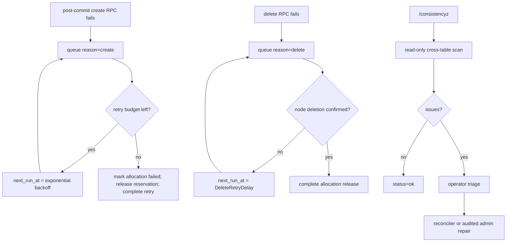

# Node Placement and Leases

`controld` performs placement for runs, services, Function-owned worker
services, and allocation reconciliation. Placement stays separate from
node-internal execution details; realtime exec still goes directly to the
selected node.

## Node Reporter

The `axnoded` node reporter is optional and is configured through:

- `plugin.control_plane_target`
- `plugin.control_plane_node_id`
- `plugin.control_plane_node_target`
- `plugin.control_plane_heartbeat_interval`
- `plugin.control_plane_node_state`
- optional structured `plugin.node_extension_capabilities`
- `plugin.control_plane_node_labels`

When `plugin.control_plane_target` is empty, `axnoded` does not start the
reporter.

## Placement

Placement is evaluated in three stages:

- eligibility evaluation records explicit rejection reasons for stale reports,
  non-ready components, label mismatches, capability mismatches, unsupported
  runtimes, and resource pressure
- locality, warm-path, and current-load rank sort the remaining eligible
  candidates
- if every otherwise-valid node is rejected only for transient health
  conditions such as stale reports or node-local runtime components being
  unavailable, admission may still bind the allocation to one of those nodes
  and rely on the durable allocation lifecycle retry queue to converge

Capability mismatch, missing evidence, invalid identity, and expired evidence
are fail-closed eligibility failures. They never enter the transient-health
fallback.

The selector returns a request-scoped candidate plan rather than a bare node
list. The plan preserves health, capability, locality, warm-path, and initial
load preferences until the Postgres admission transaction reaches its
authoritative node decision.

Durable admission locks candidate node rows in stable node-id order and reruns
the complete eligibility evaluator against the locked row: lifecycle,
heartbeat and summary freshness, runtime, component health, labels, typed
capability observations and evidence, capacity, and slots. A candidate that
changed after the initial plan is skipped and the transaction tries the next
candidate. The selected observation dependencies and exact evidence commit in
the same transaction as the allocation and reservation. Admission also loads
the latest active reservations and refreshes the dynamic load rank. It adds
only reservations not yet reflected in the latest
node `committed` summary, so running allocations are not counted twice while
concurrent `STARTING` allocations still influence placement. Run admission and
service replica admission share this path; service scale-up does not maintain a
second process-local placement ledger. Service allocations are durably admitted
one at a time and their node create RPCs are dispatched concurrently after the
batch is reserved.

Service desired-state writes enqueue the affected service id immediately.
Allocation status batches enqueue only services with follow-up controller work,
such as replacing an ended allocation or advancing an actionable rollout;
ordinary starting and readiness projection does not schedule a no-op sync. The
bounded keyed queue coalesces duplicate events; overflow becomes a single full
sweep. Autoscaling retains the fast periodic cadence, while pending/retry
recovery runs once at process startup and then on a separate 30-second safety
sweep. Recovery is not part of the normal startup latency path. Independent
services run through a bounded worker pool; their allocation creates share a
controller-wide concurrency budget with single-service replica scale. This
preserves parallel fanout without turning status events or fast periodic ticks
into repeated pending-service scans, or multiplying the per-service worker limit
across every pending service.

`CreateRun` creates a run, allocation, and node reservation in the
authoritative store, then calls the node allocation lifecycle API after the
database transaction commits.

Run and service node lifecycle calls are repaired through the durable
`allocation_reconcile_queue` when post-commit create or delete calls fail. That
queue keeps reservation and lease cleanup tied to confirmed node lifecycle
state instead of best-effort RPC success. The queue is allocation-scoped and
owner-neutral; run and service controllers apply their own terminal workload
state after queue convergence.

Capability loss uses a separate `allocation_capability_reconcile_queue`, so a
capability transition cannot overwrite create/delete lifecycle intent. Axnoded
first performs allocation-specific verification and is the only component that
owns fail-stop deletion for capability loss. Controld's durable worker is a
restart and missed-report safety net: it requests reconciliation and polls until
normal lifecycle reporting confirms deletion, but does not race axnoded with a
second delete. `ADMISSION_ONLY` dependencies never enter this runtime queue;
the indexed transition transaction queues only `DEGRADE` and `FAIL_STOP`
dependencies. Provider evidence, catalog loss policy, and the bounded
verification sequence are defined by the canonical
[Observed Capability Providers](../../../docs/architecture/observed-capability-providers.md)
contract rather than duplicated here.

Allocation capability conditions use a separate full-set report with a
monotonic revision fenced by allocation attempt. Controld ignores reports for a
different attempt and stale or duplicate revisions, then atomically projects
accepted exact-key sets from normalized condition rows. The report cannot
mutate allocation lifecycle state, readiness, exit code, Run/Service status, or
the primary message; only normal lifecycle and exit reports own those fields.

## Reconciler Health

The Admin reliability API reports process-local background reconciler health
for each `controld` instance: component, running state, last start, last
success, last error, and consecutive failure count. It is an operator read
model, not durable cluster state. The same snapshot feeds reconcile health
metrics for Prometheus and Grafana.

## Node Lifecycle

Postgres stores node identity independently from heartbeat freshness. Active
nodes participate in placement and fleet health; retired nodes remain as audit
and historical allocation references but cannot register, report, authenticate,
or receive new reservations. Retirement is irreversible and replacement hosts
must use a new node ID.

Inspect and retire nodes through the typed admin workflow:

```bash
axern admin node list --status active
axern admin node retire <node-id> --operator-reason "host permanently removed"
```

Retirement requires a stale heartbeat and fails while the node has active
allocations, reservations, execution leases, tunnel sessions, allocation
lifecycle retries, non-deleted storage bindings, or pending volume reclaims.
The storage health check must be reachable when storaged is configured. A
successful mutation and its audit event commit together.

## Lifecycle Retry Queue

The debug `/allocation-reconcilez` endpoint is intentionally read-only. It
lists queued allocation lifecycle work: owner, reason, attempts, last error,
next retry time, and queue age.

The debug `/consistencyz` endpoint is also read-only. It scans the durable
Postgres state for active reservations, execution leases, tunnel sessions, and
service allocation references that no longer match allocation ownership or
terminal allocation state. It is a diagnostic guardrail for convergence bugs;
it does not mutate state or replace the owner-aware run/service/admin repair
paths.

The product-facing admin read model exposes the same consistency snapshot
through `axern admin consistency check` and folds it with allocation lifecycle
retry counts, active-node fleet health, and reconcile health in `axern admin
reliability check`. Smoke tests use the typed admin gRPC path rather than debug
HTTP.

Lifecycle retry writes are admin operations, not debug HTTP operations. The
queue coordinates node lifecycle convergence with allocation status,
reservations, and lease cleanup, so every write must go through the owning run
or service controller and its state-transition rules.

The typed gRPC admin surface is:

- `ListAllocationLifecycleRetries`: queue rows plus owner, reason, due-only,
  limit filters, `clearable`, and `clear_blocked_reason`.
- `ForceAllocationLifecycleRetry`: lock the row, record an audit event, and
  move `next_run_at` to `now` without changing reason or attempt count.
- `FailAllocationLifecycleRetry`: create retries only; mark the owning run or
  service allocation failed, release the reservation, remove the retry row, and
  record the operator reason.
- `ClearAllocationLifecycleRetry`: stale rows only; require terminal
  allocation state, owner convergence away from the allocation, and no active
  reservations, leases, or tunnel sessions.

All write requests require an explicit human-readable reason, audit before
commit, a transactional row lock, and typed gRPC errors when the requested
action no longer matches allocation state. There is no generic delete operation:
queue rows are convergence intent, and removing one without owner-aware cleanup
can strand reservations or leases.
For operator triage and repair commands, see
[Reconcile Operations](reconcile-operations.md).

## Lifecycle Retry Policy

Create retry is bounded because the allocation has not reached confirmed node
ownership. Delete retry is unbounded because cleanup must continue until the
node confirms deletion or an operator clears a stale, already-clean row.



Timing rules:

- Initial create failure schedules `create` at `now + CreateRetryDelay(1)` and
  increments attempts.
- Queued create failure schedules exponential backoff capped by
  `CreateRetryMaxDelay` and increments attempts until exhaustion.
- Run cancel delete failure schedules an immediate `delete` retry without
  incrementing attempts, preserving cancel responsiveness.
- Service scale-down, rollout drain, service delete, and queued delete failures
  schedule `delete` at `now + DeleteRetryDelay` and increment attempts.

## Resource Admission Policy

The global `-resource-cpu-overcommit-ratio` flag controls only control-plane
CPU request admission. Placement and the Postgres transaction both evaluate the
same effective CPU allocatable value:

```text
floor(node_allocatable_cpu_milli * resource_cpu_overcommit_ratio)
```

Memory does not overcommit. Axnoded reports physical capacity and the resource
source's allocatable value as distinct facts. Raw allocatable is the lesser of
`source_allocatable_bytes` and any finite delegated cgroup-root limit;
`physical_capacity_bytes` is diagnostic identity-bound capacity and is not a
second scheduling pool. Effective allocatable subtracts the explicit system
reserve. Placement and the locked admission transaction use the larger
of database reservations and the latest node-local commitment so terminating
workloads remain charged until cgroup cleanup converges. Requests drive that
reservation; limits remain the sandbox-domain host `memory.max`.

Each active workload reservation also consumes one runtime instance slot. The
transactional capacity comes from the node-owned aggregate `runtime_slots`
report. Placement ranks nodes by active instance occupancy,
including reservations not yet reflected in node summaries, so zero-request
workloads remain balanced without weakening the hard admission boundary.

The debug `/resourcez` endpoint also reports the current global resource
admission policy, including `cpu_overcommit_ratio`.

For services, readiness observations can accompany allocation status while the
replica remains `RUNNING`.

## Inventory Reconciliation

`BatchReportAllocationStatus` closes the control-plane state loop when nodes
report start, readiness, exit, or failure observations. Axnoded coalesces the
latest observation per allocation before sending; controld authenticates the
node once, resolves allocation ownership once, and projects each affected
service once per batch.

`ReportNode` closes the complementary inventory loop. Axnoded summaries carry
both running allocation ids and the broader set of active locally known
allocation ids. `controld` uses the active set to detect allocations that
disappeared from a node without racing legitimate `STARTING` allocations that
have not reached `RUNNING` yet.

The control-plane reconciler also sweeps nodes whose heartbeat is outside the
configured freshness window. Active run and service allocations on an
unavailable node are failed through the same allocation-reporting path used by
inventory reconciliation. That releases reservations and leases, records the
allocation failure, and lets service reconciliation admit replacement replicas
on fresh nodes.

## Execution Leases

Execution lease plaintext tokens are returned only to internal gateway callers
through the control-plane acquire RPC. Public CLI and SDK clients never receive
them. The database stores token hashes, and
`WatchExecutionLeases` replicates only
`ExecutionLease.validation_token_hash` for node cache validation. The watch is
a commit-driven stream. Each response fixes a global revision high-water mark
before reading that node's `(after_revision, current_revision]` lease window;
the client resumes from `current_revision`. This ordering prevents a concurrent
commit from being omitted while its revision is already acknowledged.

The control plane is the authoritative registry for environments, runs,
services, functions, allocations, reservations, and execution leases. Durable
control-plane state is stored in Postgres; in-memory registries are
reconstructed caches, not the source of truth.
