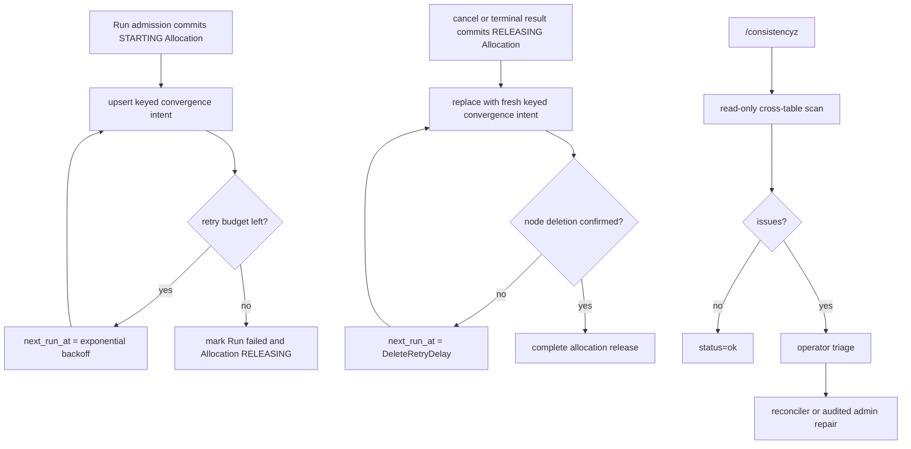

# Node Placement and Leases

`controld` performs placement for Runs and Allocation reconciliation. Placement stays separate from node-internal execution details; realtime exec still goes directly to the selected node.

## Node Reporter

The `axnoded` node reporter is optional and is configured through:

- `plugin.control_plane_target`
- `plugin.control_plane_node_id`
- `plugin.control_plane_node_target`
- `plugin.control_plane_heartbeat_interval`
- `plugin.control_plane_node_state`
- optional structured `plugin.node_extension_capabilities`
- `plugin.control_plane_node_labels`

When `plugin.control_plane_target` is empty, `axnoded` does not start the reporter.

## Placement

Placement is evaluated in three stages:

- eligibility evaluation records explicit rejection reasons for stale reports, non-ready components, label mismatches, capability mismatches, unsupported runtimes, and requests larger than total allocatable capacity
- locality, warm-path, runtime-slot occupancy, and durable Allocation charges deterministically sort the remaining eligible candidates
- if every otherwise-valid node is rejected only for transient health conditions such as stale reports or node-local runtime components being unavailable, admission may still bind the allocation to one of those nodes and rely on the durable allocation lifecycle retry queue to converge

Capability mismatch, missing observation, invalid host evidence, and expired observation are fail-closed eligibility failures. They never enter the transient-health fallback.

The selector returns a request-scoped candidate plan rather than a bare node list. The plan preserves health, capability, locality, warm-path, and initial load preferences until the Postgres admission transaction reaches its authoritative node decision.

Durable admission locks candidate Node rows in stable Node-ID order and reruns the complete eligibility evaluator against the locked row: lifecycle, heartbeat and summary freshness, runtime, component health, labels, typed capability observations, capacity, and slots. A candidate that changed after the initial plan is skipped and the transaction tries the next candidate. Immutable capability requirements, the Node binding, and resource quantities commit on the Allocation; selected observations are not copied into a second admission record. Admission derives CPU, memory, and ephemeral-storage charge exclusively from non-released Allocations. Node-reported actual usage remains diagnostic and never participates in the charge calculation. Run admission is the only workload admission path.

Pending lifecycle recovery runs immediately at process startup and after an in-process commit signal, with a periodic scan as the lost-wakeup safety net. The durable Allocation queue coalesces repeated intent. Workers claim rows with a unique controld owner and a renewable delivery claim; independent Allocations run through a bounded worker pool. The claim is only multi-worker fencing and never authorizes sandbox execution.

`CreateRun` transactionally creates the Run, Allocation with its resource charge, immutable capability requirements, and ensure-present intent. Cancellation and terminal observation transactionally replace that intent with ensure-absent while changing Run and Allocation state and revoking AllocationAccessGrants and TunnelSessions. Public request handlers never call Node Create/Delete directly.

The durable `allocation_reconcile_queue` is the sole dispatcher for Run-owned node lifecycle calls. A claimed worker renews ownership during long operations; completion, retry, and create-to-delete transitions are fenced by that owner. A failed or stale worker therefore cannot acknowledge or rewrite work after another controld instance takes over. The queue is Allocation-scoped; the Run controller applies terminal workload state independently from infrastructure cleanup convergence.

Capability loss is owned entirely by axnoded's Allocation-scoped durable intent. Controld does not maintain a parallel capability queue or issue a competing delete. Provider observation, platform loss policy, and bounded verification are defined by the canonical [Capability Admission and Observation](../../../docs/architecture/observed-capability-providers.md) contract.

Allocation capability conditions use one complete projection timestamped by `observed_at`. Controld ignores reports for unknown, wrongly bound, or terminal Allocations and ignores older projections. Equal-time conflicting data fails closed. The report cannot mutate allocation lifecycle state, exit code, Run status, or the primary message.

## Reconciler Health

The Admin reliability API reports process-local background reconciler health for each `controld` instance: component, running state, last start, last success, last error, and consecutive failure count. It is an operator read model, not durable cluster state. The same snapshot feeds reconcile health metrics for Prometheus and Grafana.

## Node Lifecycle

Postgres stores Node identity independently from heartbeat freshness. Active Nodes participate in placement and fleet health; retired Nodes remain as audit and historical Allocation references but cannot register, report, authenticate, or receive new Allocations. Retirement is irreversible and replacement hosts must use a new Node ID.

Inspect and retire nodes through the typed admin workflow:

```bash
axern admin node list --status active
axern admin node retire <node-id> --operator-reason "host permanently removed"
```

Retirement requires a stale heartbeat and fails while the Node has non-released Allocations, active AllocationAccessGrants, TunnelSessions, or Allocation lifecycle delivery intents. ExecutionLease has no control-plane row: its authority derives from those bound non-terminal Allocations. A successful mutation and its audit event commit together.

## Lifecycle Retry Queue

The debug `/allocation-reconcilez` endpoint is intentionally read-only. It lists queued allocation lifecycle work: Allocation and Run identity, current Allocation lifecycle state, attempts, last error, next retry time, and queue age. The queue does not store an action or reason; the reconciler derives start versus cleanup exclusively from the authoritative Allocation lifecycle state.

The debug `/consistencyz` endpoint is also read-only. It scans durable Postgres state for active AllocationAccessGrants or TunnelSessions attached to ended Allocations and for lifecycle inconsistencies. It does not mutate state or replace owner-scoped repair paths.

The admin read model exposes the same consistency snapshot through `axern admin consistency check` and folds it with allocation lifecycle retry counts, active-node fleet health, and reconcile health in `axern admin reliability check`. Lifecycle retry mutations live in the private operator Proto package; they are deliberately absent from the public product API and public Python/TypeScript SDK surfaces. Smoke tests use the typed operator gRPC path rather than debug HTTP.

Lifecycle retry writes are admin operations, not debug HTTP operations. The queue coordinates Node lifecycle delivery with Allocation state and dependent cleanup, so every write must go through the owning Run controller or an audited admin operation and its state-transition rules.

The typed gRPC admin surface is:

- `ListAllocationLifecycleRetries`: queue rows joined with Allocation and Run state, plus due-only and limit filters, `clearable`, and `clear_blocked_reason`.
- `ForceAllocationLifecycleRetry`: lock the row, record an audit event, and move `next_run_at` to `now` without changing the attempt count or authoritative Allocation state.
- `FailAllocationLifecycleRetry`: startup retries only; mark the owning Run failed and Allocation `RELEASING`, replace create with cleanup intent, and record the operator reason.
- `ClearAllocationLifecycleRetry`: stale rows only; require terminal Run/Allocation convergence and no active access grant or TunnelSession.

All write requests require an explicit human-readable reason, audit before commit, a transactional row lock, and typed gRPC errors when the requested action no longer matches Allocation state. There is no generic delete operation: removing durable cleanup intent can strand a runtime or resource ownership. See [Reconcile Operations](reconcile-operations.md).

## Lifecycle Retry Policy

Create retry is bounded because the allocation has not reached confirmed node ownership. Delete retry is unbounded because cleanup must continue until the node confirms deletion or an operator clears a stale, already-clean row.



Timing rules:

- Initial node-start failure schedules the Allocation intent at `now + CreateRetryDelay(1)` and increments attempts.
- A queued failure while the Allocation is `STARTING` uses exponential backoff capped by `CreateRetryMaxDelay` and increments attempts until exhaustion.
- Run cancellation atomically moves the Allocation to `RELEASING`, replaces any pending startup work with a fresh immediate convergence intent, and resets the startup retry history.
- A queued cleanup failure while the Allocation is `RELEASING` schedules the same keyed intent at `now + DeleteRetryDelay` and increments attempts.

## Resource Admission Policy

The global `-resource-cpu-overcommit-ratio` flag controls only control-plane CPU request admission. Placement and the Postgres transaction both evaluate the same effective CPU allocatable value:

```text
floor(node_allocatable_cpu_milli * resource_cpu_overcommit_ratio)
```

Memory does not overcommit. Axnoded reports physical capacity and the resource source's allocatable value as distinct facts. Raw allocatable is the lesser of `source_allocatable_bytes` and any finite delegated cgroup-root limit. Effective allocatable subtracts the explicit system reserve. The locked admission transaction subtracts non-released Allocation requests from that observation. Requests drive the charge; limits remain the sandbox-domain host `memory.max`. Node-local cgroup commitment is a rebuildable enforcement projection and cleanup diagnostic, not a control-plane charge ledger.

Each non-released Allocation also consumes one runtime instance slot. The transactional capacity comes from the Node-owned aggregate `runtime_slots` report. Occupancy is the conservative union of charged Allocation IDs and node-reported active Allocation IDs, bounded below by the pool's current using count.

The debug `/resourcez` endpoint also reports the current global resource admission policy, including `cpu_overcommit_ratio`.

## Inventory Reconciliation

`BatchReportAllocationLifecycle` closes the control-plane state loop when nodes report start, exit, or failure observations. Axnoded coalesces the latest observation per Allocation before sending; controld authenticates the node once, resolves ownership once, and projects each affected Run once per batch.

`ReportNode` closes the complementary inventory loop. Axnoded summaries carry both running allocation ids and the broader set of active locally known allocation ids. `controld` uses the active set to detect allocations that disappeared from a node without racing legitimate `STARTING` allocations that have not reached `RUNNING` yet.

The control-plane availability reconciler sweeps Nodes whose heartbeat is outside the freshness window. Active Run Allocations on an unavailable Node become terminal through the same authoritative transaction used for accepted terminal observations; this revokes access grants and tunnels and schedules cleanup. The Node independently stops the sandbox when its locally measured ExecutionLease expires.

## Execution Authority And Data-Plane Access

ExecutionLease is finite liveness authority, not a token or database entity. Every successful authenticated `ReportNode` response returns the complete set of non-terminal Allocations bound to that Node with a TTL. Axnoded measures deadlines from its local receipt clock, persists them in the sole Allocation recovery record, and durably records termination intent before stopping an omitted or expired Allocation. Failed heartbeats never extend authority; delayed successful responses cannot arrive out of order because one reporter loop owns heartbeat delivery. The default five-second heartbeat renews a thirty-second lease.

AllocationAccessGrant is separate request-scoped data-plane authority. PostgreSQL stores grant token hashes, expiry, revocation, and delivery revision. `WatchAllocationAccessGrants` replicates hash-only validation material to the bound Node. Public CLI and SDK clients receive neither access tokens nor Node targets. An access grant cannot keep a sandbox alive, and an ExecutionLease cannot authorize process, file, archive, terminal, SSH, or Tunnel traffic.

Run watches use the same principle without inventing a second event log: PostgreSQL notification is only a wake-up edge, while the versioned Run row remains authoritative. A watcher subscribes before reading and reloads the row after every wake, so commits cannot be lost and no fixed-interval database polling is required.

The control plane is authoritative for Environments, Runs, Allocations, AllocationAccessGrants, and TunnelSessions. PostgreSQL owns durable central state; in-memory registries are reconstructed caches. Axnoded's Allocation recovery record is the node-local authority for resources already admitted to that exact Allocation, including the most recently received ExecutionLease deadline.
