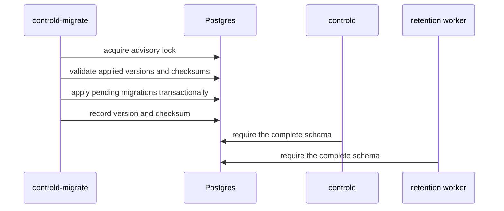
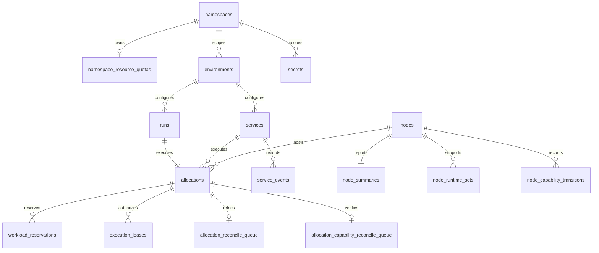
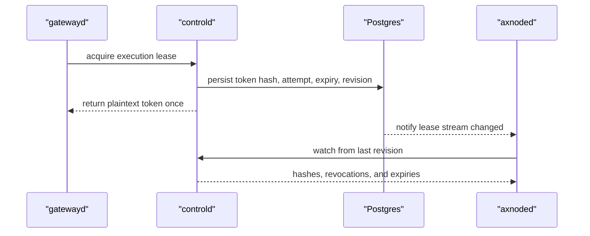
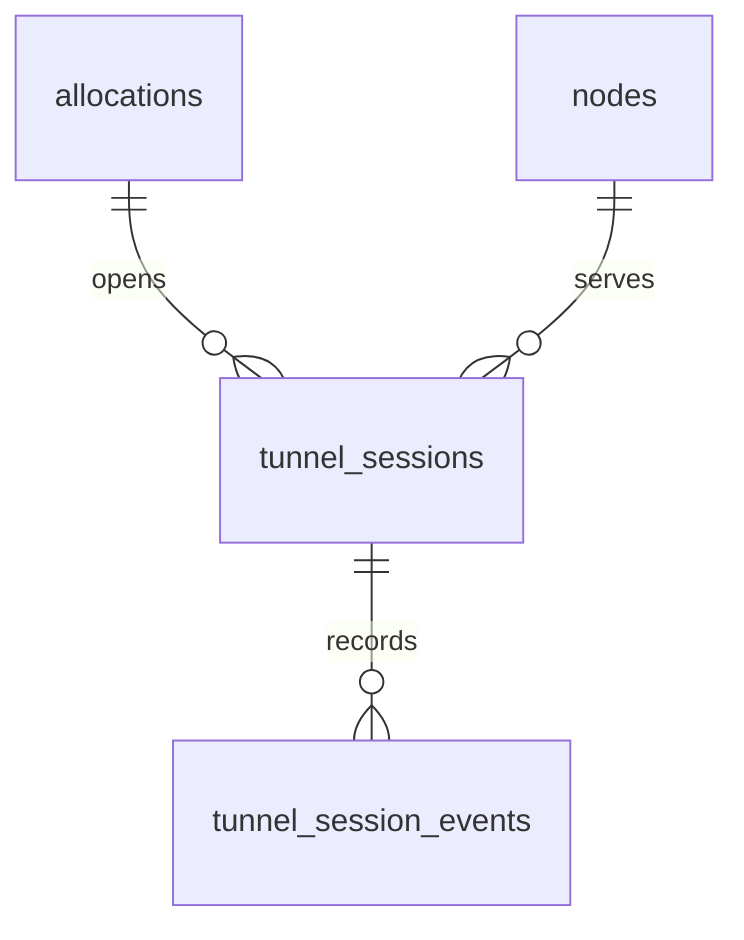
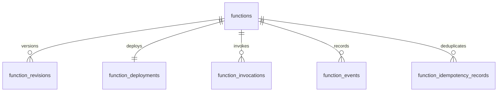
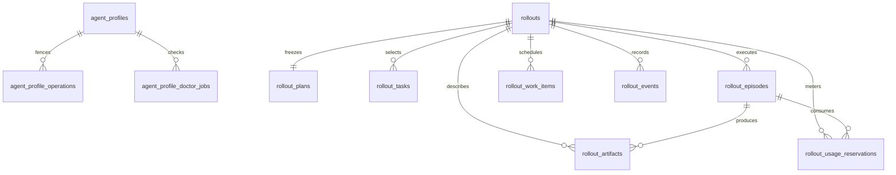

# controld Postgres Schema Design

Postgres is the authoritative store for `controld`. The canonical schema is
defined by `internal/postgres/migrations/*.sql`; application startup validates
the applied versions but never mutates the schema.

## Migration Layout

The schema is split by durable ownership boundary:

| Migration | Ownership |
| --- | --- |
| `000001_initial.sql` | Nodes, namespaces, environments, secrets, runs, services, desired-spec identity, CPU/memory/ephemeral-storage quota and reservations, allocations, execution leases, reconciliation, and audit state |
| `000002_tunnel_sessions.sql` | Tunnel sessions, peer events, and the tunnel revision stream |
| `000003_functions.sql` | Functions, revisions, deployments, invocations, events, idempotency records, and bundles |
| `000004_managed_rollouts.sql` | Agent Profiles, rollout planning and execution, worker leases, metering, evidence, and artifact metadata |

Each migration declares the final shape of its domain. Migrations run in one
direction under a Postgres advisory lock and are recorded in
`schema_migrations` with version, name, checksum, and application time. The
repository currently supports rebuild-only database upgrades, so a coordinated
contract replacement folds schema changes into the owning baseline migration
and requires the database to be rebuilt. It must not add a compatibility
migration or dual-read path without an explicit persisted-database compatibility
contract.

An edited checksum, a missing version, or a database ahead of the binary is a
startup error for an existing database. Rebuild the database when a coordinated
baseline replacement changes a checksum. Once a migration participates in a
declared persisted-database compatibility contract, it is immutable and future
schema changes use a new sequential migration.

## Core Control-Plane Model

### Catalog and namespace state

- `namespaces` is the durable scope and optimistic-lock row.
- `namespace_resource_quotas` stores optional CPU, memory, and ephemeral-storage
  admission limits.
- `environment_templates` stores versioned catalog entries.
- `environments.spec` stores user intent; `resolved_template` stores the
  normalized runtime snapshot used by execution paths.
- `namespace_quota_events` records durable admission decisions independently
  from operator audit events.

Namespace names are stored on scoped resources for filtering and ownership.
Only relationships whose deletion semantics are part of the domain contract
use database foreign keys.

### Secrets

`secrets` stores encrypted payloads and query-safe metadata:

- `data_keys` lists available keys without exposing values.
- `encrypted_payload` is never returned after creation.
- `visibility='PUBLIC'` identifies resources visible through the generic
  Secret API.
- `visibility='INTERNAL'`, `owner_type`, and `owner_id` identify credentials
  owned by another domain, including Agent Profiles.

Execution configuration stores secret references, not plaintext. Public Secret
queries use the partial public index; retention uses the internal ownership
index.

### Runs, services, and allocations

`runs` models single-shot execution and owns one allocation ID. `services`
models desired replicas, rollout policy, probes, autoscaling, and current
allocation IDs. `service_events` stores operational history outside the current
service row.

`allocations` is the shared execution unit. Its `owner_type` and `owner_id`
identify the Run or Service, while `node_id`, `attempt`, status, readiness, and
exit fields describe the current concrete execution attempt. For a TaskSet
workspace, `workspace_preparation` stores the typed node-observed payload
format/digest, cache result, image resolution/pull time, and COW preparation
time. Service replica reads expose this allocation fact without parsing node
logs.

`workload_reservations` records admitted CPU, memory, runsc host-memory
overhead, and ephemeral-storage requests. A non-null `released_at` closes the
reservation without erasing accounting history.

Allocations persist typed capability dependencies, placement evidence,
create-time admitted evidence, and structured conditions. This is independent
of the latest node summary so admission and later enforcement can be audited.

### Reconciliation and audit

`allocation_reconcile_queue` is the durable retry queue. `next_run_at`,
`reconcile_attempts`, and `last_error` describe retry state; `lease_owner` and
`lease_expires_at` provide bounded multi-worker claims.

`node_capability_transitions` records idempotent effective state/evidence
changes. `allocation_capability_reconcile_queue` is the separate durable
capability-loss queue; it cannot overwrite allocation create/delete retry
intent.

`admin_audit_events` records operator mutations before lifecycle coordination
state changes. It is distinct from quota decisions and workload event history.

## Nodes and Execution Leases

`nodes` stores identity, control target, authentication hash, heartbeat
freshness, lifecycle status, retirement reason, and version. Active identities
may report and participate in placement. Retirement is irreversible, retains
historical references, and commits with an admin audit event after lifecycle
and storage blockers are clear. `node_summaries` stores rich reported capacity
and inventory, while `node_runtime_sets` keeps runtime eligibility cheap to
query.

`execution_leases` binds authorization to an allocation, node, and attempt.
Only token hashes are stored. `control_revisions` owns the monotonic revision
stream, and the execution-lease trigger wakes watchers without making
notifications authoritative state.

## Tunnel Model

`tunnel_sessions` stores the selected allocation attempt, remote port, edge and
relay targets, encrypted node token, token hashes, revision, traffic counters,
expiry, and revocation state. A partial unique index prevents two active
sessions from claiming the same allocation port.

`tunnel_session_events` is append-only peer and lifecycle history. The
`tunnel_sessions` control revision supports incremental node convergence.

## Function Model

- `functions` owns namespace/name identity and current product status.
- `function_revisions` stores immutable source and spec snapshots.
- `function_deployments` stores the current worker service and scaling state.
- `function_invocations` stores request, result, error, timeout, duration, and
  lifecycle timestamps.
- `function_events.event_sequence` provides a globally ordered watch cursor.
- `function_idempotency_records` fences repeated requests for a function
  revision.
- `function_bundles` stores digest-addressed worker payloads for the private
  Function download path.

Function execution still uses owned worker services; these tables do not create
a second general execution backend.

## Managed Rollout Model

### Profiles and credentials

`agent_profiles` owns the provider, wire API, agent contract, concurrency, and
current immutable credential version. Profile operations store request hashes
and results by idempotency key.

Profile credentials are internal Secret rows. Generic Secret APIs cannot list
or fetch them. Rotation creates a new credential version; it does not mutate a
credential used by an accepted rollout.

### Frozen rollout contract

`rollouts` stores the accepted spec, start policy, status, durable terminal
failure class, source and descriptor digests, summary, deadline, and preflight
report. The rollout-level failure class also covers planning failures, where no
Episode exists, and drives diagnosis and CLI exit status. The row also stores
the frozen Profile snapshot and credential version.

`rollouts.profile_id` is snapshot metadata, not a foreign key to the current
Profile. Deleting a Profile therefore cannot invalidate retained or running
rollouts. The frozen credential Secret remains protected by a direct foreign
key until no retained rollout references it.

`rollout_plans` stores the immutable resolved plan. `rollout_tasks` stores the
selected task contracts in deterministic ordinal order. `rollout_episodes`
stores attempt and execution-generation outcomes, verifier result, reward,
usage, cost, duration, failure class, and execution facts. Rollout execution
facts copy the allocation workspace preparation and add verifier materialization,
allocation identity, runtime class, and frozen agent bundle digest.

### Durable work and doctor jobs

`rollout_work_items` schedules exactly one of three owners:

- planning work owns a rollout and no episode;
- episode work owns a rollout and episode;
- Profile doctor work owns a doctor job and no rollout.

Database check constraints enforce this ownership union and require Profile ID,
version, and concurrency to be either all absent or all valid. Lease hashes,
expiry, cancellation state, attempts, and retry time make claims recoverable
across worker restarts.

`agent_profile_doctor_jobs` stores the frozen Profile and credential reference,
model, typed checks, health result, and completion state. Provider probes are
executed only by leased workers; controld persists scheduling and results.

### Metering, evidence, and artifacts

`rollout_usage_reservations` persists reserved and actual token/cost usage.
Planning probes may have no episode, so `episode_id` is nullable; episode usage
binds to both episode and execution generation.

`rollout_artifacts` stores metadata and object keys, never public object-store
URLs or credentials. Artifact tickets are validated against artifact ID,
generation, digest, size, expiry, and audience before gateway streaming.

`rollout_events.sequence` is the reconnect cursor for watch clients. Events and
notifications accelerate observation; rollout rows, work rows, and usage rows
remain the authoritative state.

## Query and Index Intent

Indexes follow server-side access paths:

- namespace and creation cursors for list APIs;
- node/status and owner/status for placement and lifecycle projection;
- partial active indexes for reservations, leases, tunnels, and live services;
- partial pending/expired claim indexes and leased owner, rollout, and Profile
  capacity indexes for the rollout work claim predicate;
- sequence indexes for reconnectable Function and rollout watches;
- retention indexes on expiry and creation timestamps;
- public visibility and internal ownership indexes for Secret boundaries.

New indexes require a concrete query, reconciliation, retention, or uniqueness
contract. Low-cardinality status values are not indexed alone.

## Storage Rules

Typed columns own identity, state-machine status, foreign keys, optimistic
versions, timestamps, budgets, usage totals, and fields used for ordering or
selection. JSONB owns versioned intent and snapshots that are read and written
as a whole.

Notifications are wake-up hints only. Rollout work triggers emit only when new
candidate supply appears or a lease releases capacity; a candidate may have a
future `next_run_at`, and lease renewal and other non-actionable updates stay
silent. Unique supply hints wake one compatible
FIFO waiter per replica, while capacity hints wake at most one waiter per
capability group. Workers always re-read durable rows after a notification and
periodic jittered safety sweeps recover missed notifications.

Retention may delete completed history only after checking domain references.
It must not delete current workloads, active leases, claimed work, frozen
credentials, or artifact metadata whose object lifecycle is incomplete.
