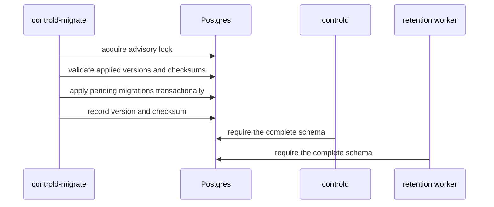
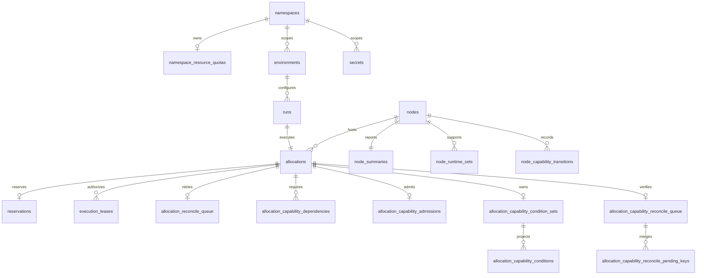
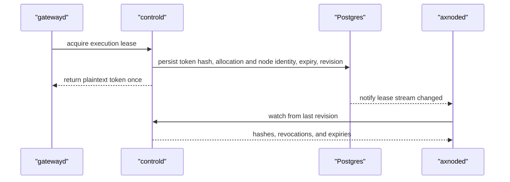
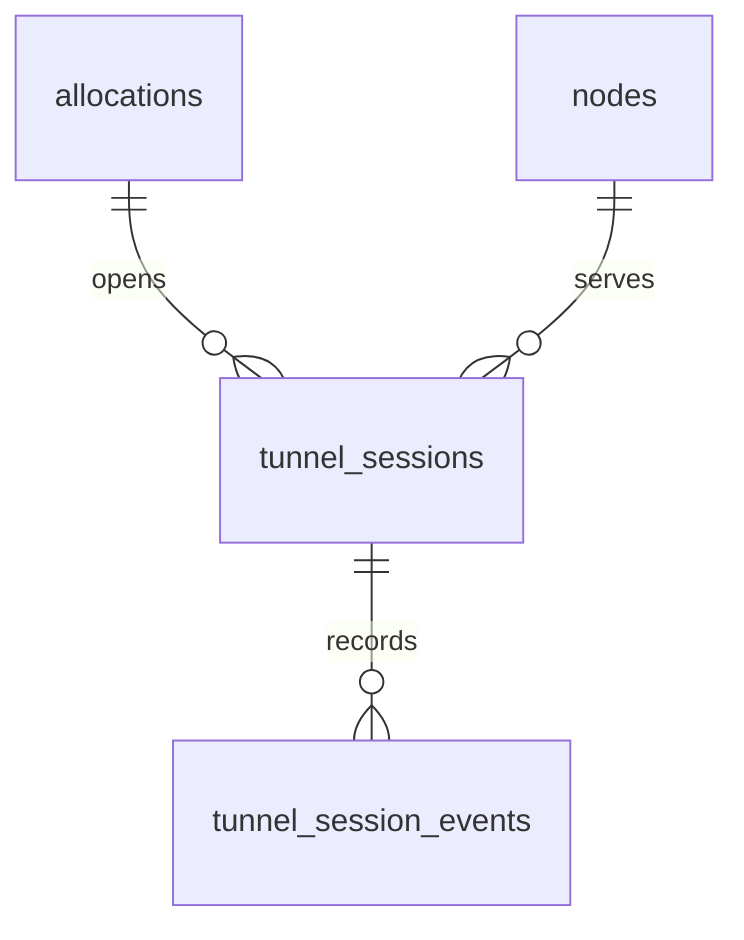

# controld Postgres Schema Design

Postgres is the authoritative store for `controld`. The canonical schema is defined by `internal/postgres/migrations/*.sql`; application startup validates the applied versions but never mutates the schema.

## Migration Layout

The rebuild-only schema has one canonical baseline:

| Migration | Ownership |
| --- | --- |
| `000001_initial.sql` | Principals, nodes, namespaces, environments, secrets, Runs, Allocations, reservations, execution leases, tunnels, reconciliation, and audit state |

Each migration declares the final shape of its domain. Migrations run in one direction under a Postgres advisory lock and are recorded in `schema_migrations` with version, name, checksum, and application time. The repository uses rebuild-only database upgrades: schema changes are folded into the owning baseline migration and the database is recreated. Compatibility migrations and dual-read paths are outside the current contract.

An edited checksum, a missing version, or a database ahead of the binary is a startup error. Rebuild the database whenever a baseline checksum changes.

## Core Control-Plane Model

### Catalog and namespace state

- `namespaces` is the durable scope and optimistic-lock row.
- `namespace_resource_quotas` stores optional CPU, memory, and ephemeral-storage admission limits.
- `environment_templates` stores versioned catalog entries.
- `environments.spec` stores user intent; `resolved_template` stores the normalized runtime snapshot used by execution paths.
- `namespace_quota_events` records durable admission decisions independently from operator audit events.

Namespace names are stored on scoped resources for filtering and ownership. Only relationships whose deletion semantics are part of the domain contract use database foreign keys.

### Secrets

`secrets` stores encrypted payloads and query-safe metadata:

- `data_keys` lists available keys without exposing values.
- `encrypted_payload` is never returned after creation. Execution configuration stores secret references, not plaintext.

### Runs and allocations

`runs` models one user-visible execution lifecycle and is the only durable owner of immutable execution config, public status, result, diagnostics, message, optimistic version, and user-visible timestamps. Every Run owns exactly one Allocation through the unique, non-null `allocations.run_id` foreign key. The uniqueness constraint is intentional: the product does not reschedule one Run onto multiple or replacement Allocations. A retry of execution is a new Run.

`allocations` is the concrete execution unit and infrastructure-convergence record. Its globally unique, never-reused `allocation_id` is the data-plane and cleanup identity; `run_id` is its sole owner and `node_id` is its immutable execution binding. `lifecycle_state` contains only `BOUND`, `STARTING`, `ACTIVE`, `RELEASING`, or `RELEASED`. A node `STOPPED` observation atomically commits result fields to the Run and persists the Allocation as `RELEASING`; it is never stored as an Allocation state. For a workspace image, `workspace_preparation` stores typed node-observed preparation facts. Allocation has no config, public status, exit result, diagnostic, message, or version columns.

`reservations` records admitted CPU, sandbox-memory, and ephemeral-storage requests. `sandbox_memory_request_bytes` is the public request without a runtime overhead side channel. A non-null `released_at` closes the control-plane reservation without erasing accounting history; node admission still honors a larger axnoded local commitment until host cleanup completes.

`allocation_memory_admission_evidence` freezes the node memory budget used by the admission transaction, including distinct physical capacity, source allocatable, delegated-root limit, system reserve, and node-local commitment facts. `allocation_memory_observations` keeps only the latest revisioned host memcg sample for an Allocation; it is not a second reservation ledger.

`allocation_capability_dependencies` stores one typed key per allocation with catalog loss policy, placement proof, and create-time admitted proof. `allocation_capability_admissions` is the immutable per-Allocation commit marker and stores the canonical admitted dependency-set digest, including the zero-dependency case. The first post-create admission transaction binds the proof rows, projects conditions, and inserts this marker atomically. A retried Create may only replay the exact digest and proof set; it never refreshes the historical create proof. Runtime capability reconciliation is condition-only. The `(node_id, capability_key_id, allocation_id)` index is the authoritative path from a node transition to affected allocations; report processing never scans allocation configuration JSON.

`allocation_capability_condition_sets` owns the latest full-set revision, observation time, and canonical protobuf SHA-256 payload digest for an Allocation. `allocation_capability_conditions` stores the normalized per-key projection under the same `(allocation_id, revision)`, so readers cannot observe a partially replaced generation. A new Run creates a new Allocation ID and starts its own revision stream. An exact revision replay is idempotent only when the digest matches; a different payload at the same revision is rejected. Conditions are independent of Allocation lifecycle and cannot update Run status, readiness, exit information, or the primary message.

### Reconciliation and audit

`allocation_reconcile_queue` is the durable retry queue. `next_run_at`, `reconcile_attempts`, and `last_error` describe retry state; `lease_owner` and `lease_expires_at` provide bounded multi-worker claims.

`node_capability_transitions` records idempotent effective state, evidence, and bounded reason-code changes. Ordinary TTL refresh without one of those changes does not create history. `allocation_capability_reconcile_queue` owns claim and retry state; `allocation_capability_reconcile_pending_keys` merges the latest snapshot sequence per key. This capability-loss queue is separate from create/delete lifecycle intent.

A node report replaces the latest summary, evaluates effective transitions, inserts idempotent transition rows, and merges pending keys for directly indexed active `DEGRADE` or `FAIL_STOP` dependencies in one transaction. `ADMISSION_ONLY` rows remain durable admission evidence but are never runtime reconcile work. Rollback leaves all four projections unchanged. Capability condition reporting likewise replaces the allocation-scoped set header and normalized rows in one transaction; it has no write path to the allocation lifecycle columns.

`admin_audit_events` records operator mutations before lifecycle coordination state changes. It is distinct from quota decisions and workload event history.

## Nodes and Execution Leases

`nodes` stores identity, control target, authentication hash, heartbeat freshness, lifecycle status, retirement reason, and version. Active identities may report and participate in placement. Retirement is irreversible, retains historical references, and commits with an admin audit event after lifecycle and storage blockers are clear. `node_summaries` stores rich reported capacity and inventory, while `node_runtime_sets` keeps runtime eligibility cheap to query.

`execution_leases` binds authorization to an exact Allocation ID and Node ID. Only token hashes are stored. `control_revisions` owns the monotonic revision stream, and the execution-lease trigger wakes watchers without making notifications authoritative state.

## Tunnel Model

`tunnel_sessions` stores the selected Allocation ID, remote port, edge and relay targets, encrypted node token, token hashes, revision, traffic counters, expiry, and revocation state. A partial unique index prevents two active sessions from claiming the same allocation port.

`tunnel_session_events` is append-only peer and lifecycle history. The `tunnel_sessions` control revision supports incremental node convergence.

## Query and Index Intent

Indexes follow server-side access paths:

- namespace and creation cursors for list APIs;
- node/lifecycle and namespace/run-status indexes for placement and lifecycle projection;
- partial active indexes for reservations, leases, tunnels, and live Allocations;
- retention indexes on expiry and creation timestamps;

New indexes require a concrete query, reconciliation, retention, or uniqueness contract. Low-cardinality status values are not indexed alone.

## Storage Rules

Typed columns own identity, state-machine status, foreign keys, optimistic versions, timestamps, budgets, usage totals, and fields used for ordering or selection. JSONB owns versioned intent and snapshots that are read and written as a whole.

Retention may delete completed history only after checking domain references. It must not delete current workloads or active leases.
