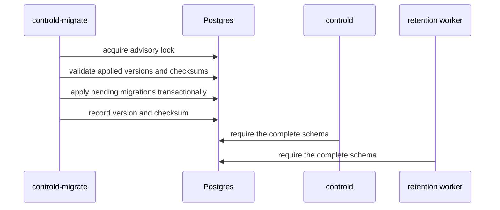
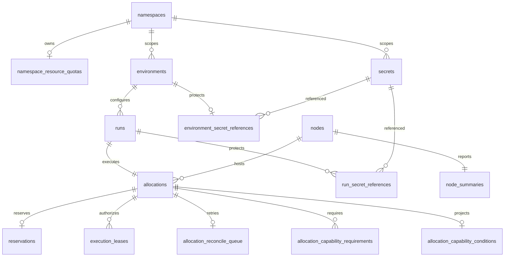
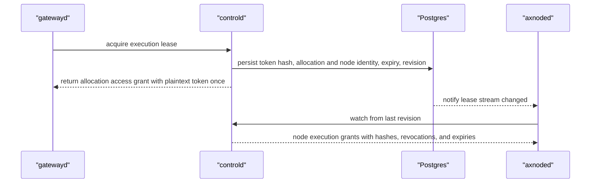
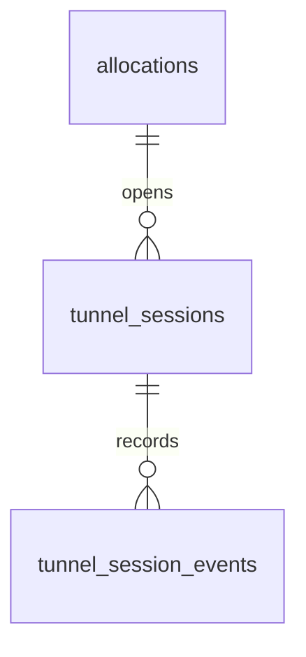

# controld Postgres Schema Design

Postgres is the authoritative store for `controld`. The canonical schema is defined by `internal/postgres/migrations/*.sql`; application startup validates the applied versions but never mutates the schema.

## Migration Layout

The rebuild-only schema has one canonical baseline:

| Migration | Ownership |
| --- | --- |
| `000001_initial.sql` | Principals, nodes, namespaces, environments, secrets, Runs, Allocations, reservations, execution leases, tunnels, reconciliation, and audit state |

Each migration declares the final shape of its domain. Migrations run in one direction under a Postgres advisory lock and are recorded in `schema_migrations` with version, name, checksum, and application time. The repository uses rebuild-only database upgrades: schema changes are folded into the owning baseline migration and the database is recreated. Compatibility migrations and dual-read paths are outside the current contract.

An edited checksum, a missing version, or a database ahead of the binary is a startup error. Rebuild the database whenever a baseline checksum changes.

## Core Control-Plane Model

### Environment inputs and namespace state

- `namespaces` is the durable scope and admission lock row. Its `deleted_at` is a security tombstone that prevents a deleted namespace name from being reused and confused with retained Run history or revoked authorization records; this is the only generic-resource-style soft deletion in the workload schema.
- `namespace_resource_quotas` stores optional CPU, memory, and ephemeral-storage admission limits.
- Built-in Environment templates are deployment configuration used only during resolution. They have no public API, product identity, or database table.
- `environments.spec` stores normalized user intent and `resolved_spec` stores the immutable runtime input available for new admission. Environment deletion physically removes this row.
- `namespace_quota_events` records durable admission decisions independently from operator audit events.

Namespace names are stored on scoped resources for filtering and ownership. Only relationships whose deletion semantics are part of the domain contract use database foreign keys.

### Secrets

`secrets` stores encrypted payloads and query-safe metadata:

- `data_keys` lists available keys without exposing values.
- `encrypted_payload` is never returned after creation. Execution configuration stores secret references, not plaintext.
- `environment_secret_references` protects one required registry credential for an Environment. `run_secret_references` protects the Run snapshot's registry credential together with deduplicated required execution inputs while the Run is non-terminal. Composite foreign keys enforce that owners and Secrets share one Namespace; terminalization drops Run references atomically, and Environment deletion removes only the reusable Environment's reference without weakening an admitted Run's independent lock.

### Runs and allocations

`runs` models one user-visible execution lifecycle and is the only durable owner of immutable execution config, the admitted Environment source and resolved snapshots, public status, result, diagnostics, message, optimistic version, and user-visible timestamps. Admission copies both Environment snapshots in the same transaction as the Run, Allocation, reservation, capability requirements, Secret references, and create intent. Node creation and recovery never depend on the continued existence of the Environment row. Every Run owns exactly one Allocation through the unique, non-null `allocations.run_id` foreign key. The uniqueness constraint is intentional: the product does not reschedule one Run onto multiple or replacement Allocations. A retry of execution is a new Run.

`allocations` is the concrete execution unit and infrastructure-convergence record. Its globally unique, never-reused `allocation_id` is the data-plane and cleanup identity; `run_id` is its sole owner and `node_id` is its immutable execution binding. `lifecycle_state` contains only `BOUND`, `STARTING`, `ACTIVE`, `RELEASING`, or `RELEASED`. A node `STOPPED` observation atomically commits result fields to the Run and persists the Allocation as `RELEASING`; it is never stored as an Allocation state. Allocation has no config, public status, exit result, diagnostic, message, version, or TaskSet-specific preparation columns.

`reservations` records admitted CPU, sandbox-memory, and ephemeral-storage requests. `sandbox_memory_request_bytes` is the public request without a runtime overhead side channel. A non-null `released_at` closes the control-plane reservation without erasing accounting history; node admission still honors a larger axnoded local commitment until host cleanup completes.

Allocation memory usage is live node-local diagnostic data rebuilt from the authoritative cgroup. It is not persisted by controld and does not participate in reservation or lifecycle decisions. The memory budget used during placement is validated inside the reservation transaction.

`allocation_capability_requirements` stores only the immutable typed key and platform loss policy. It is owned through the Allocation foreign key and does not repeat Node binding or preserve placement observations. The Allocation binding, requirement rows, reservation, and create intent commit in one transaction; that transaction is the admission decision.

`allocation_capability_conditions` stores one complete latest diagnostic projection and its `observed_at`. Older reports are ignored, exact equal-time replay is idempotent, and conflicting equal-time data is rejected. Terminal Allocations ignore late reports. Conditions cannot update Run or Allocation lifecycle, readiness, exit information, or the primary message.

### Reconciliation and audit

`allocation_reconcile_queue` is the sole durable dispatcher for node Create/Delete operations. `next_run_at`, `reconcile_attempts`, and `last_error` describe delivery state; `lease_owner` and `lease_expires_at` provide renewable multi-worker claims. Run admission, cancellation, terminal observation, and create exhaustion write or replace this intent in the same transaction as their authoritative lifecycle changes. Completion and rescheduling require the current claim owner, so an expired worker cannot acknowledge newer work.

Lifecycle transactions lock the Allocation before its queue row. Node reports, cancellation, worker completion, and release therefore share one lock order; a terminal report racing successful node creation cannot deadlock or let the stale create completion erase the replacement delete intent.

Capability loss has no controld queue or transition-history table. Axnoded owns the crash-safe Allocation-scoped verification/termination intent. Controld persists only the latest ordered Node summary and condition projection; its lifecycle queue remains limited to create/delete convergence.

`admin_audit_events` records operator mutations before lifecycle coordination state changes. It is distinct from quota decisions and workload event history.

## Nodes and Execution Leases

`nodes` stores identity, non-empty control target, a 64-character authentication hash, the latest accepted heartbeat time, lifecycle status, and retirement facts. The schema does not permit a half-registered empty target or token hash. Active identities may report and participate in placement. Retirement is irreversible, retains historical references, and commits with an admin audit event after lifecycle and storage blockers are clear. `node_summaries.summary` stores the complete rich observation, including its own collection time; duplicate summary timestamps and node versions are not persisted. Runtime eligibility is not stored because Axern has one production execution boundary.

`execution_leases` binds authorization to an exact Allocation ID and Node ID. Only token hashes are stored. `control_revisions` owns the monotonic revision stream, and the execution-lease trigger wakes watchers without making notifications authoritative state.

Gateway and node protocols deliberately use different messages. `AllocationAccessGrant` exists only on the trusted gateway issuance path and carries plaintext. `NodeExecutionGrant` is the node validation projection and never has a plaintext field. Neither message carries a lease type or routing target; the Allocation binding owns both purpose and node routing.

## Tunnel Model

`tunnel_sessions` stores the selected Allocation ID, remote port, edge and relay targets, encrypted node token, token hashes, node-desired-state revision, traffic counters, expiry, and terminal state. Namespace ownership and Node routing are derived through the immutable Allocation-to-Run and Allocation-to-Node relationships rather than copied into the session. A partial unique index prevents two active sessions from claiming the same allocation port.

`tunnel_session_events` is append-only peer and lifecycle history. The `tunnel_sessions` revision is only the ordered node desired-state feed: create and terminalization advance it, while renewal, non-terminal node status, relay peer events, and traffic counters do not. PostgreSQL notifications wake node-specific watchers; fixed high-water reads make reconnects and concurrent commits lossless. Each watcher also sleeps until its node's nearest active TTL deadline, so expiry does not depend on unrelated writes or polling. Terminal session rows are retained as recovery tombstones, while event retention may prune older diagnostic history.

## Query and Index Intent

Indexes follow server-side access paths:

- namespace and creation cursors for list APIs;
- composite `(created_at, id)` keyset indexes and JSONB label indexes for Run, Environment, and Secret list filters;
- node/lifecycle and namespace/run-status indexes for placement and lifecycle projection;
- partial active indexes for reservations, leases, tunnels, and live Allocations;
- retention indexes on expiry and creation timestamps;

New indexes require a concrete query, reconciliation, retention, or uniqueness contract. Low-cardinality status values are not indexed alone.

## Storage Rules

Typed columns own identity, state-machine status, foreign keys, required concurrency versions, timestamps, budgets, usage totals, and fields used for ordering or selection. JSONB owns typed protobuf intent and immutable snapshots that are read and written as a whole. Database checks reject unknown Run and TunnelSession states, unsupported Secret types, empty Node routing or authentication identity, empty quota-event Environment identity, non-object specifications and labels, invalid versions or revisions, negative counters, and impossible timestamp ordering before those values can become authoritative. Quota rejection events name the real Environment request but have no `run_id`, because rejection means no Run exists.

Retention may delete completed history only after checking domain references. A terminal Run is eligible only after its Allocation is `RELEASED`, no reconcile intent remains, every execution lease is revoked or expired, and no pending/running/degraded TunnelSession survives. It must not delete current workloads or active access paths through cascading foreign keys.
