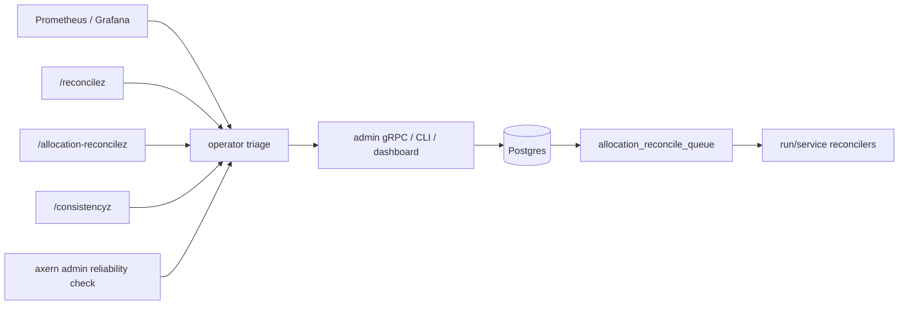

# Reconcile Operations

This runbook covers control-plane reconcile diagnostics and allocation
lifecycle retry repair. It is for operators and agents investigating workload
convergence issues.

## Surfaces

- Grafana/Prometheus metrics answer whether reconcile work is healthy over
  time.
- `/reconcilez` shows process-local background reconciler health for one
  `controld` instance.
- `/allocation-reconcilez` shows read-only allocation lifecycle retry queue
  state.
- `/consistencyz` shows read-only cross-table consistency issues for active
  reservations, leases, tunnel sessions, service references, and allocations.
- `axern admin consistency check` and `axern admin reliability check` expose the
  typed admin gRPC read models used by smoke tests and operator triage.
- Storage binding health from `storaged` is folded into `axern admin
  reliability check`; failed or stuck releasing bindings produce a storage
  reliability signal.
- Active-node heartbeat freshness, summary freshness, and axnoded readiness are
  folded into the same reliability response. Retired nodes are excluded.
- The admin gRPC API, CLI, and dashboard perform audited repair actions.

Debug HTTP endpoints are read-only. Durable mutations must go through admin
gRPC so row locks, owner-aware state transitions, and audit records stay in the
same transaction.



## Health Triage

Start with reconcile health metrics:

- `axern_controld_reconcile_consecutive_failures`: non-zero means a background
  component is failing repeatedly.
- `axern_controld_reconcile_last_error_age_seconds`: recent non-empty series
  means the component recently failed.
- `axern_controld_reconcile_last_success_age_seconds`: a large age means the
  component has not completed successfully recently.
- `axern_controld_reconcile_running`: `1` means a component is currently inside
  a reconcile pass.

Use `/reconcilez` for the exact component, timestamps, and last error message
on the affected `controld` process.

For a node-fleet signal, list active nodes and inspect the stale or non-ready
rows. Retire a node only after it has permanently left the fleet and all
reported blockers have converged:

```bash
axern admin node list --status active
axern admin node retire <node-id> --operator-reason "host permanently removed"
axern admin audit list --operation retire-node --target-type node --target-id <node-id>
```

## Allocation Retry Triage

Use the allocation lifecycle queue when a workload is stuck after a node
lifecycle call failed after the database transaction committed.

```bash
axern admin allocation-retry list
axern admin reliability check
axern admin consistency check
curl -fsS http://127.0.0.1:24001/allocation-reconcilez
```

Important fields:

- `owner_type`: whether the allocation belongs to a run or service.
- `reason`: `create` retries start missing node allocations; `delete` retries
  clean up node state.
- `reconcile_attempts`: current durable retry count.
- `last_error`: latest node lifecycle failure.
- `due`: whether the item is eligible to run now.
- `clearable` and `clear_blocked_reason`: server-side clear preconditions.

Use `/consistencyz` when queue state, quotas, or node inventory suggest
stranded control-plane resources. A healthy response has `status: "ok"`.
An inconsistent response lists issue codes such as active reservations on ended
allocations, active leases or tunnel sessions on ended allocations, or service
references to missing/ended allocations. The endpoint is diagnostic only; fix
state through the owning reconciler or audited admin operation. Issue details
are capped; `truncated: true` means the response found more issues than it
returned.

Repair ownership for each consistency issue family is defined in
[Consistency Repair Boundaries](consistency-repair-boundaries.md). The short
version: diagnostics stay read-only, and writes go through the owning
run/service/tunnel controller or audited admin operation.

## Repair Actions

Use `force` when the underlying condition was fixed and the queue item is not
yet due:

```bash
axern admin allocation-retry force <allocation_id> \
  --reason create \
  --operator-reason "node recovered and allocation state was checked"
```

Use `fail` only for create retries when the workload should become terminal:

```bash
axern admin allocation-retry fail <allocation_id> \
  --operator-reason "image cannot start on selected node"
```

Use `clear` only for stale terminal retry rows that the server marks
`clearable`:

```bash
axern admin allocation-retry clear <allocation_id> \
  --reason delete \
  --operator-reason "allocation is terminal and cleanup state is already gone"
```

Every repair requires a human-readable operator reason. Check the audit log
after a successful action:

```bash
axern admin audit list --target-type allocation --target-id <allocation_id>
```

## Retry Policy

Create retries are bounded. If create continues failing, the owner-specific
reconciler marks the allocation failed, releases its reservation, and removes
the queue row.

Delete retries are intentionally unbounded. They represent cleanup intent and
continue until node deletion is confirmed or an operator clears a stale,
already-clean terminal row.

Do not add generic queue deletion. Removing convergence intent without
owner-aware cleanup can strand reservations, leases, or tunnel sessions.

## Verification

For code changes in this area, run:

```bash
make -C control/controld test
make -C control/controld vet
make -C control/controld check-architecture
go test ./apps/cli/...
make axern-cli-dashboard-smoke
```

For an end-to-end local check of admin repair, debug endpoints, and audit:

```bash
make axern-cli-e2e
```
