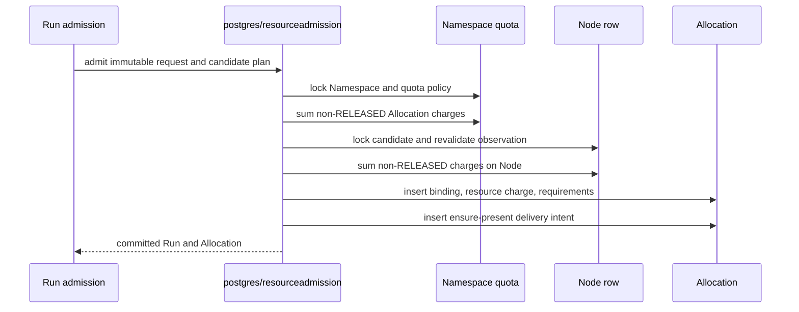

# Resource Quota Design

This document defines the control-plane design for Namespace resource quotas. Quota is an admission ceiling over immutable Allocation resource requests; it is not a second resource lifecycle.

## Ownership

- `namespace_resource_quotas` owns the Namespace admission limits.
- A non-released `allocations` row owns its admitted CPU, sandbox-memory, and ephemeral-storage charge.
- `axnoded` owns runtime enforcement and node-local resource recovery.
- `namespace_quota_events` is retained diagnostic history for rejected admissions. It never participates in admission or cleanup.

There is no Reservation entity, reservation table, release timestamp, or quota usage cache. Allocation cleanup reaching `RELEASED` is the only event that returns its charged capacity.

## Policy

Quota is Namespace-scoped and evaluates `resources.requests`. Runtime `resources.limits` remain hard ceilings enforced by axnoded. Nullable quota limits mean unlimited. CPU overcommit is a Node admission policy and never multiplies Namespace quota; memory and ephemeral storage remain strict.

```text
used_cpu_milli + requested_cpu_milli <= cpu_milli_limit
used_memory_bytes + requested_memory_bytes <= memory_bytes_limit
used_ephemeral_storage_bytes + requested_ephemeral_storage_bytes
  <= ephemeral_storage_bytes_limit
```

Lowering quota below current usage does not evict an admitted Allocation. It blocks subsequent admissions until cleanup reduces usage.

## Authoritative Admission Transaction

Run admission performs quota, placement revalidation, Allocation creation, and durable delivery-intent creation in one PostgreSQL transaction:



The lock order is stable:

1. Namespace and quota policy.
2. Candidate Node rows in Node-ID order.
3. Run, Allocation, capability requirements, and delivery intent writes.

Placement is a request-scoped prefilter. The locked transaction is the only authority for quota, node capacity, freshness, runtime readiness, labels, capabilities, and runtime slots. A failed admission creates neither a Run nor an Allocation resource charge.

## Usage And Cleanup

Active usage is derived directly from Allocations whose lifecycle is not `RELEASED`. This intentionally keeps capacity charged after a Run becomes terminal while runtime, cgroup, egress, or filesystem cleanup is still pending. The allocation lifecycle reconciler changes the row to `RELEASED` only after axnoded confirms idempotent deletion.

Namespace usage is joined through `Allocation -> Run -> Namespace`; Namespace identity is not copied onto Allocation. Node usage comes directly from the immutable Allocation binding. Database charges are compared with the latest node-local commitments so an observation lag cannot make live capacity reusable.

## Diagnostics

Admission errors use `google.rpc.ErrorInfo` with domain `axern.control.resource_admission` and stable reasons such as `NAMESPACE_QUOTA_EXCEEDED` and `NODE_CAPACITY_EXHAUSTED`.

`namespace_quota_events` stores only committed `admission_rejected` decisions. The event names the requested Environment and has no `run_id`, because no Run exists after rejection. Event `used_*` fields are point-in-time quantities used for diagnosis; they are never read as current usage or lifecycle truth.

Metrics and read APIs derive current values from the quota policy and Allocation rows:

```text
controld_namespace_resource_current{namespace,resource,state=limit}
controld_namespace_resource_current{namespace,resource,state=used}
controld_namespace_resource_current{namespace,resource,state=available}
```

The `used` state is derived from non-released Allocation charges.

## Namespace Lifecycle

Namespace deletion is an irreversible tombstone transition. It is rejected while the Namespace owns non-terminal Runs, non-released Allocations, live Environments, or Secrets. Historical terminal Runs and rejected-admission events retain their foreign-key identity for auditability without becoming active usage.

## Package Boundaries

- `internal/kernel/resource` owns normalization, fit policy, and diagnostic reasons.
- `internal/postgres/resourceadmission` owns locks, authoritative usage queries, candidate revalidation, and the atomic Run/Allocation write.
- `internal/application/run` maps typed admission outcomes to Run/API results; it does not sum or cache usage.
- axnoded enforces limits and reports node-local commitments; it cannot release the control-plane Allocation charge.

Do not add a Reservation table, usage cache, release outbox, or a second admission path. Any future quota dimension must be derived from the same owner row and released by the same Allocation lifecycle transition.
