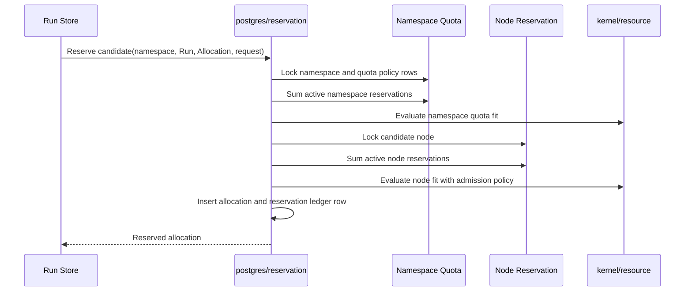

# Resource Quota Design

This document defines the long-term control-plane design for namespace resource quotas in `controld`.

Resource quota is separate from node placement. Placement decides whether a workload can fit on a selected node. Quota decides whether a namespace is allowed to consume more admitted workload resources. Both decisions use workload `resources.requests`; runtime `resources.limits` remain container hard limits enforced by `axnoded`.

## Goals

- Bound namespace resource consumption with durable control-plane state.
- Keep quota admission consistent for every Run-backed Allocation.
- Evaluate quota in the same Postgres transaction as allocation and node reservation admission, using the same pure resource policy model.
- Keep CPU overcommit as a node admission policy, not a quota multiplier.
- Keep memory strict in V1.

## Non-Goals

- No namespace-level CPU overcommit ratio in V1.
- No memory overcommit.
- No quota on runtime limits in V1.
- No quota on count-based resources such as Runs, Allocations, images, or secrets in V1.
- No per-node, per-runtime, per-region, or per-cloud quota in V1.
- No billing or chargeback model.

## Policy Model

V1 quota is namespace scoped:

```text
namespaces
  namespace
  created_at
  deleted_at

namespace_resource_quotas
  namespace
  cpu_milli_limit
  memory_bytes_limit
  created_at
  updated_at
```

Every namespace has a durable namespace row and a quota policy row before workload admission can reserve resources in that namespace. Nullable limits mean the namespace is unlimited for that resource. The namespace row is the stable lock target for admission and policy updates, while `namespace_resource_quotas` stores the quota policy.

Quota limits cap active admitted workload requests. Runtime limits are not counted, and node CPU overcommit does not increase namespace quota.

## Admission Model

Quota admission and node reservation admission must happen in one database transaction:



The lock order is always:

1. Namespace quota state.
2. Candidate node state.
3. Allocation and reservation writes.

Run admission is the only product execution path through the reservation helper. Do not add another admission ledger.

## Reservation Ledger

The long-term model is one reservation per Allocation. The `reservations` ledger is shared by node reservation and namespace quota usage:

```text
reservations
  allocation_id (primary key)
  node_id
  cpu_milli
  sandbox_memory_request_bytes
  ephemeral_storage_bytes
  created_at
  released_at
```

Required active indexes:

```sql
CREATE INDEX idx_reservations_active_node
  ON reservations(node_id)
  WHERE released_at IS NULL;

CREATE INDEX idx_reservations_active_created
  ON reservations(created_at, allocation_id)
  WHERE released_at IS NULL;

CREATE INDEX idx_runs_namespace_id
  ON runs(namespace, run_id);
```

Namespace usage is derived through `Reservation -> Allocation -> Run`; the ledger does not duplicate Namespace ownership. Using one ledger avoids parallel release paths: allocation release, node capacity release, and quota release stay atomic.

## Package Boundaries

Pure resource rules live in `control/controld/internal/kernel/resource`:

- request normalization contracts
- node admission policy
- namespace quota policy
- fit evaluation
- diagnostic reason construction

Postgres code owns durable locking, queries, and writes:

- create, get, and list durable namespace rows
- load and lock namespace quota state
- load active namespace usage
- load and lock node state
- load active node reservations
- insert and release reservation ledger rows

Application stores call Postgres reservation helpers. They do not evaluate quota or manually sum reservations.

This keeps the dependency direction simple:

```text
application -> postgres adapter -> kernel/resource
application -> placement -> kernel/resource
```

The domain package does not know about SQL, gRPC, or store types.

## Evaluation Rules

Quota fit uses the same arithmetic shape as node resource fit:

```text
used_cpu_milli + requested_cpu_milli <= cpu_milli_limit
used_memory_bytes + requested_memory_bytes <= memory_bytes_limit
```

If a quota field is unset, that resource is unlimited for the namespace.

Quota updates are admission-time policy changes. Lowering quota below current usage does not evict admitted workloads; it blocks new admissions until active usage falls below the new limit. Clearing both limits returns the namespace to unlimited quota while preserving the namespace lock target.

Quota evaluation must return structured results instead of formatted strings:

```text
resource: cpu | memory
requested
used
limit
available
reason
```

Adapters can render those results into gRPC errors, debug endpoints, metrics, or logs. Quota admission errors should return `ResourceExhausted` with a readable message plus a `google.rpc.ErrorInfo` detail using reason `NAMESPACE_QUOTA_EXCEEDED` and stable metadata such as `namespace`, `resources`, `cpu_requested`, `cpu_reserved`, `cpu_limit`, and `cpu_available`. Error messages should cap per-candidate detail just like node reservation diagnostics.

## Workload Semantics

Runs consume quota while their allocation reservation is active. Run admission is synchronous: if namespace quota or node reservation capacity is exhausted, `CreateRun` returns `ResourceExhausted` and no run or reservation is created. Releasing the allocation releases quota.

## Observability

Metrics should expose quota usage separately from node capacity:

```text
controld_namespace_resource_current{namespace,resource,state=limit}
controld_namespace_resource_current{namespace,resource,state=reserved}
controld_namespace_resource_current{namespace,resource,state=available}
```

Debug endpoints should keep node and namespace concepts distinct. `/resourcez` continues to describe node policy and node capacity. `/quotasz` exposes namespace quota state and usage for local diagnostics. The public namespace API is the management surface for namespace lifecycle. The public quota API is the management surface for quota policy.

Quota admission rejections are also stored in a durable event ledger:

```text
namespace_quota_events
  event_id
  namespace
  event_type
  run_id
  environment_id
  reason
  requested_cpu_milli
  reserved_cpu_milli
  cpu_milli_limit
  available_cpu_milli
  requested_memory_bytes
  reserved_memory_bytes
  memory_bytes_limit
  available_memory_bytes
  created_at
```

The event ledger is not operator audit. Admin audit records human repair actions, while quota events record system admission decisions. V1 records `admission_rejected` events only. A rejected admission is still a committed admission decision transaction: the workload/allocation/reservation writes are not created, but the event row is committed before the API returns `ResourceExhausted`. The public quota API owns this read model through `ListNamespaceQuotaEvents`; debug HTTP and logs must not become the durable event interface.

Events are append-only operational history with retention. They do not affect quota usage, placement, or retry behavior. Their typed resource and reason fields explain recent namespace pressure without parsing gRPC error text. Event queries require an explicit active namespace; tombstoned namespace identity is retained so historical foreign keys are never rebound to a new owner.

## Namespace Lifecycle

Namespace deletion is an irreversible tombstone transition after the namespace has no live operational state. The durable row and its foreign-key relationships remain, and the same namespace identity can never be recreated or rebound.

Deletion is intentionally conservative. The namespace row remains the stable quota lock target until the delete transaction verifies that these blockers are gone:

- active Allocation reservations
- non-terminal runs
- live environments
- active allocations
- secrets

Historical rows do not block the tombstone transition. Completed, failed, and cancelled Runs retain their foreign-key identity for auditability.

Clients may surface known blockers from public quota and workload data, but namespace delete remains authoritative because some blockers, such as secrets and environments, are not inferred from quota state.

## Current Implementation Contract

The implementation contract is:

1. Namespace creation ensures the namespace row and nullable quota policy row.
2. Quota set/unset updates the policy row instead of deleting it.
3. Workload admission ensures namespace state, evaluates quota and node capacity in one reservation transaction, and records usage in `reservations`.
4. Active usage is read with `released_at IS NULL`.
5. Namespace deletion rejects live blockers before deleting namespace and quota policy rows.
6. CLI and SDKs read quota through public APIs; they do not infer quota usage from node summaries.
7. Namespace quota admission rejections are recorded in `namespace_quota_events` and queried through the quota API.

Future quota dimensions such as Run or Allocation count should extend this same namespace policy and reservation model rather than introducing parallel quota ledgers.
