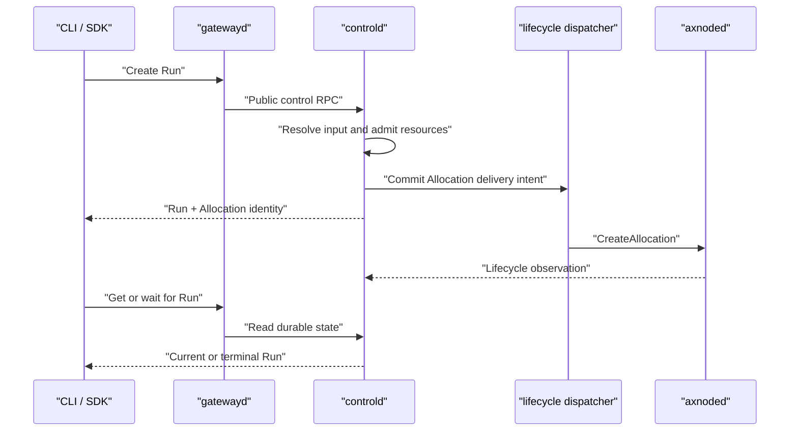
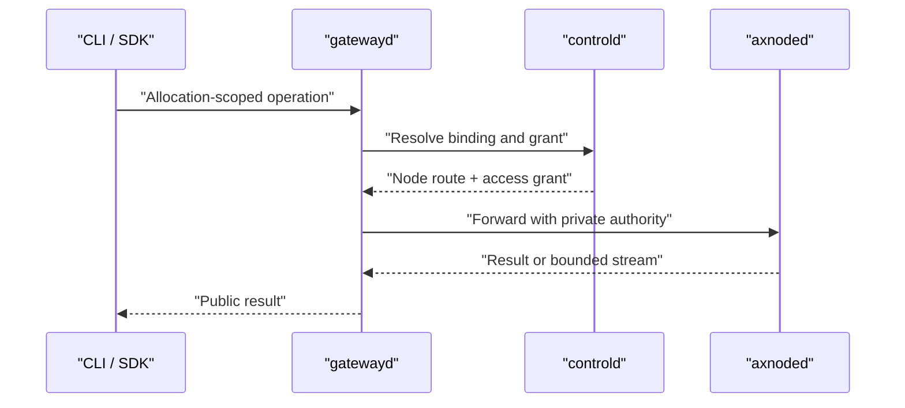

# Execution Lifecycle

This document defines the current end-to-end Run and Allocation lifecycle, fact ownership, and failure guarantees.

## Authority

| Fact | Owner | Durable representation |
| --- | --- | --- |
| Request, public status, terminal result | Run | PostgreSQL `runs` |
| Node binding, infrastructure state, resource charge | Allocation | PostgreSQL `allocations` |
| Create and delete delivery intent | controld lifecycle dispatcher | PostgreSQL lifecycle queue |
| Allocations currently authorized to execute | controld | Nonterminal bound Allocations returned by authenticated heartbeat |
| Locally enforceable execution deadline | axnoded | Receipt-clock deadline in node `AllocationState` |
| Data-plane authority | controld | Purpose-scoped AllocationAccessGrant |
| Accepted node execution contract | axnoded | Node `AllocationState` |
| Live runtime identity and state | runsc | Runtime inventory |
| Exact or explicitly unavailable exit result | axnoded | Minimal runtime checkpoint |
| Unacknowledged terminal result | axnoded | Terminal lifecycle outbox |
| Reverse TCP lifetime | TunnelSession | PostgreSQL `tunnel_sessions` |

Reservation is not another object: the Allocation row carries the resource charge until `RELEASED`. Queue claims are delivery fencing, capability conditions are observations, and neither can advance desired state independently.

## Submit And Observe

Clients submit through gatewayd. Controld resolves immutable Environment input and atomically creates the Run, its single Allocation and resource charge, required Secret references, capability requirements, and lifecycle delivery intent. Startup continues asynchronously; wait operations observe the durable Run instead of holding creation open.



## State Transitions

Run projects the user-visible lifecycle; Allocation tracks infrastructure convergence.

```text
Run progress:     PLACED -> STARTING -> RUNNING
Run terminalization from any nonterminal state:
                  PLACED | STARTING | RUNNING -> CANCELLED | SUCCEEDED | FAILED

Allocation progress:     BOUND -> STARTING -> ACTIVE
Allocation convergence:  BOUND | STARTING | ACTIVE -> RELEASING -> RELEASED
```

- Node STARTING or ACTIVE observations may advance a nonterminal Allocation.
- A node STOPPED observation supplies candidate result evidence; controld atomically commits the terminal Run, moves the Allocation to `RELEASING`, revokes subordinate access, and records delete intent.
- User cancellation and control-plane failure may enter `RELEASING` but cannot invent a node exit code.
- Only acknowledged idempotent node cleanup moves the Allocation to `RELEASED` and ends its resource charge.
- Terminal Run and Allocation states never move backwards, and delayed observations cannot revive them.

## Allocation Data Plane

Public clients provide Allocation identity, never Node targets or private credentials. Gatewayd resolves the binding and purpose-scoped AllocationAccessGrant. For interactive operations, axnoded validates the grant, authoritative `AllocationState`, runtime identity, and operable state before serving the request. An output-only grant instead reads the immutable sealed snapshot within its retention deadline; it does not require or revive a live runtime. ExecutionLease remains separate runtime-liveness authority.



SSH, Terminal, Process, File, Archive, and Tunnel consume the same Allocation binding. Closing access does not redefine Run state, and ExecutionLease does not authorize a user operation.

## Cleanup And Node Operations

Cancellation or terminalization records one durable delete intent; request handlers and recovery scanners do not create competing dispatch paths. Output sealing, when declared by the Run, is an immutable barrier before runtime deletion. Cleanup of runtime, cgroup, egress, mounts, tunnels, grants, and recovery records is idempotent and remains owned by the Allocation until acknowledgement.

Node-local `Exec`, `ExecStream`, and `Wait` are diagnostic capabilities over the same Allocation-scoped process implementation. They cannot bind, revive, terminate, release, or delete an Allocation. Destructive break-glass operations require explicit operator authority and preserve terminal reporting and cleanup obligations. Machine lookup, human operator, lifecycle, sandbox, and conformance authorities remain separate.

## Failure Guarantees

- Admission, binding, charge, requirements, and create intent commit in one PostgreSQL transaction; terminal result, revocation, and delete intent commit together.
- Dispatcher claims are fenced, and node create or delete is idempotent on the never-reused Allocation ID and immutable request.
- Exact terminal evidence is persisted before runtime artifacts can be removed and retried until acknowledged.
- Restart preserves admitted live sandboxes and recovery state; service shutdown is not workload cancellation.
- Authenticated heartbeat authority is finite and measured from node receipt. A failed heartbeat or an omitted Allocation never extends its existing deadline; expiry stops execution fail-closed and cannot be revived by a delayed response.
- Runtime, cgroup, egress, SSH, Tunnel, leases, grants, output sealing, and cleanup all converge on one Allocation identity.
