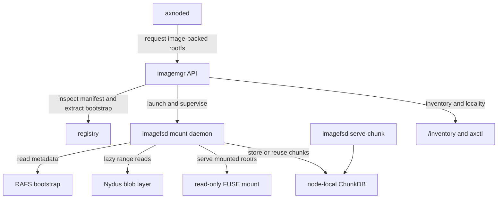
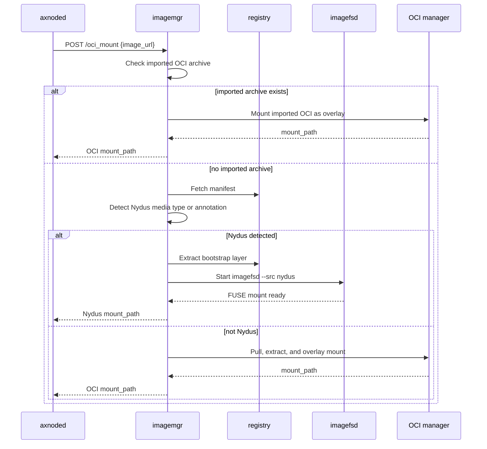
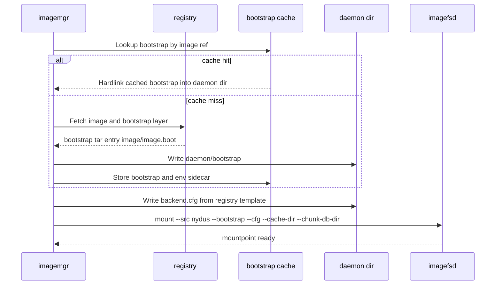
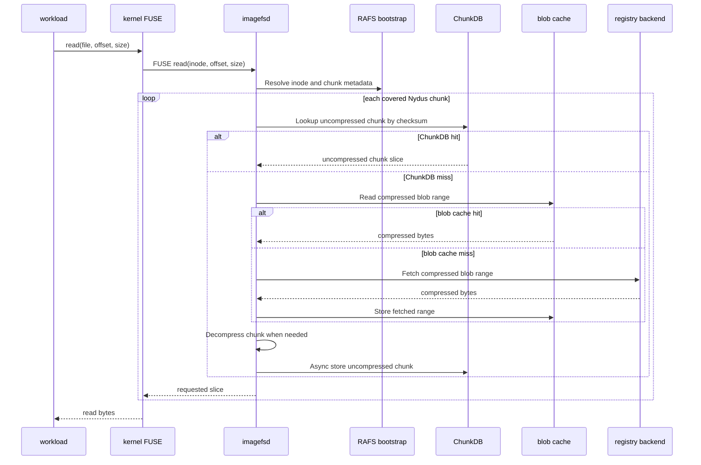
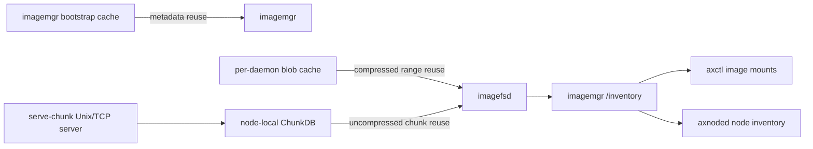

# Nydus Image Runtime

This document covers:

- How Axern runs Nydus images through its own node-runtime image path.
- How lazy pulling works inside `imagefsd`.
- What this means for future large-image usage.

Boundary:

- Axern's Nydus path is not the Kubernetes `nydus-snapshotter` path.
- Kubernetes Pod startup through `kubelet -> containerd -> nydus-snapshotter`
  is outside this runtime boundary.
- Axern validates and uses its own `imagemgr -> imagefsd -> axnoded -> sandbox`
  path:


## Component Roles

- `axnoded` asks `imagemgr` for an image-backed rootfs and uses the returned
  mount path as the sandbox rootfs.
- `imagemgr` owns image mount routing, registry inspection, Nydus bootstrap
  extraction, `imagefsd` process lifecycle, mount records, and inventory.
- `imagefsd` owns the read-only FUSE filesystem, RAFS metadata traversal,
  blob-range reads, decompression, local blob cache, ChunkDB, and locality
  reporting.
- The local `imagefsd serve-chunk` process exposes node-local chunks through a
  Unix socket and, when configured, TCP peer serving.



## Image Detection And Mount Routing

Axern can mount Nydus images through two `imagemgr` entrypoints:

- `POST /nydus_mount` mounts a known Nydus image directly.
- `POST /oci_mount` first checks whether the requested image is Nydus, then
  routes to Nydus when detection succeeds; otherwise it falls back to normal OCI
  pull, extract, and read-only overlay.

Detection is manifest-based. `imagemgr/nydus` treats an image as Nydus when its
manifest layers or annotations contain the standard Nydus bootstrap/blob markers,
including:

- `application/vnd.oci.image.layer.nydus.blob.v1`
- `containerd.io/snapshot/nydus-bootstrap`
- `containerd.io/snapshot/nydus-blob`

Important routing rules:

- Imported OCI archives skip Nydus detection and use the node-local OCI cache.
- Request-scoped Docker config JSON currently applies to the OCI pull path, not
  the Nydus detection path.
- If an image is detected as Nydus but the Nydus mount fails, Axern returns the
  mount error instead of silently falling back to OCI.
- When `-nydus_suffix` is configured, `/oci_mount` may also try a suffixed image
  ref such as `<image>-nydus`.



## Bootstrap And Backend Config

A Nydus image separates metadata from data:

- The bootstrap is small RAFS metadata that describes directories, files,
  inodes, chunks, blob indexes, offsets, sizes, compression, and checksums.
- The blob layer contains the actual chunk payloads.

During Nydus mount setup, `imagemgr`:

1. Parses the image ref and fills the registry backend template with the target
   registry host and repository.
2. Resolves registry auth from the static registry auth file when configured.
3. Fetches the image manifest and extracts the bootstrap from the Nydus
   bootstrap layer.
4. Caches bootstraps under a per-root `.bootstrap_cache` directory with an LRU
   capacity, so repeated mounts of the same image avoid re-extracting metadata.
5. Writes an `imagefsd` backend config file for the registry blob backend.
6. Starts `imagefsd mount --src nydus` with:
   - `--bootstrap <daemon/bootstrap>`
   - `--cfg <daemon/backend.cfg>`
   - `--cache-dir <daemon/cache_dir>`
   - `--chunk-db-dir <imagemgr-root>/chunk_db`
   - `--image-meta-dir <imagemgr-root>/image_metas/<daemon-id>`

At this point only the metadata path has been prepared. The full image blob is
not downloaded up front.



## Lazy Pulling

`imagefsd` mounts the Nydus bootstrap as a read-only FUSE filesystem.

During mount startup:

- `imagefsd` loads the registry backend config through the Nydus storage backend
  abstraction.
- `imagefsd` loads the RAFS superblock from the bootstrap.
- `imagefsd` builds an in-memory map of blob indexes to blob metadata.
- The kernel sees a mounted rootfs directory, but file payloads are still remote
  unless they were already cached.

During a file read:

1. FUSE calls `imagefsd` with inode, offset, and size.
2. `imagefsd` resolves the RAFS inode and computes which Nydus chunks cover the
   requested file range.
3. For each chunk, `imagefsd` reads the chunk metadata from the bootstrap:
   blob index, compressed offset, compressed size, uncompressed size,
   compression mode, and checksum.
4. `imagefsd` first tries to serve the uncompressed chunk from `ChunkDB`.
5. On a ChunkDB miss, `imagefsd` reads only the required compressed blob range
   from the registry backend, or from the local blob cache if that range has
   already been fetched.
6. If the chunk is compressed, `imagefsd` decompresses it into the full
   uncompressed chunk.
7. `imagefsd` returns only the requested slice to the FUSE response.
8. When dedup is enabled and the full uncompressed chunk is available,
   `imagefsd` asynchronously stores it in `ChunkDB` for future reuse.

That is Axern's lazy pulling model: sandbox startup needs the mount and metadata
path, while image data is fetched chunk-by-chunk only when workload reads touch
specific files.



## Cache, Dedup, And Locality

Axern uses three complementary cache layers:

- Bootstrap cache in `imagemgr`: avoids repeatedly extracting the same Nydus
  bootstrap from the registry image.
- Blob cache in `imagefsd`: stores compressed blob ranges under each daemon's
  cache directory with bitmap sidecars, so repeated reads avoid registry fetches.
- `ChunkDB` in `imagefsd`: stores uncompressed chunks by checksum under the
  node-local `imagemgr` root, so chunks can be reused across daemons and images
  when checksums match.

Node-local runtime wiring:

- `node-all-in-one` starts `imagefsd serve-chunk` before `imagemgr`.
- The shared ChunkDB lives at `/var/lib/imagemgr/chunk_db`.
- The Unix chunk-server socket lives at
  `/var/lib/imagemgr/chunk_db/chunkserver.sock`.

`imagemgr /inventory`, `axctl image mounts`, and node inventory can report:

- live `imagefsd` daemons
- `mount_type=nydus`
- global ChunkDB stats
- per-rootfs locality and peer health summaries

The current local compose/kind Nydus smokes assert this observability path in
addition to sandbox startup.



## Scaling To Many Images

Yes, with conditions. This architecture is meant to support many future images
when:

- Images are published in Nydus format.
- The node runtime is configured with the Nydus-capable `imagemgr` and
  `imagefsd` stack.
- Registry backend, auth, proxy, FUSE, and local cache capacity are ready for
  the expected fleet size.

For each Nydus image:

- `imagemgr` can detect or directly mount the image.
- `imagefsd` can expose the RAFS rootfs without extracting a full OCI rootfs.
- Reads are lazy and chunk-scoped.
- Shared chunks can be reused through the node-local ChunkDB.
- Repeated metadata work is reduced by the bootstrap cache.

This does not mean every OCI image automatically gets lazy pulling. A plain OCI
image still uses the OCI pull, layer extraction, and overlay path unless it has
been converted and published as a Nydus image or a configured Nydus suffix image
exists.

Operational constraints still matter:

- The node must run on Linux with FUSE support.
- The registry backend and auth/proxy settings must allow bootstrap and blob
  access.
- The Nydus image must use supported chunk features; encrypted chunks and batch
  chunks are currently unsupported by `imagefsd`.
- ChunkDB, daemon cache directories, and bootstrap cache need capacity planning
  and garbage collection for large fleets.
- More mounted images mean more `imagefsd` daemon lifecycle, memory, file
  descriptor, FUSE, and cgroup pressure.
- Peer serving is available in `imagefsd`, but Dragonfly or other production P2P
  integration remains a separate image read-path enhancement.

## Local Verification

Use the self-contained local Nydus smokes for the Axern-owned path:

```bash
make local-compose-nydus-smoke
make kind-axern-nydus-smoke
```

Default smoke behavior:

- Build a local Nydus image from `axern/python311-runtime:dev`.
- Push it to the repo-managed local registry.
- Mount it through `imagemgr` and `imagefsd`.
- Start an Axern sandbox from the resulting rootfs.

Use `NYDUS_TEST_IMAGE` only when intentionally validating a custom,
production-built, or externally produced Nydus image:

```bash
NYDUS_TEST_IMAGE=<registry/ref:tag-or-digest> make local-compose-nydus-smoke
NYDUS_TEST_IMAGE=<registry/ref:tag-or-digest> make kind-axern-nydus-smoke
```

For the full local command checklist, see
[Local Full Verification Checklist](../verification/local-full-verification.md).
