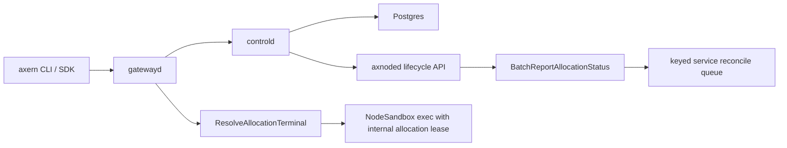

# Runtime Architecture

Axern V1 separates the durable control plane from node-local execution:

- `controld` owns catalog, environments, runs, services, functions, allocations,
  reservations, and execution leases.
- `axnoded` owns node-local process/container execution and reports allocation
  status back to `controld`. Probe and lifecycle workers enqueue observations
  without waiting for control-plane I/O; the node reporter coalesces the latest
  state per allocation, preserves terminal state, and retries bounded batches
  with jittered exponential backoff. This queue is process-local; durable state
  remains in `controld` and node inventory repairs state after node restarts.
- `axnoded` also reports node inventory summaries that distinguish actively
  known allocations from the subset already `RUNNING`, so `controld` can
  reconcile missing allocations without failing normal startup in flight.
- `controld` persists node identities as active or retired. Retirement is an
  audited irreversible operation after workload, tunnel, lease, retry, and
  storage state converges; retired identities are fenced from node auth and
  placement, and replacement hosts use new node IDs.
- The node summary includes an axnoded-owned aggregate `runtime_slots`
  contract. Its capacity starts from `max_instance_num`, enabled node-local
  pools constrain it, and disabled pools are omitted from that calculation.
  Controld rejects reports that omit the aggregate instead of reconstructing it
  from cgroup or interface diagnostics.
- Node inventory also carries imagemgr image inventory as separate
  imported-cache and mounted-workload counts. Imported images mean the image is
  present in the node-local `imagemgr` OCI cache; mounted images mean the image
  currently backs a workload rootfs mount.
- Service readiness is a control-plane-visible concern: `axnoded` reports
  `ready` and `readiness_message` separately from lifecycle `status`, and
  `controld` gates service `READY` and rollout drain decisions on that
  readiness signal.
- Service rollout and autoscaling are Service capabilities for long-running,
  replica-oriented workloads. `Run` stays a single-allocation lifecycle API;
  Function owns revisions, worker scaling, and invocation history.
- Public control-plane API names are `Environment`, `Run`, `Service`, and
  `Function`.
- Catalog templates and environments are runtime-neutral. Workloads select
  `runsc` or `runc` through `ExecutionConfig.runtime_class`; omitted values
  default to `runsc` in `controld` before placement and node lifecycle dispatch.
- Gateway-forwarded sandbox execution is authorized by revocable internal
  execution leases bound to `allocation_id`, `node_id`, `attempt`, and
  `lease_type`; clients send allocation ids to `gatewayd`, not node targets or
  lease tokens.

