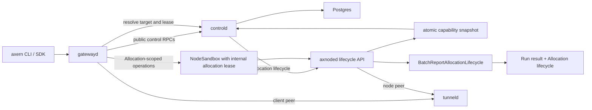

# Runtime Architecture

Object identity and ownership follow the [Stable Domain Model](../product/domain-model.md). This document describes the current component and traffic boundaries that implement it.

Axern separates durable product intent from node-local execution:

- `controld` and PostgreSQL own Environments, Runs, Allocations, reservations, execution leases, TunnelSessions, placement, authorization, and durable lifecycle state.
- `axnoded` owns node-local Allocation execution, recovery, cleanup, and allocation-scoped reporting. Its local state and queues cannot become a second source of product truth.
- `gatewayd` is the unified external gateway for public control and Allocation-scoped data-plane protocols. It owns no placement, lifecycle, or durable product state.
- `imagemgr`, `imagefsd`, `egressd`, `bpfnet`, and `tunneld` own narrow image, network, or relay responsibilities below the Run lifecycle.
- SDK `Sandbox` objects compose the durable `Environment -> Run -> Allocation` chain. Axrun and other evaluation, training, or data-synthesis systems remain callers above the platform.

## External And Internal Flows

Public clients send Allocation identities to `gatewayd`, never node targets or internal lease tokens. Gatewayd forwards control RPCs to `controld`; for process, file, archive, terminal, and SSH operations it resolves the target and authority bound to that exact Allocation ID before forwarding to `axnoded`. The public request remains credential-free; gatewayd overwrites the private execution-lease metadata on every backend attempt, and axnoded accepts exactly one non-empty value. Internal lifecycle and status paths remain direct.

| Flow | Path | Authority |
| --- | --- | --- |
| Public control API | Client -> `gatewayd` -> `controld` | `controld` and PostgreSQL |
| Process, file, archive, terminal, and SSH | Client -> `gatewayd` -> `axnoded` | Allocation and lease resolved by `controld`; execution owned by `axnoded` |
| Allocation lifecycle | `controld` -> `axnoded` | `controld` owns intent; `axnoded` owns node-local execution |
| Lifecycle and capability reporting | `axnoded` -> `controld` | Node observations originate at `axnoded`; Run result and Allocation convergence are committed by `controld` |
| Tunnel client peer | Client -> `gatewayd` -> `tunneld` | TunnelSession belongs to `controld`; relay pairing belongs to `tunneld` |
| Tunnel node peer | `axnoded` -> `tunneld` | Allocation-local binding belongs to `axnoded`; relay pairing belongs to `tunneld` |

## Runtime Invariants

- Runsc is the only supported production sandbox runtime; required isolation, network policy, and platform capability evidence fail closed. See [Observed Capability Providers](observed-capability-providers.md) and [Sandbox Network Policy](sandbox-network-policy.md).
- Allocation lifecycle and exit observations are scoped to a globally unique, never-reused Allocation ID and project unambiguously into the owning Run. There is no Service replica, readiness, or rolling-update state machine.
- Writable rootfs and workspace data is Allocation-local. Image ownership and output transfer follow the [Storage Architecture](storage-architecture.md).
- Requests drive placement and reservation, limits drive runtime enforcement, and node capacity remains typed evidence. See the [Resource Model](resource-model.md).
- The private lifecycle request remains typed from `controld` through `axnoded`: resolved secrets, registry credentials, ports, network mode, and egress policy are validated before request identity is computed. JSON side channels and behavior-bearing OCI labels are not execution contracts.
