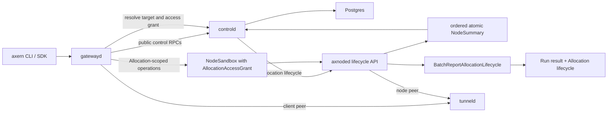

# Runtime Architecture

Object identity and ownership follow the [Stable Domain Model](../product/domain-model.md). This document describes the current component and traffic boundaries that implement it.

Axern separates durable product intent from node-local execution:

- `controld` and PostgreSQL own Environments, Runs, Allocations with their resource charges, allocation access grants, TunnelSessions, placement, authorization, and durable lifecycle state. Axnoded persists the locally received execution-lease deadline with its Allocation recovery record.
- `axnoded` owns node-local Allocation execution, recovery, cleanup, and allocation-scoped reporting. Its local state and queues cannot become a second source of product truth.
- `gatewayd` is the unified external gateway for public control and Allocation-scoped data-plane protocols. It owns no placement, lifecycle, or durable product state.
- `imagemgr`, `imagefsd`, `egressd`, `bpfnet`, and `tunneld` own narrow image, network, or relay responsibilities below the Run lifecycle.
- SDK `Sandbox` objects compose the durable `Environment -> Run -> Allocation` chain without creating another lifecycle.

## External And Internal Flows

Public clients send Allocation identities to `gatewayd`, never node targets or private access tokens. Gatewayd forwards control RPCs to `controld`; for process, file, archive, terminal, and SSH operations it resolves the target and AllocationAccessGrant bound to that exact Allocation ID before forwarding to `axnoded`. The public request remains credential-free; gatewayd overwrites private access metadata on every backend attempt, and axnoded accepts exactly one non-empty value. Internal lifecycle and status paths remain direct.

| Flow | Path | Authority |
| --- | --- | --- |
| Public control API | Client -> `gatewayd` -> `controld` | `controld` and PostgreSQL |
| Process, file, archive, terminal, and SSH | Client -> `gatewayd` -> `axnoded` | Allocation and AllocationAccessGrant resolved by `controld`; execution owned by `axnoded` |
| Allocation lifecycle | `controld` -> `axnoded` | `controld` owns intent; `axnoded` owns node-local execution |
| Lifecycle and capability reporting | `axnoded` -> `controld` | Node observations originate at `axnoded`; Run result and Allocation convergence are committed by `controld` |
| Tunnel client peer | Client -> `gatewayd` -> `tunneld` | TunnelSession belongs to `controld`; relay pairing belongs to `tunneld` |
| Tunnel node peer | `axnoded` -> `tunneld` | Allocation-local binding belongs to `axnoded`; relay pairing belongs to `tunneld` |

## Runtime Invariants

- Runsc is the only supported production sandbox runtime; required isolation, network policy, and platform capability evidence fail closed. See [Observed Capability Providers](observed-capability-providers.md) and [Sandbox Network Policy](sandbox-network-policy.md).
- Allocation lifecycle and exit observations are scoped to a globally unique, never-reused Allocation ID and project unambiguously into the owning Run. There is no Service replica, readiness, or rolling-update state machine.
- Writable rootfs and workspace data is Allocation-local. Image ownership and output transfer follow the [Storage Architecture](storage-architecture.md).
- Requests drive placement and resource charging, limits drive runtime enforcement, and node capacity remains typed evidence. See the [Resource Model](resource-model.md).
- The private lifecycle request remains typed from `controld` through `axnoded`: resolved secrets, registry credentials, ports, network mode, and egress policy are validated before request identity is computed. JSON side channels and behavior-bearing OCI labels are not execution contracts.

## Local DNS Ownership And Host Integration

The installed CLI owns the resolver snapshot applied by `local up`. On native Linux it selects non-loopback nameserver addresses from `/etc/resolv.conf`, then `/run/systemd/resolve/resolv.conf` if the first file contains none. On Docker Desktop it leaves discovery to the Node container inside the VM. An explicit `AXERN_LOCAL_DNS_NAMESERVERS` list takes precedence on either platform. Axnoded validates the effective non-loopback upstreams, writes the Allocation's `/etc/resolv.conf`, and fails resolver-dependent operations when no usable upstream exists. It never invents a public resolver. `local doctor` separately checks configuration, Node reachability and, with `--probe --image`, resolution through a real Run and runsc sandbox.

**Decision: defer additional host DNS integration and a managed local forwarder.** The existing path has one configuration owner and no additional daemon, cache or listening port. It handles ordinary resolver snapshots, but selecting IP addresses alone cannot promise that Linux per-domain split-DNS rules, VPN route changes, search domains, DNSSEC behavior or changes after startup are preserved. Docker Desktop's VM resolver may supply some of these behaviors; that is a platform property requiring separate qualification, not an Axern guarantee. The public override is a controlled remediation only when the specified resolvers are reachable from the Node and sandbox.

Platform-native integration could observe resolver and VPN changes and preserve domain routing, but it would require separate Linux and macOS ownership, update ordering, and failure behavior. A managed forwarder could centralize per-domain routing and UDP/TCP handling, but it would add a long-running service, bounded sockets/cache/queries, port binding, restart and health ownership, privacy-sensitive query handling, and an abuse surface for untrusted workloads. Neither choice has a measured gap or a qualified security and resource contract that justifies adopting it now. Axern does not claim DNSSEC validation or cache semantics of its own.

Reconsider this decision when a reproducible supported-platform Run fails on a required VPN or split-DNS path despite a reachable explicit override, or when resolver changes cannot be applied through `local up` without unacceptable disruption. Qualification must record the host and container resolver source, address family, actual Run result, and data preservation across down/up. Until then, untested Docker Desktop architectures, VPN/split-DNS combinations and resolver-change behavior remain unqualified; a successful Linux CI probe cannot establish their support.

## Runtime Backend Boundary

The public and control-plane model is backend-neutral today: Environment, Run, Allocation, resource charge, ExecutionLease, AllocationAccessGrant, SSH, TunnelSession, and Gateway routing carry only Allocation identity and typed execution requirements. Runsc container names, bundles, OCI state, and recovery checkpoints stay under `runtime/axnoded`.

Axnoded is not yet ready to add Firecracker as a second implementation without node-local work. The concrete blockers are intentionally local:

- lifecycle wiring stores one `runscHandler` and several recovery paths call it directly;
- create planning, rootfs overlay enforcement, capability conformance, process/file transport, and sandboxd session establishment assume OCI/runsc artifacts;
- node recovery inventory and terminal checkpoint recovery enumerate runsc containers directly;
- cgroup and ephemeral-storage enforcement manifests contain runsc-specific verification details.

Those blockers do not justify a second control-plane lifecycle, speculative backend fields, or an in-process runtime registry. If Firecracker is qualified later, it should ship as a separate node implementation and node pool that satisfies the existing Allocation lifecycle, process/file/session, recovery, and capability-evidence contracts. Backend-specific handles remain private to that implementation; the Allocation ID remains the only execution identity, and placement selects a node from immutable execution requirements rather than a user-visible backend name.
