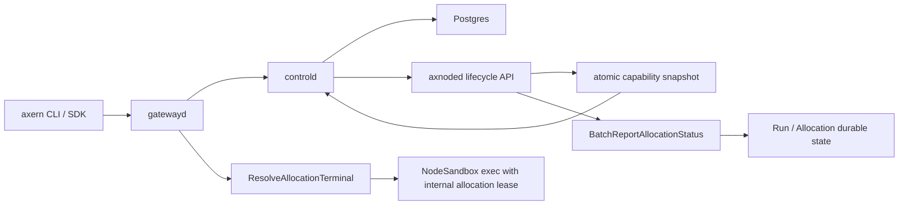

# Runtime Architecture

Axern V1 separates the durable control plane from node-local execution:

- `controld` owns catalog, environments, runs, allocations, reservations,
  execution leases, and tunnel sessions. The canonical durable execution model
  is `Environment -> Run -> Allocation`; SDK `Sandbox` objects are facades over
  that model rather than independent control-plane resources.
- `axnoded` owns node-local process/container execution and reports allocation
  status back to `controld`. Probe and lifecycle workers enqueue observations
  without waiting for control-plane I/O; the node reporter coalesces the latest
  state per allocation, preserves terminal state, and retries bounded batches
  with jittered exponential backoff. This queue is process-local; durable state
  remains in `controld` and node inventory repairs state after node restarts.
- `axnoded` also reports node inventory summaries that distinguish actively
  known allocations from the subset already `RUNNING`, so `controld` can
  reconcile missing allocations without failing normal startup in flight.
- Each node summary contains one atomic typed capability snapshot. Atomic means
  a coherent published generation, not simultaneous provider sampling; each
  observation retains its own sample time and independent expiry. Axnoded owns
  observations, the shared catalog owns derivation and loss policy, controld
  owns transaction-time placement admission, and axnoded owns allocation-time
  and periodic enforcement. See the
  [Observed Capability Providers](observed-capability-providers.md) contract;
  these platform capabilities are distinct from sandboxd operation discovery.
- `controld` persists node identities as active or retired. Retirement is an
  audited irreversible operation after workload, tunnel, lease, and retry
  state converges; retired identities are fenced from node auth and
  placement, and replacement hosts use new node IDs.
- The node summary includes an axnoded-owned aggregate `runtime_slots`
  contract. Its capacity starts from `max_instance_num`, enabled node-local
  pools constrain it, and disabled pools are omitted from that calculation.
  Controld rejects reports that omit the aggregate instead of reconstructing it
  from cgroup or interface diagnostics.
- Node inventory also carries imagemgr image inventory as separate
  imported-cache and mounted-workload counts. Imported images mean the image is
  present in the node-local `imagemgr` OCI cache; mounted images mean the image
  currently backs a workload rootfs mount.
  Rootfs sources are local directories or registry images (OCI/Nydus), not
  raw object-store mounts; explicit artifact delivery is a separate data path.
- Writable rootfs and workspace directories are allocation-local, with
  node-owned reservations and recovery records. They do not survive allocation
  replacement or node loss by contract. Durable outputs require explicit
  delivery; there is no generic volume class/claim/binding service. See
  [Storage Architecture](storage-architecture.md) for ownership and the
  historical-data upgrade boundary.
- Allocation lifecycle and exit status are control-plane-visible concerns.
  `axnoded` reports attempt-fenced observations and `controld` projects them
  into the owning Run without a Service readiness or replica state machine.
- Public workload API names are `Environment` and `Run`. `Allocation` is the
  concrete execution identity used by terminal, SSH, Tunnel, process, file,
  and administrative lifecycle operations.
- Catalog templates and environments are runtime-neutral. Workloads select
  `runsc` through `ExecutionConfig.runtime_class`; omitted values
  default to `runsc` in `controld` before placement and node lifecycle dispatch.
- Gateway-forwarded sandbox execution is authorized by revocable internal
  execution leases bound to `allocation_id`, `node_id`, `attempt`, and
  `lease_type`; clients send allocation ids to `gatewayd`, not node targets or
  lease tokens.

