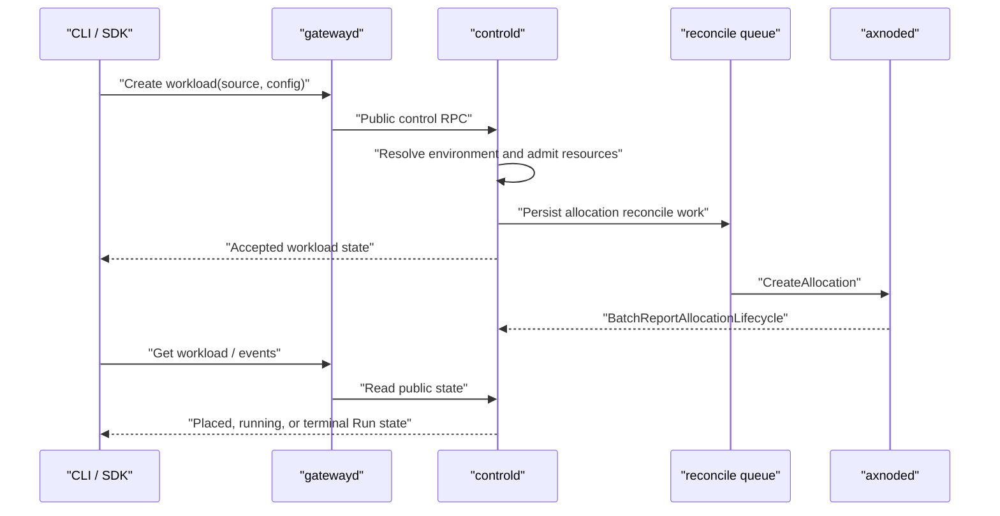
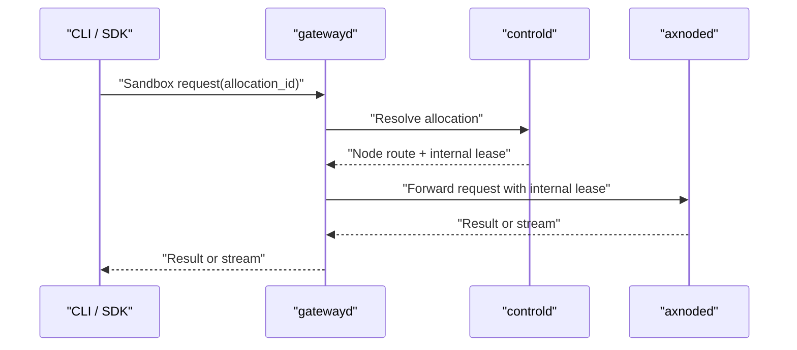

# Axern Workload Lifecycle

Public clients connect to gatewayd. Gatewayd exposes product APIs, resolves Allocation routing, obtains an AllocationAccessGrant from controld, and forwards sandbox traffic to axnoded. Clients never receive node targets or access tokens. Public sandbox messages therefore contain no credential field; gatewayd carries the token as private outgoing gRPC metadata that axnoded validates before acknowledging the operation. This data-plane grant is distinct from the heartbeat-delivered ExecutionLease that bounds sandbox liveness.

`Run` is the single public workload model: one execution owns one allocation and eventually records a terminal exit status. SDK Sandboxes use a detached Run while their client-managed session is active.

Runs use `Environment` as the execution source. A resource spec selects exactly one existing Environment, deployment-provided template identifier, or OCI image. Template and image inputs are resolved into an immutable Environment before admission. Admission freezes the normalized source and resolved runtime input on the Run; subsequent node creation and recovery do not read the reusable Environment row. Deleting that Environment is therefore a physical removal and cannot change an admitted Run. Templates are private control-plane configuration, not public product objects. `runsc` is the platform execution boundary and is not a workload-selectable field.

## Submit And Observe

Creation is a durable submit operation. Controld records the Run and Environment snapshots, its unique Allocation, resource charge, required Secret references, capability requirements, and reconcile work transactionally. Node startup, image preparation, and status reporting continue asynchronously. `--wait` observes the durable lifecycle rather than holding the create RPC open.

Foreground `axern run` returns the workload exit code after normal termination.

## Sandbox Data Plane

Cancellation atomically commits the Run terminal state, Allocation releasing state, lease revocation, and Allocation delete intent. A claimed background worker performs the node deletion; the request path never creates a best-effort second dispatch path. Node-control identity is mTLS based; node lifecycle APIs and lease replication are private implementation contracts.
