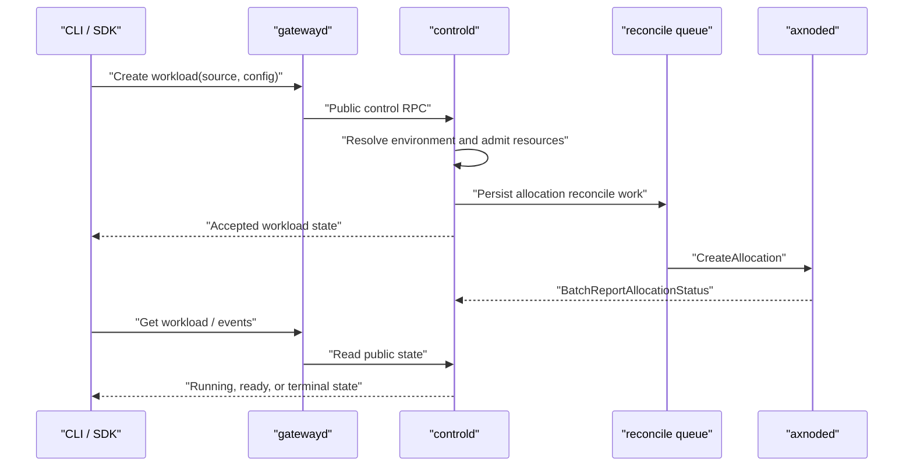
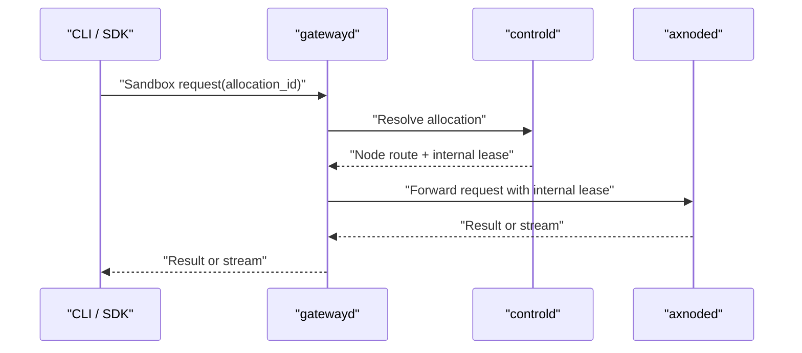

# Axern Workload Lifecycle

Public clients connect to gatewayd. Gatewayd exposes product APIs, resolves
allocation routing, obtains internal execution authorization from controld,
and forwards sandbox traffic to axnoded. Clients never receive node targets or
execution lease tokens.

Public workload models have separate semantics:

- `Run`: one-shot, single-allocation execution with terminal exit status.
- `Service`: long-running replica convergence, rollout, probes, and autoscaling.
- `Function`: named revisions, worker scaling, results, and invocation history.

All three use `Environment` as the execution source. A resource spec selects
exactly one existing environment, catalog template, or OCI image. Template and
image sources are resolved into an immutable environment before admission.
Runtime class belongs to execution config, not the environment.

## Submit And Observe

Creation is a durable submit operation. Controld records workload intent,
allocation, reservation, and reconcile work transactionally. Node startup,
image preparation, probes, and status reporting continue asynchronously.
`--wait` observes the durable lifecycle rather than holding the create RPC
open.

Foreground `axern run` returns the workload exit code after normal termination.
Service wait observes rollout, replica, readiness, and event state. Function
deploy observes its worker service through the Function deployment projection.

## Sandbox Data Plane

Cancellation revokes internal execution leases and reconciles allocation
deletion. Node-control identity is mTLS based; node lifecycle APIs and lease
replication are private implementation contracts.
