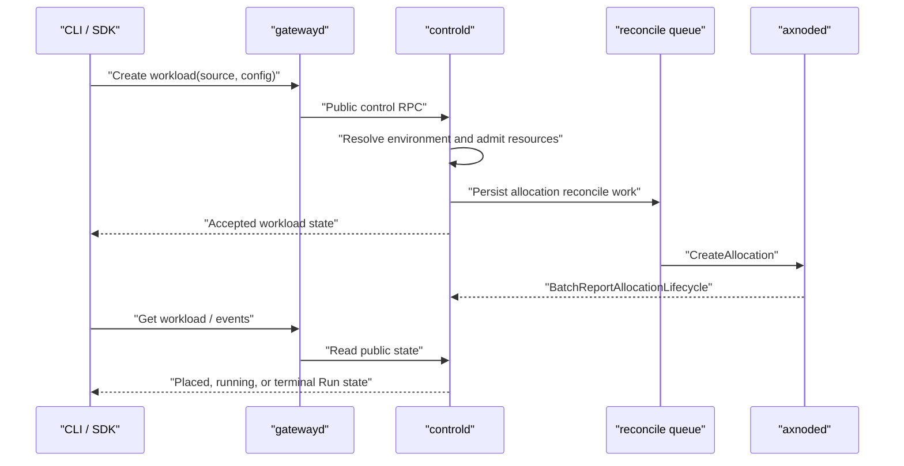
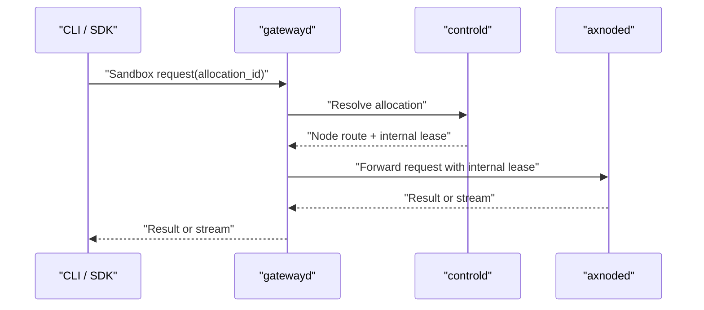

# Axern Workload Lifecycle

Public clients connect to gatewayd. Gatewayd exposes product APIs, resolves allocation routing, obtains internal execution authorization from controld, and forwards sandbox traffic to axnoded. Clients never receive node targets or execution lease tokens.

`Run` is the single public workload model: one execution owns one allocation and eventually records a terminal exit status. SDK Sandboxes use a detached Run while their client-managed session is active.

Runs use `Environment` as the execution source. A resource spec selects exactly one existing environment, catalog template, or OCI image. Template and image sources are resolved into an immutable environment before admission. `runsc` is the platform execution boundary and is not a workload-selectable field.

## Submit And Observe

Creation is a durable submit operation. Controld records workload intent, allocation, reservation, and reconcile work transactionally. Node startup, image preparation, and status reporting continue asynchronously. `--wait` observes the durable lifecycle rather than holding the create RPC open.

Foreground `axern run` returns the workload exit code after normal termination.

## Sandbox Data Plane

Cancellation revokes internal execution leases and reconciles allocation deletion. Node-control identity is mTLS based; node lifecycle APIs and lease replication are private implementation contracts.
