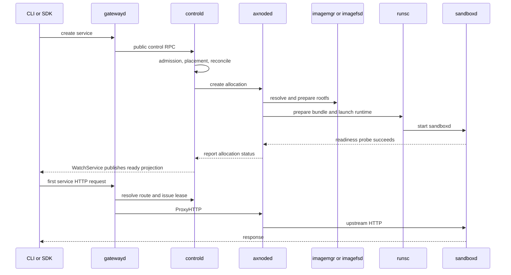

# Startup And Readiness Performance Contract

## Purpose

Axern startup performance must be attributable before it is optimized. A
production benchmark must show whether latency belongs to control-plane
admission, placement, node dispatch, image and rootfs preparation, runtime
launch, readiness probing, status projection, route publication, or the gateway
data plane.

Client latency alone is not an accepted performance result. Every baseline must
pair client samples with complete before/after Prometheus histogram deltas.

## Workload Model

Use the same image fixtures, runtime class, resource requests, topology, and
cache-state declaration for every comparison.

- `service-fanout`: `N` services with one replica each. This is the primary
  production model for many independent agent services.
- `service-replica-scale`: one service with `N` replicas. This isolates
  per-service rollout, projection, and lock contention.
- `sandbox`: transient SDK sandbox creation. This preserves the user-facing
  sandbox contract while sharing the service allocation path.

Service readiness is observed through the resumable `WatchService` stream.
Polling intervals must not be part of client readiness latency.

## Metric Contract

The startup benchmark consumes these low-cardinality Prometheus-exported OTel
histograms:

- `axern_controld_service_replica_stage_duration_seconds`
- `axern_controld_service_allocation_queue_duration_seconds`
- `axern_controld_service_transaction_stage_duration_seconds`
- `axern_controld_service_reconcile_stage_duration_seconds`
- `axern_controld_node_lifecycle_rpc_duration_seconds`
- `axern_controld_resource_admission_stage_duration_seconds`
- `axern_controld_allocation_status_report_stage_duration_seconds`
- `axern_controld_service_status_batch_stage_duration_seconds`
- `axern_controld_service_replica_ready_duration_seconds`
- `axern_controld_service_ready_duration_seconds`
- `axern_axnoded_startup_phase_duration_seconds`
- `axern_axnoded_startup_step_duration_seconds`
- `axern_axnoded_lifecycle_stage_duration_seconds`
- `axern_axnoded_allocation_status_queue_wait_duration_seconds`
- `axern_axnoded_readiness_wait_duration_seconds`
- `axern_axnoded_probe_attempt_duration_seconds`
- `axern_axnoded_readiness_probe_stage_duration_seconds`
- `axern_axnoded_control_plane_rpc_duration_seconds`
- `axern_imagemgr_timed_operation_stage_duration_seconds`
- `axern_gateway_service_proxy_stage_duration_seconds`
- `axern_axnoded_execution_lease_visibility_duration_seconds`
- `axern_axnoded_http_proxy_stage_duration_seconds`

Nydus cold-path attribution additionally requires
`imagefsd_cache_backend_fetch_duration_ms_milliseconds` and
`imagefsd_cache_inflight_wait_duration_ms_milliseconds`. Regional summaries
retain `node_id`, fetch `path`, and bounded result labels while using
`exported_instance` only to calculate reset-safe deltas. A cold Nydus result
without a foreground backend-fetch sample is incomplete.

Long-running and high-water runs also collect the standard OTel Go runtime
metrics for gateway heap, allocations, GC, goroutines, and scheduler latency.
Client success and stable request latency do not by themselves establish a
steady state.

Long-running validation additionally inspects
`axern_gateway_route_cache_entries_current` and
`axern_controld_postgres_pool_connections`. These gauges are deployment-state
snapshots, not before/after histogram deltas emitted in `metrics_summary`.

`service.instance.id` is a bounded process identity. Prometheus must preserve it
as `exported_instance` so cumulative streams from different process lifetimes
are not merged after a rollout. Benchmark deltas are reset-aware per exported
instance and, for node metrics, per node. Dashboards may aggregate the label
away after calculating a valid rate or delta.

Do not add service IDs, allocation IDs, image IDs, paths, or other workload
identities as metric labels. Use traces and structured logs for request-level
forensics.

## Stage Model

Gateway service HTTP stages have fixed semantics:

- `route_resolve`: control-plane route lookup only.
- `endpoint_select`: endpoint load-balancer selection.
- `node_proxy_round_trip`: gateway-to-axnoded `ProxyHTTP` call.
- `response_copy`: upstream response copied to the client.
- `total`: the complete proxied route, including route resolution, endpoint
  retries, node proxying, and response copy.

The axnoded HTTP proxy reports container IP lookup, container-port connect,
upstream round trip, stream pumping, and its own total independently.
`axern_axnoded_execution_lease_visibility_duration_seconds` reports whether
direct requests found the exact lease in cache, waited for an event, observed a
known-invalid lease, or timed out.

Allocation queue stages have fixed semantics:

- `claim_store`: Postgres claim operation for one durable batch.
- `due_lag`: time from the requested `next_run_at` until claim completion.
- `claim_wait`: time from actual durable eligibility until claim completion.
- `dispatcher_wait`: time from claim completion until worker dispatch.
- `total`: time from durable eligibility until worker dispatch.

`claim_wait` is the queue-delay signal. `due_lag` can include work before a queue
item becomes eligible and must not be reported as queue wait. Service
transaction `begin` latency and
`axern_controld_postgres_pool_connections{axern_state="acquired|max|total|idle"}`
separate database-pool contention from durable queue or dispatcher pressure.

## Cache-State Contract

OCI and Nydus comparisons must name both cache dimensions:

- **node state**: whether the runtime node has prepared the image/rootfs;
- **distribution state**: whether Dragonfly or the upstream registry path has
  fetched the required blobs.

Dragonfly-preheated blobs with a first imagemgr mount are distribution-warm and
node-cold. They are not a fully cold run. Warm results must be immediate repeats
with unchanged image digests and a declared prepared node set.

## Acceptance Gates

A run is accepted only when:

1. Every client phase has zero failures and cleanup succeeds.
2. Every `metrics_summary` has `complete=true` and no query errors.
3. Expected samples exist for controld replica ready, allocation claim wait,
   allocation dispatcher wait, allocation queue total, resource admission,
   axnoded runtime launch and readiness, gateway total, and axnoded proxy total.
4. Execution-lease visibility has one sample per first request and no `timeout`
   result.
5. Placement covers the intended runtime nodes without unexplained skew.
6. Image format and both cache dimensions are declared.
7. The compared runs use the same workload shape, resources, runtime class,
   image contents, and client behavior.
8. Gateway route, endpoint, quarantine, and in-flight cache entries are bounded
   by workload concurrency and configured limits; they must not track the
   cumulative number of short-lived services.
9. Gateway heap and RSS reach a bounded steady state after warmup and return to
   an explainable idle range after workload cleanup. A monotonic process-memory
   trend fails the run even when request latency remains within its SLO.
10. Nydus full-scan runs include reset-aware imagefsd read/cache byte deltas and
    Dragonfly Seed Client proxy/backend/traffic deltas. Mount paths and pod
    identities may be used to handle counter resets internally, but must not be
    retained in the aggregated evidence.

Timeout changes, resource expansion, hidden errors, or benchmark-definition
changes are not performance improvements.

## Optimization Order

1. Identify the dominant server-side stage at the target concurrency.
2. Confirm it with traces or structured logs when histogram labels are
   intentionally too coarse for a single request.
3. Change the owning subsystem, preserving benchmark semantics.
4. Rebuild and deploy only the affected components.
5. Repeat the same baseline and compare both client and server-side deltas.

Execution leases use a commit-driven control stream. Axnoded validates the exact
token carried by each request and waits on local cache visibility under the RPC
context; gateway must not add a fixed propagation delay.
