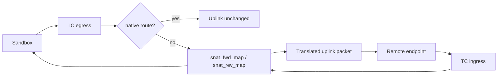

# bpfnet Architecture

## Scope

`bpfnet` is an IPv4 eBPF egress-NAT library embedded in `axnoded`. Its only durable domain input is node network configuration. Allocation identity and lifecycle remain owned by `axnoded`; ingress access remains owned by Allocation-scoped Tunnel and SSH sessions.

It does not own endpoint publication, service routing, host-port allocation, scheduling, or a second workload lifecycle.

## Ownership

| Owner | Facts | Does not own |
| --- | --- | --- |
| `axnoded` | bridge/veth/netns leases, selected NAT backend, SNAT GC schedule | eBPF object internals |
| `bpfnet.Controller` | current configured attach intent and diagnostic state | Allocation or endpoint identity |
| kernel maps/programs | live SNAT flow projection | durable workload intent |
| `bpfnetctl` | read-only inspection | attach, mutation, cleanup policy |

## Packet paths

| Path | Hook |
| --- | --- |
| sandbox TCP/UDP/ICMP egress SNAT | TC egress |
| egress reply restoration | TC ingress |
| native-routing CIDR bypass | TC egress |

TC ingress is required because reply restoration occurs before packets re-enter the sandbox network. It is not an inbound endpoint publication path.

## State model

| State | Class | Recovery |
| --- | --- | --- |
| configured CIDR, uplinks, native-route CIDRs | node configuration | reapplied by `EnsureAttached` |
| `dataplane_state.json` | diagnostic projection | overwritten after each attach attempt |
| config/uplink/native-route maps | rebuildable projection | reconciled from configuration and host interfaces |
| SNAT forward/reverse/marker maps | live kernel flow state | cleared on attach and bounded by GC while running |
| TC links and pinned programs | rebuildable projection | checked and reattached by `EnsureAttached` |

No endpoint-intent file or endpoint map exists. A daemon restart cannot recreate an externally published endpoint because bpfnet has no such product responsibility.

## Failure semantics

- Invalid or missing IPv4 sandbox CIDR fails attach.
- Uplink discovery, map reconciliation, program load, or either TC attachment failure fails the eBPF backend closed.
- `axnoded` does not silently mix iptables rules into an active eBPF backend.
- IPv6 nodes must explicitly select the separate iptables backend.
- Missing or stale SNAT mappings never grant ingress; they can only break the affected egress flow.

## Observability

`Status` exposes attach state, configured range, selected uplinks, map/program readiness, SNAT map occupancy, allocator pressure, close-path misses, and attach/reconcile errors. These are diagnostics and alerts, not alternative facts used to decide Allocation ownership.

The stable readiness contract is:

1. `TCReady` is true.
2. ingress and egress TC filters are attached.
3. every current pinned map and program is present and openable.

## Generation and verification

Changes to `internal/tcprog` must regenerate both endian loaders and object files with `make generate`, then pass `make generate-check`. Linux truth tests must cover TCP/UDP/ICMP egress, reply restoration, native-route bypass, map exhaustion, GC, and restart attach behavior.
