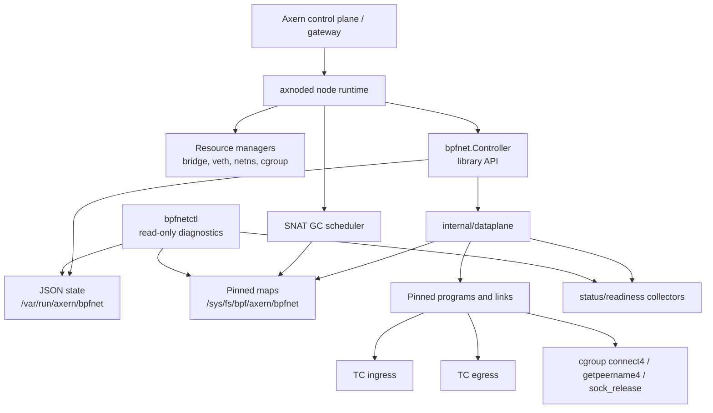
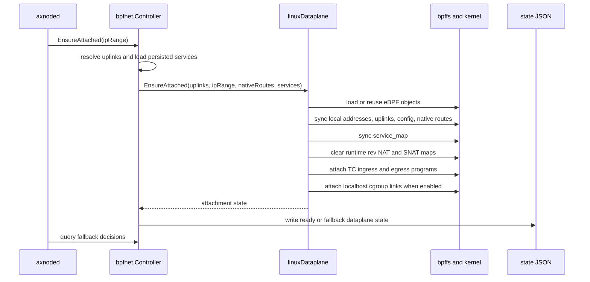
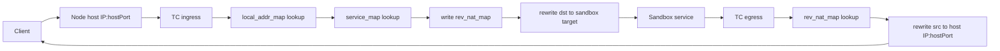
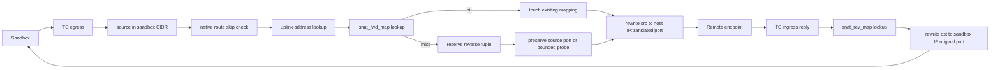
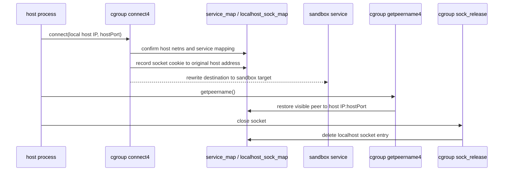
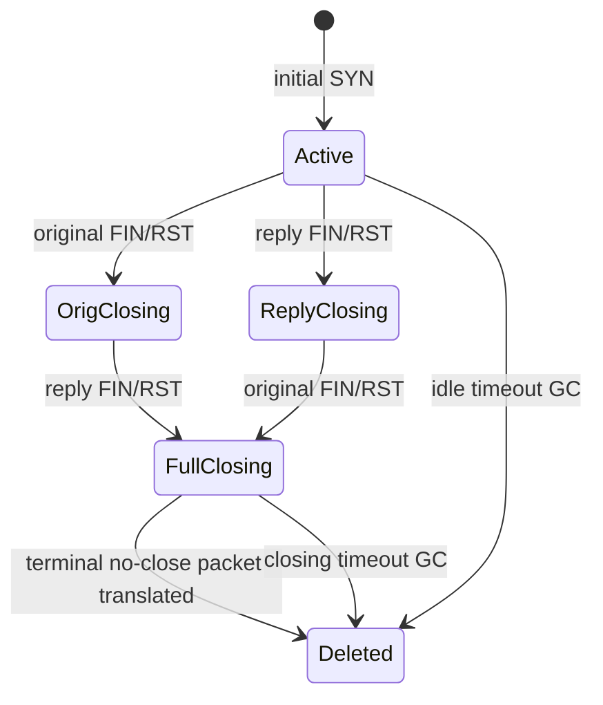
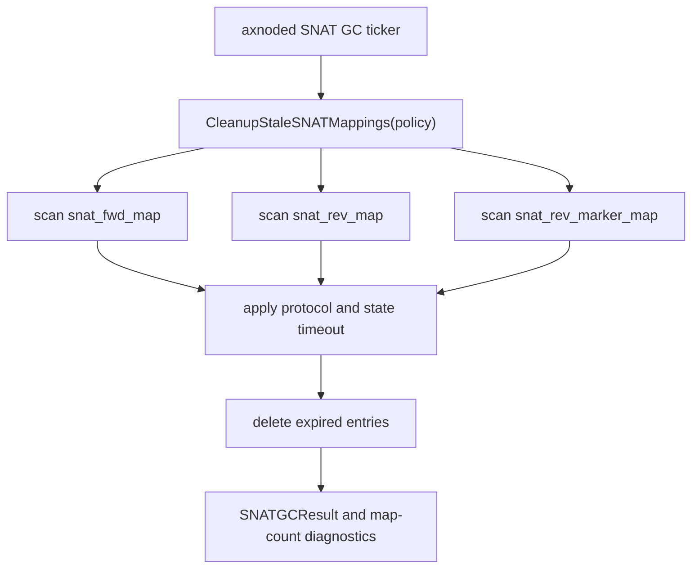

# bpfnet Architecture

This document describes the long-term architecture of `bpfnet`, Axern's
in-repo Linux eBPF NAT dataplane. It focuses on ownership boundaries, packet
paths, state, fallback, and observability. Use
[Production Replacement Baseline](production-replacement-baseline.md) for the
current performance and stability acceptance gates.
[Production Regression Runbook](production-regression-runbook.md) defines the
repeatable Kubernetes validation flow, and
[Production Alerting](production-alerting.md) defines the production alert
signals.

## Design Decision

`bpfnet` is the default production NAT dataplane for Axern Linux nodes when the
replacement baseline passes. It replaces the `iptables` backend for the
supported service and sandbox traffic shape while keeping `iptables` as an
explicit rollback backend.

The design keeps `bpfnet` as a library owned by the node runtime process. It is
not a daemon and does not own sandbox lifecycle, service lifecycle, scheduling,
or rollback policy.

## Goals

- Keep service ingress and sandbox egress NAT on the kernel fast path.
- Preserve the existing axnoded bridge/veth/netns resource model.
- Make attach and restart recovery idempotent through pinned eBPF state and
  persisted controller state.
- Keep fallback explicit and observable.
- Keep high-cardinality workload details out of metrics and use node-local
  diagnostics for packet-path investigation.
- Make short-connection churn, pooled TCP, UDP bursts, and rollout recovery
  measurable with stable acceptance gates.

## Non-Goals

- `bpfnet` does not create, delete, or schedule sandboxes.
- `bpfnet` does not replace axnoded as the owner of service intent.
- `bpfnet` does not run as a separate long-lived daemon.
- Linux localhost UDP hostPort support is out of scope.
- Native IPv6 eBPF dataplane support is out of scope. Axnoded may select its
  explicit bridge/ip6tables compatibility path for an IPv6 sandbox pool, and
  must expose that effective backend as bridge rather than bpfnet capability.

## Ownership Model

| Component | Owns | Does not own |
| --- | --- | --- |
| `runtime/axnoded` | sandbox lifecycle, bridge/veth/netns resources, service hostPort intent, backend selection, rollback policy, SNAT GC scheduling | eBPF program internals |
| `network/bpfnet.Controller` | public library API, persisted dataplane state, service-map persistence, fallback decisions | sandbox allocation records |
| `network/bpfnet/internal/dataplane` | Linux attach/reconcile, pinned maps, pinned programs, TC links, localhost cgroup links, map inspection | axnoded resource pools |
| `network/bpfnet/internal/tcprog` | TC and cgroup eBPF programs, map schemas, packet parsing and rewriting | user-facing configuration |
| `bpfnetctl` | read-only node-local diagnostics | service intent, attach lifecycle, cleanup, fallback policy |
| axnoded benchmark harness | production-like verification and regression data | production traffic routing |

## Supported Dataplane Scope

| Path | Scope | Primary program |
| --- | --- | --- |
| External service ingress | IPv4 TCP/UDP hostPort DNAT to sandbox IP and port | TC ingress |
| Service reply restoration | IPv4 TCP/UDP reply source restoration to node host IP and hostPort | TC egress |
| Sandbox egress SNAT | IPv4 TCP/UDP/ICMP echo from sandbox CIDR to external destinations | TC egress |
| Sandbox egress reply restoration | IPv4 TCP/UDP/ICMP echo reply to sandbox IP and original port/ID | TC ingress |
| Host-local TCP hostPort | Linux localhost TCP connect/getpeername compatibility | cgroup hooks |
| Native routing skip | CIDR allowlist for destinations that should not be SNATed | TC egress |

## Attach And Reconcile

`EnsureAttached` is a reconcile entrypoint. It must be safe after axnoded
restart, partial bpffs cleanup, stale pinned objects, and service-map drift.

If TC attach or required map reconciliation fails and `iptables_fallback` is
enabled, the controller records full fallback state and lets axnoded use the
`iptables` backend. If only the localhost cgroup path is unavailable, axnoded
may use TCP localhost compatibility through `iptables` while TC ingress and
egress remain on eBPF.

## Service Ingress Path

External service ingress uses a compact hostPort service map. The map key is
`(protocol, host_port)` and the value is `(target_ip, target_port)`.

The reverse map is intentionally runtime state. It is cleared on attach because
service reply restoration is tied to live flows, not durable service intent.

## Sandbox Egress SNAT Path

Sandbox egress SNAT is the highest-risk hot path because short-connection churn
stresses allocation, reverse lookup, and cleanup. The TC egress program only
acts on packets whose source IP is in the configured sandbox CIDR and whose
destination is not in the native-routing allowlist.

TCP first tries to preserve the sandbox source port. When the reverse tuple is
already in use, the allocator probes the fixed translated-port range
`10000-65535` with a bounded hash/stride sequence. The hash seed includes the
sandbox source IP so multi-client short-connection churn does not collapse onto
one probe window.

UDP keeps a reverse mapping for reply restoration. When the translated port
differs from the original source port, an alias entry preserves stable reuse for
the same unconnected UDP flow shape. ICMP echo uses the echo ID as the
translated identifier.

## Localhost TCP HostPort Path

Linux localhost TCP hostPort access cannot be handled by TC ingress because the
connection starts from the host network namespace. `bpfnet` handles this path
with cgroup hooks when the kernel exposes the required netns-cookie behavior.

When this path is unavailable, `localhost-tcp-iptables-compat` is acceptable as
long as TC ingress and egress are attached. Its OUTPUT rule must match only
host-local destinations; a port-only rule can capture direct node-to-sandbox
traffic such as readiness probes. Axnoded reconciles BPFNet's durable service
intent against live sandbox DNAT ownership during recovery so mappings from
deleted sandboxes do not survive a daemon restart. `iptables-full-fallback`
means bpfnet did not take over the main dataplane and is not a valid production
replacement state.

## State And Maps

`bpfnet` deliberately separates durable intent from live flow state.

| State | Location | Meaning |
| --- | --- | --- |
| `dataplane_state.json` | state path | last attach result, fallback mode, uplinks, local addresses, config summary |
| `service_map.json` | state path | durable hostPort service intent known to bpfnet |
| `stats.json` | state path | controller-level attach/upsert/delete/fallback counters |
| `service_map` | bpffs | kernel hostPort DNAT intent |
| `local_addr_map` | bpffs | node-local IPv4 addresses accepted for service ingress |
| `uplink_addr_map` | bpffs | uplink ifindex to node source IPv4 address |
| `config_map` | bpffs | sandbox CIDR and native-route enablement |
| `native_route_map` | bpffs | CIDRs skipped by SNAT |
| `rev_nat_map` | bpffs | live service-ingress reply restoration state |
| `snat_fwd_map` | bpffs | sandbox original flow to translated host tuple |
| `snat_rev_map` | bpffs | translated reverse tuple to sandbox target |
| `snat_rev_marker_map` | bpffs | TCP reverse tuple marker for risk counters |
| `localhost_sock_map` | bpffs | host socket cookie to visible localhost peer |
| `stats_map` | bpffs | per-CPU kernel datapath counters |

Pinned maps and programs are the kernel recovery boundary. JSON files are the
controller recovery and inspection boundary. `bpfnetctl` reads both, but writes
neither.

## SNAT Lifecycle

TCP mappings keep explicit close state so short-connection churn can reclaim
translated ports without breaking final packets.

For TCP, a full-closing mapping may be reclaimed immediately when a new initial
SYN needs the same reverse tuple. Marker-gated counters distinguish expected
late close-tail packets from correctness risk:

- `snatTcpNonSynMissFwdLookups` can grow from late local FIN/RST/ACK packets
  after the forward mapping was already released.
- `snatTcpReverseMissSynAcks` is a risk signal because an inbound SYN-ACK missed
  a reverse tuple bpfnet previously managed.
- `snatTcpNonSynMissFwdHostMismatches` is a risk signal because a forward tuple
  no longer points at the expected host translation.

UDP and ICMP use datagram idle timeout. The production default is optimized for
short-message bursts:

- TCP active idle timeout: owned by axnoded config, default `5m`
- TCP closing timeout: `2s`
- UDP/ICMP datagram idle timeout: `10s`
- GC interval: `1s`

## Fallback Model

Fallback is a controlled operational state, not a hidden packet-path feature.

| State | Meaning | Production replacement interpretation |
| --- | --- | --- |
| TC ingress and egress attached | Main service and sandbox NAT paths run through bpfnet | Required |
| `localhost-tcp-iptables-compat` | Localhost TCP hostPort uses iptables compatibility, TC remains eBPF | Acceptable |
| `iptables-full-fallback` | TC dataplane did not attach or was not usable | Not acceptable for replacement |
| Unsupported protocol fallback | Non-TCP/UDP service intent is handled outside bpfnet | Expected |
| IPv6 bridge compatibility | An IPv6 sandbox pool uses axnoded's ip6tables path and publishes bridge capability | Expected; not a native bpfnet result |

`NeedsSNATFallback`, `NeedsFullDNATFallback`, and `NeedsLocalhostCompat` read
persisted dataplane state instead of transient in-memory booleans. That makes
restart recovery and diagnostics line up with the actual node state.

## Observability And Debugging

Production readiness depends on a small set of durable signals:

| Signal | Healthy direction |
| --- | --- |
| `bpfnetctl check --json` | `.ok=true` on every node |
| `axern_controld_node_bpfnet_current` | enabled and ready are `1`; fallback states are `0` |
| TC attachment | ingress and egress attached on every uplink |
| pinned maps/programs | ready |
| `snatAllocExhausted` | `0` |
| `snatTcpReverseMissSynAcks` | `0` |
| `snatTcpNonSynMissFwdHostMismatches` | `0` |
| post-GC TCP maps | forward and reverse entries drain to `0` |
| UDP translated ports | bounded by datagram idle window and drain after GC grace |

Use `bpfnetctl status --json` for readiness and counters, `bpfnetctl maps` for
map counts, and `bpfnetctl dump ...` for node-local forensic debugging. Do not
put service IDs, allocation IDs, image IDs, or paths into Prometheus labels.

## Validation Relationship

The architecture is considered production-ready for the supported traffic shape
only when the replacement baseline passes:

- eBPF benchmark failures are zero.
- Allocator exhaustion and marker-gated risk counters are zero.
- TCP steady-state paths are in the same performance class as `iptables`.
- TCP short-connection churn is at least production-comparable and preferably
  materially better than `iptables`.
- UDP burst retention is bounded by the configured datagram idle timeout.
- DaemonSet rollout returns every node to ready and post-rollout smoke passes.

The benchmark harness belongs to `runtime/axnoded` because it exercises the real
node runtime integration. The architectural truth remains here in `bpfnet`; the
measured replacement truth lives in
[Production Replacement Baseline](production-replacement-baseline.md).

## Change Rules

- Keep `bpfnet` library-only unless there is an explicit new design.
- Keep axnoded as the owner of service intent and sandbox lifecycle.
- Update axnoded integration docs when fallback semantics, config fields, pin
  paths, or supported packet paths change.
- Update the replacement baseline when acceptance gates or reference benchmark
  numbers change.
- Prefer deleting obsolete packet paths over keeping compatibility layers during
  active development.
