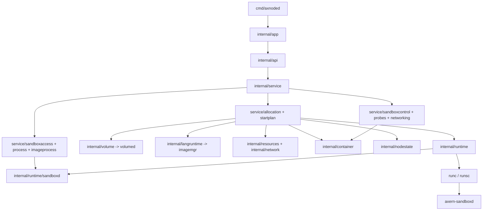
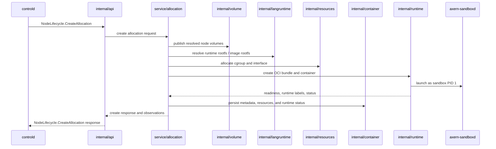
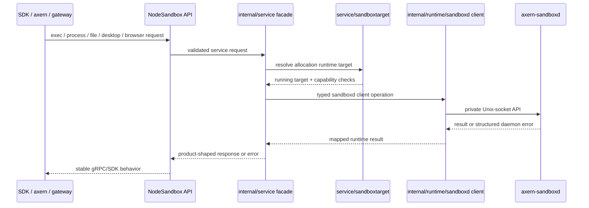

# Axnoded Architecture

This document is the internal architecture map for `runtime/axnoded`. Use
[Runtime Stack](../../../.x/runtime-stack.md) for cross-subsystem topology and
[AGENTS.md](../AGENTS.md) for package-boundary rules.

## Internal Layers

Layer ownership:

- `internal/app` wires config, dependencies, servers, and lifecycle startup.
- `internal/api` maps gRPC/HTTP requests to service interfaces.
- `internal/service` owns API-facing orchestration and delegates to focused
  subdomains.
- `internal/runtime` owns OCI runtime handlers, bundle creation, runtime state,
  and host-side sandboxd clients.
- `internal/sandboxd` is the sandbox-local daemon implementation.
- `internal/langruntime`, `internal/volume`, `internal/resources`, and
  `internal/container` own rootfs/image coordination, node-volume publish,
  cgroup/network resources, and persisted container state.
- `internal/nodestate` owns the process-wide BoltDB handle and low-level record
  transactions. Allocation orchestration owns the schema and keeps runtime
  template identity plus image/workspace ownership in one record per allocation.

## Create Allocation Flow

Create invariants:

- `controld` owns placement and sends resolved inputs; `axnoded` owns node-local
  materialization.
- Resolved volumes are published through `volumed`; `axnoded` does not call
  `storaged` directly.
- Rootfs/image resolution goes through `internal/langruntime` and `imagemgr`.
- Resource claims must be persisted in OCI annotations so delete and recovery
  can reconstruct cleanup from stored state.
- Runtime template identity and image/workspace ownership are committed in one
  allocation record. Durable deletion precedes releasing in-memory handles, so
  a failed state write cannot silently discard cleanup ownership.
- Recovery scans records independently, removes records with no live container,
  and suppresses destructive image-lease reconciliation whenever any live
  allocation cannot be reconstructed completely. Incomplete live recovery
  fails node startup instead of advertising a partially recovered runtime.
- Execution-envelope and warm-runtime paths may satisfy create before the
  fallback OCI create path; both paths must preserve the same status and
  resource contracts.
- Sandboxd readiness and baseline capabilities fail closed for normal
  sandboxd-backed OCI workloads, except for the documented short-lived clean
  runtime exit before readiness.

## Sandbox Operation Flow

Operation invariants:

- SDKs and CLIs use product APIs; sandboxd sockets stay private to `axnoded`.
- Service code dispatches through typed runtime sandboxd clients, not raw daemon
  endpoint strings.
- Public capability discovery uses `NodeSandbox.CapabilityStatus`; raw daemon
  diagnostics remain local operator data.
- Optional provider failures are scoped to the requested operation and must not
  make generic sandbox lifecycle fail.

## Change Routing

| Change Area | Start With |
| --- | --- |
| Package ownership or layering | [AGENTS.md](../AGENTS.md) |
| Cross-runtime sockets, storage, imagemgr, bpfnet, or gateway relationships | [Runtime Stack](../../../.x/runtime-stack.md) |
| Config fields and local profiles | [Configuration](configuration.md) |
| Resource claims, pools, accounting, or network backend behavior | [Resource Management](resource.md) |
| Sandboxd injection, PID 1 lifecycle, or daemon API boundary | [Sandbox Daemon](sandbox-daemon.md) |
| Sandboxd provider state, optional capabilities, or product error shape | [Sandboxd Capabilities And Providers](sandboxd-capabilities.md) |
| Required validation | [Verification](verification.md) |
