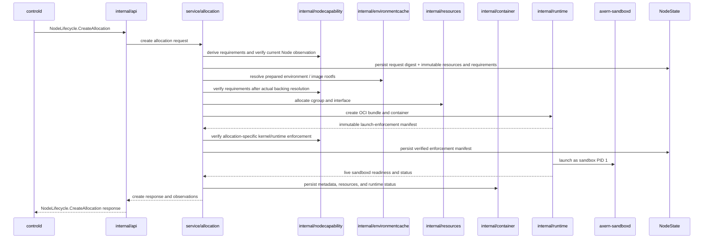
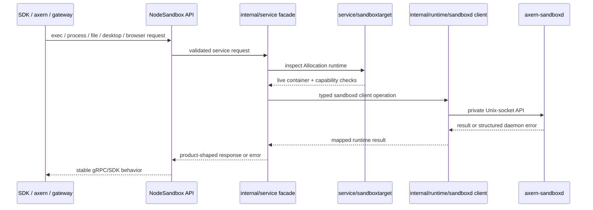

# Axnoded Architecture

This document is the internal architecture map for `runtime/axnoded`. Use [Runtime Stack](../../../.x/runtime-stack.md) for cross-subsystem topology and [AGENTS.md](../AGENTS.md) for package-boundary rules.

## Internal Layers

Layer ownership:

- `internal/app` wires config, dependencies, servers, and lifecycle startup.
- `internal/api` maps gRPC/HTTP requests to service interfaces.
- `internal/service` owns API-facing orchestration and delegates to focused subdomains.
- `internal/runtime` owns the single runsc executor, bundle creation, runtime state, and host-side sandboxd clients. Its interface is a narrow execution/test boundary, not a plugin registry or Allocation-selectable backend.
- `internal/sandboxd` is the sandbox-local daemon implementation.
- `internal/environmentcache`, `internal/egress`, `internal/resources`, and `internal/container` own rootfs/image coordination, egress enforcement, cgroup/network resources, and persisted container state.
- `internal/nodestate` owns the process-wide BoltDB handle and low-level record transactions. Allocation orchestration owns the schema and keeps environment template identity plus image/workspace ownership in one record per allocation.
- `internal/nodecapability` owns provider registration, atomic snapshots, recovery hysteresis, and the node-local admission view. The shared capability contract owns derivation and loss policy; providers do not write node summaries directly. Production startup verifies that every defined key has exactly one registered provider matching the definition owner.

The cross-system capability contract is documented in [Observed Capability Providers](../../../docs/architecture/observed-capability-providers.md). It is distinct from sandboxd operation discovery described later in this document.

## Node Persistence And Fact Ownership

The globally unique Allocation ID is the only execution identity. There is no Allocation-to-container mapping: lifecycle creation passes the Allocation ID directly as the runtime container ID and rejects a different returned ID. OCI labels, annotations, name prefixes, field presence, and zero values are never admission or ownership evidence.

| State | Authority and crash requirement | Recovery rule |
| --- | --- | --- |
| Controld PostgreSQL Allocation | Cluster lifecycle, placement, node binding, lease and tunnel routing authority | A node report is accepted only for the admitted binding; node-local labels cannot create one |
| Axnoded `AllocationState` | The sole node-local admission and execution record for one Allocation: exact node binding, canonical request digest, immutable resource/capability requirements, runtime/image ownership, verified enforcement manifest, and pending fail-stop work | Created only by the private lifecycle API. Exact retries are idempotent; a conflicting node or request is rejected. Node-local sessions and conformance probes remain in memory. A live runtime without this complete record makes recovery fail closed |
| Container metadata/config | Runtime handler inputs only | Runtime existence cannot authorize durable recovery. A container with no admitted `AllocationState` is a node-local execution and is discarded after restart; conditions and Node observations are rebuilt rather than persisted here |
| Runtime checkpoint (`status.pb`) | The local lifecycle barrier for init PID/start time and the exact terminal result obtained from runsc `Wait`; it never duplicates Allocation resources, admission, or enforcement | A missing checkpoint is `UNKNOWN`, never implicitly running. Live runsc inventory refreshes only runtime identity. An exited runtime without a terminal checkpoint must be recovered through `Wait` before outbox publication or runtime deletion; an unavailable exact result fails startup closed |
| Cgroup ledger | Resource ownership, admission commitment, `RETIRING` cleanup debt, and boot/mount/inode fencing; required across restart | Re-read kernel state and retain conservative charges until the exact fenced cgroup is clean |
| Egressd policy record | Complete normalized policy and sandbox IP for one Allocation; required across restart | Rebuild nftables/DNS/L7 projections from this record, then delete records whose durable Allocation execution is absent |
| Terminal lifecycle outbox | First immutable terminal observation awaiting controld acknowledgement; required only until acknowledgement | Seed it from a terminal runtime checkpoint only for an admitted Allocation record; retry exact observation and delete by compare-and-swap after acknowledgement |
| Node inventory, locality, sandboxd diagnostics, runtime and kernel observations | Rebuildable projections, never admission facts | Recompute after the runsc executor and durable owners have recovered; do not persist another cache |

The immutable verified enforcement manifest and cgroup ledger deliberately have different ownership even where observations overlap: the former records what the runtime verified at creation and is never rewritten; the latter is the mutable resource/retirement authority. The terminal outbox is likewise not a lifecycle database—it exists only because runtime cleanup may remove the terminal checkpoint before the control-plane RPC is acknowledged.

Recovery ordering is strict: load the complete runsc inventory and local checkpoints, load admitted `AllocationState` records, and classify the complete inventory before deletion. A persisted create intent with no runtime is rolled back through the ordinary failed-start cleanup path. An OCI container still in `created` state is also rolled back because the workload never crossed OCI start. A running or unknown admitted container without a verified enforcement manifest is retained fail-closed and keeps the node NotReady. For a runsc container already in `exited`, recovery obtains the exact `Wait` result and commits the terminal runtime checkpoint before seeding the lifecycle outbox or deleting runtime state; inventory status alone is never terminal evidence. Only then does recovery seed admitted terminal observations, discard containers with no admitted Allocation record, restore durable Allocation state, and reconcile cgroup, egress, runtime storage, and resource ownership. A live execution with an incomplete or conflicting admitted record keeps the node NotReady before destructive orphan cleanup.

The deterministic crash matrix is:

| Last durable barrier | Runtime observation after restart | Recovery action |
| --- | --- | --- |
| no Allocation admission | absent | discard partial runtime artifacts; no lifecycle report |
| admitted Allocation, no runtime | absent | ordered failed-start cleanup and terminal failure report |
| typed cgroup/network leases | absent | release through the normal idempotent cleanup path; never infer ownership from OCI metadata |
| runtime created, not started | `created` | force-delete, then ordered resource and storage cleanup |
| runtime started, no verified enforcement manifest | `running` or `unknown` | retain everything, keep the node NotReady, and require operator/recovery resolution |
| verified enforcement manifest | `running` or `unknown` | restore monitoring and the admitted Allocation without rewriting immutable facts |
| exact terminal checkpoint | `exited` or absent | seed/replay the terminal outbox, acknowledge controld, then clean up |
| resource release persistence failed | runtime absent | retain/quarantine the durable lease and retry; do not return capacity to the pool |

Inventory active IDs come from admitted `AllocationState` records plus their unacknowledged terminal outbox entries. Running IDs and locality are live joins against runtime state and the environment template already held by `AllocationState`; arbitrary internal containers and container labels cannot enter the control-plane Allocation inventory.

Rootfs handling follows the three-boundary contract in [rootfs-storage.md](rootfs-storage.md): host target projection, runtime-specific guest writable storage, and cgroup memory enforcement are independent. The input lower rootfs is immutable across create, start, failure rollback, and delete.

## Create Allocation Flow

Create invariants:

- `controld` owns placement and sends resolved inputs; `axnoded` owns node-local materialization.
- The lifecycle adapter preserves resolved secrets, registry credentials, ports, network mode, and egress policy as typed fields through the node service boundary. The complete request is validated before its canonical digest and before node-local side effects; malformed security inputs fail closed rather than becoming empty defaults. OCI annotations contain only runtime projection data and never carry caller-selected execution behavior.
- Capability requirements are derived locally and checked against the supplied immutable set and current Node observation before materialization. Actual-backing requirements are re-derived after the image mount lease is acquired and before bundle/runtime side effects.
- The canonical request digest, immutable resource specification, and immutable requirements are the first persisted Allocation side effect. Idempotent retries of a live Allocation must match that digest and reuse the verified enforcement manifest without retroactively applying changed Node observations. Admission, runtime create, post-create verification, replay, and Delete share one Allocation lifecycle lock. Conditions are rebuilt and reported, never persisted in `AllocationState`.
- Runtime handlers must publish an immutable launch-enforcement manifest. Runtime-specific hard enforcement is checked after create, immediately after relevant events, and by a bounded sharded audit of cheap controls, identities, and PID membership. Destructive conformance is not a runtime audit. Failure uses the durable, detached allocation termination path rather than the caller's cancelable context.
- The allocation parent is the authoritative memory safety boundary and requires cgroup v2 `memory.max`, `memory.swap.max=0`, and `memory.oom.group=1` readback. The workload leaf is the OCI/runtime contract and attribution boundary; its runtime-created limit/swap controls, stable cgroup identity, and PID membership are verified without installing a second authoritative Axern limit. The host memcg is the total sandbox budget, including runsc runtime processes and guest accounting plus lower/upper page cache. Axnoded has no cgroup v1, runtime-overhead reservation, or ignored-resource fallback for this contract.
- Writable rootfs and workspace directories are allocation-local. Their runtime ownership, storage reservations, recovery, and cleanup remain node-owned; durable outputs are exported explicitly.
- Rootfs/image resolution goes through `internal/environmentcache` and `imagemgr`.
- Runtime cleanup inputs may be checkpointed in container metadata, but OCI annotations are never resource ownership or Allocation identity. Durable `AllocationState`, the cgroup ledger, and egressd records own their respective cleanup obligations.
- Environment template identity and image/workspace ownership are committed in one allocation record. Durable deletion precedes releasing in-memory handles, so a failed state write cannot silently discard cleanup ownership.
- Immutable requirements, the verified enforcement manifest, and the latest pending Node observation sequence share the Allocation record. Per-Allocation mutation serialization prevents concurrent updates from reverting newer intent. Capability fail-stop termination has one durable node-local owner.
- Reconcile acknowledgement failures retain pending work for retry. Event-triggered reconciliation plus the bounded sharded audit covers both `DEGRADE` and `FAIL_STOP`; each pass rebuilds one complete condition projection. There is no control-plane capability reconcile queue.
- Recovery distinguishes an admitted create intent from an execution with a verified enforcement manifest without adding a second durable lifecycle object. Absence from a complete runsc inventory proves an intent has no runtime; runsc `created` proves the workload never started. Both use ordered failed-start cleanup. Running or unknown runtime state without verified enforcement remains untouched and fails node startup. Image-lease reconciliation is suppressed whenever any retained live Allocation cannot be reconstructed completely.
- Persistent-state recovery starts only after the configured runsc executor has loaded. Transient host cleanup, filestore, or runtime-state contention keeps the process NotReady and retries with bounded exponential backoff until the process context is canceled; there is no partial execution stack.
- Sandboxd readiness and baseline capabilities fail closed for normal sandboxd-backed OCI workloads, except for the documented short-lived clean runtime exit before readiness.

## Sandbox Operation Flow

Operation invariants:

- SDKs and CLIs use product APIs; sandboxd sockets stay private to `axnoded`.
- Service code dispatches through typed runtime sandboxd clients, not raw daemon endpoint strings.
- Public capability discovery uses `NodeSandbox.CapabilityStatus`; raw daemon diagnostics remain local operator data.
- Sandboxd socket paths are derived from the configured runtime root and the explicit Allocation ID. Readiness and supported operations are queried live; container labels are not a capability cache.
- Optional provider failures are scoped to the requested operation and must not make generic sandbox lifecycle fail.

## Change Routing

| Change Area                                                                  | Start With                                                                                   |
| ---------------------------------------------------------------------------- | -------------------------------------------------------------------------------------------- |
| Package ownership or layering                                                | [AGENTS.md](../AGENTS.md)                                                                    |
| Cross-runtime sockets, storage, imagemgr, bpfnet, or gateway relationships   | [Runtime Stack](../../../.x/runtime-stack.md)                                                |
| Config fields and local profiles                                             | [Configuration](configuration.md)                                                            |
| Resource claims, pools, accounting, or network backend behavior              | [Resource Management](resource.md)                                                           |
| Observed node facts, capability policy, admission evidence, or enforcement loss | [Observed Capability Providers](../../../docs/architecture/observed-capability-providers.md) |
| Sandboxd injection, PID 1 lifecycle, or daemon API boundary                  | [Sandbox Daemon](sandbox-daemon.md)                                                          |
| Sandboxd provider state, optional capabilities, or product error shape       | [Sandboxd Capabilities And Providers](sandboxd-capabilities.md)                              |
| Required validation                                                          | [Verification](verification.md)                                                              |
