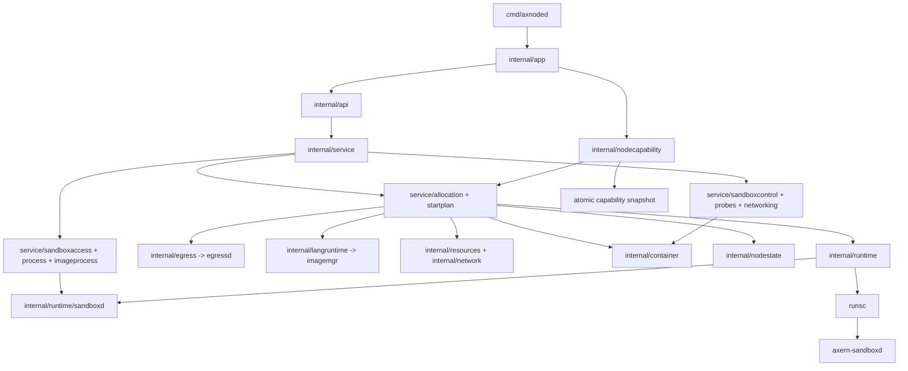
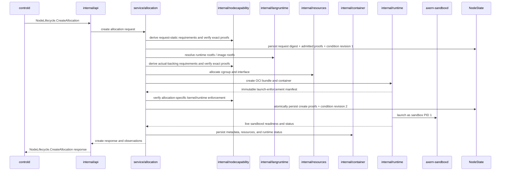
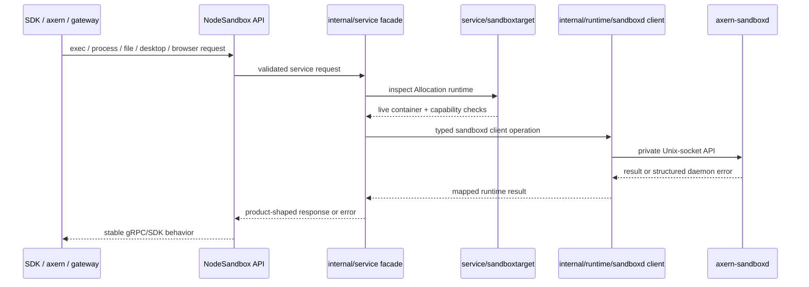

# Axnoded Architecture

This document is the internal architecture map for `runtime/axnoded`. Use [Runtime Stack](../../../.x/runtime-stack.md) for cross-subsystem topology and [AGENTS.md](../AGENTS.md) for package-boundary rules.

## Internal Layers

Layer ownership:

- `internal/app` wires config, dependencies, servers, and lifecycle startup.
- `internal/api` maps gRPC/HTTP requests to service interfaces.
- `internal/service` owns API-facing orchestration and delegates to focused subdomains.
- `internal/runtime` owns OCI runtime handlers, bundle creation, runtime state, and host-side sandboxd clients.
- `internal/sandboxd` is the sandbox-local daemon implementation.
- `internal/langruntime`, `internal/egress`, `internal/resources`, and `internal/container` own rootfs/image coordination, egress enforcement, cgroup/network resources, and persisted container state.
- `internal/nodestate` owns the process-wide BoltDB handle and low-level record transactions. Allocation orchestration owns the schema and keeps runtime template identity plus image/workspace ownership in one record per allocation.
- `internal/nodecapability` owns provider registration, atomic snapshots, recovery hysteresis, and the node-local admission view. The shared catalog owns derivation and loss policy; providers do not write node summaries directly. Production startup verifies that every catalog key has exactly one registered provider matching the catalog owner.

The cross-system capability contract is documented in [Observed Capability Providers](../../../docs/architecture/observed-capability-providers.md). It is distinct from sandboxd operation discovery described later in this document.

## Node Persistence And Fact Ownership

The globally unique Allocation ID is the only execution identity. There is no Allocation-to-container mapping: lifecycle creation passes the Allocation ID directly as the runtime container ID and rejects a different returned ID. OCI labels, annotations, name prefixes, field presence, and zero values are never admission or ownership evidence.

| State | Authority and crash requirement | Recovery rule |
| --- | --- | --- |
| Controld PostgreSQL Allocation | Cluster lifecycle, placement, node binding, lease and tunnel routing authority | A node report is accepted only for the admitted binding; node-local labels cannot create one |
| Axnoded `ControlPlaneAllocationBinding` | The sole node-local proof that controld admitted one Allocation ID to this exact node, fenced by the canonical request digest | Created only by the private lifecycle API; exact retries are idempotent and a conflicting node or request is rejected |
| Axnoded `AllocationState` | One node-local execution contract: request digest, runtime/image ownership, admitted capability evidence, current conditions, launch verification and pending fail-stop work; required across restart | A durable live runtime without a complete record makes recovery fail closed; an absent record is never reconstructed from OCI metadata |
| Container metadata/config/status | Runtime handler inputs, process/output checkpoint, and explicit `DURABLE` or `DISCARD_ON_RESTART` recovery mode only | Durable recovery additionally requires both authorities above. Node-local sessions and self-tests are deleted after restart and can never authorize reporting |
| Cgroup ledger | Resource ownership, admission commitment, `RETIRING` cleanup debt, and boot/mount/inode fencing; required across restart | Re-read kernel state and retain conservative charges until the exact fenced cgroup is clean |
| Egressd policy record | Complete normalized policy and sandbox IP for one Allocation; required across restart | Rebuild nftables/DNS/L7 projections from this record, then delete records whose durable Allocation execution is absent |
| Terminal lifecycle outbox | First immutable terminal observation awaiting controld acknowledgement; required only until acknowledgement | Seed it from a terminal runtime checkpoint only for an exact control-plane binding; retry exact observation and delete by compare-and-swap after acknowledgement |
| Node inventory, locality, sandboxd diagnostics, runtime and kernel observations | Rebuildable projections, never admission facts | Recompute after all runtime handlers and durable owners have recovered; do not persist another cache |

The immutable launch-verification fields and cgroup ledger deliberately have different ownership even where evidence overlaps: the former records what the runtime proved at creation and is never rewritten; the latter is the mutable resource/retirement authority. The terminal outbox is likewise not a lifecycle database—it exists only because runtime cleanup may remove the terminal checkpoint before the control-plane RPC is acknowledged.

Recovery ordering is strict: load every runtime inventory and container checkpoint, load the independent binding and execution records, classify the complete inventory without deletion, seed bound terminal observations, remove explicitly discard-on-restart sessions, restore durable Allocation state, then reconcile cgroup, egress, runtime storage, and resource ownership. A durable live execution missing either authority—or any container with an unspecified or contradictory recovery mode—keeps the node NotReady before destructive orphan cleanup.

Inventory active IDs come from the intersection of `ControlPlaneAllocationBinding` and `AllocationState`, plus unacknowledged bound terminal outbox entries. Running IDs and locality are live joins against runtime state and the runtime template already held by `AllocationState`; arbitrary internal containers and container labels cannot enter the control-plane Allocation inventory.

Rootfs handling follows the three-boundary contract in [rootfs-storage.md](rootfs-storage.md): host target projection, runtime-specific guest writable storage, and cgroup memory enforcement are independent. The input lower rootfs is immutable across create, start, failure rollback, and delete.

## Create Allocation Flow

Create invariants:

- `controld` owns placement and sends resolved inputs; `axnoded` owns node-local materialization.
- Request-static capability dependencies are derived locally, persisted, and checked before materialization. Actual-backing requirements are re-derived after the image mount lease is acquired and before bundle/runtime side effects. Both sets must exactly match the supplied typed dependencies.
- The pre-create admitted dependency set and complete healthy condition set are persisted atomically with a canonical request digest before any Allocation side effect. Idempotent retries of a live Allocation must match that digest and replay the immutable admitted proof without running a new node-level admission. Admission, runtime create, post-create verification, replay, and Delete share one allocation lifecycle lock. The post-create verified proof and revision 2 condition set are another atomic mutation. Recovery rejects a governed record containing only one projection.
- Runtime handlers must publish an immutable launch-enforcement manifest. Runtime-specific hard enforcement is checked after create, immediately after relevant events, and by a bounded sharded audit of cheap controls, identities, and PID membership. Destructive conformance is not a runtime audit. Failure uses the durable, detached allocation termination path rather than the caller's cancelable context.
- The allocation parent is the authoritative memory safety boundary and requires cgroup v2 `memory.max`, `memory.swap.max=0`, and `memory.oom.group=1` readback. The workload leaf is the OCI/runtime contract and attribution boundary; its runtime-created limit/swap controls, stable cgroup identity, and PID membership are verified without installing a second authoritative Axern limit. The host memcg is the total sandbox budget, including runsc runtime processes and guest accounting plus lower/upper page cache. Axnoded has no cgroup v1, runtime-overhead reservation, or ignored-resource fallback for this contract.
- Writable rootfs and workspace directories are allocation-local. Their runtime ownership, storage reservations, recovery, and cleanup remain node-owned; durable outputs are exported explicitly.
- Rootfs/image resolution goes through `internal/langruntime` and `imagemgr`.
- Runtime cleanup inputs may be checkpointed in container metadata, but OCI annotations are never resource ownership or Allocation identity. Durable `AllocationState`, the cgroup ledger, and egressd records own their respective cleanup obligations.
- Runtime template identity and image/workspace ownership are committed in one allocation record. Durable deletion precedes releasing in-memory handles, so a failed state write cannot silently discard cleanup ownership.
- Dependency proofs, enforcement manifest, complete capability condition set, and capability reconcile generations share the same Allocation record. Condition revisions are scoped to its globally unique ID. Per-allocation mutation serialization prevents one concurrent update from reverting another; capability conditions never mutate lifecycle status. Capability fail-stop termination has one durable node-local owner, so multiple losses and control-plane safety reconciliation cannot start concurrent cleanup.
- Condition persistence and reconcile acknowledgement failures retain pending work for retry. Event-triggered reconciliation plus the bounded sharded audit covers both `DEGRADE` and `FAIL_STOP` dependencies, while the control-plane reconciliation path may update only conditions and cannot rewrite the historical create admission proof.
- Recovery scans records independently, removes records with no live container, and suppresses destructive image-lease reconciliation whenever any live allocation cannot be reconstructed completely. Incomplete live recovery fails node startup instead of advertising a partially recovered runtime.
- Persistent-state recovery starts only after every configured runtime handler has loaded. Transient host cleanup, filestore, or runtime-state contention keeps the process NotReady and retries with bounded exponential backoff until the process context is canceled; there is no timeout path that exposes a partial handler registry.
- Sandboxd readiness and baseline capabilities fail closed for normal sandboxd-backed OCI workloads, except for the documented short-lived clean runtime exit before readiness.

## Sandbox Operation Flow

Operation invariants:

- SDKs and CLIs use product APIs; sandboxd sockets stay private to `axnoded`.
- Service code dispatches through typed runtime sandboxd clients, not raw daemon endpoint strings.
- Public capability discovery uses `NodeSandbox.CapabilityStatus`; raw daemon diagnostics remain local operator data.
- Sandboxd socket paths are derived from the configured runtime root and the explicit Allocation ID. Readiness and supported operations are queried live; container labels are not a capability cache.
- Optional provider failures are scoped to the requested operation and must not make generic sandbox lifecycle fail.

## Change Routing

| Change Area                                                                  | Start With                                                                                   |
| ---------------------------------------------------------------------------- | -------------------------------------------------------------------------------------------- |
| Package ownership or layering                                                | [AGENTS.md](../AGENTS.md)                                                                    |
| Cross-runtime sockets, storage, imagemgr, bpfnet, or gateway relationships   | [Runtime Stack](../../../.x/runtime-stack.md)                                                |
| Config fields and local profiles                                             | [Configuration](configuration.md)                                                            |
| Resource claims, pools, accounting, or network backend behavior              | [Resource Management](resource.md)                                                           |
| Observed node facts, catalog policy, admission evidence, or enforcement loss | [Observed Capability Providers](../../../docs/architecture/observed-capability-providers.md) |
| Sandboxd injection, PID 1 lifecycle, or daemon API boundary                  | [Sandbox Daemon](sandbox-daemon.md)                                                          |
| Sandboxd provider state, optional capabilities, or product error shape       | [Sandboxd Capabilities And Providers](sandboxd-capabilities.md)                              |
| Required validation                                                          | [Verification](verification.md)                                                              |
