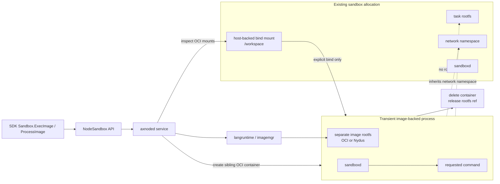

# Image-Backed Process

Image-backed process is the Axern node primitive behind `ExecImage` and
`ProcessImage`. It runs a request-scoped process from a separate image against
explicit host-backed paths from an existing sandbox allocation.

It is not a second Sandbox API object. A Sandbox created from an image or
template remains the primary lifecycle object and owns files, exec, process,
tunnels, metadata, and teardown. An image-backed process is a temporary side
process attached to that allocation for one command/session.

## Execution Model



The request path is:

```text
NodeSandbox ExecImage/ProcessImage
  -> internal/api request mapping
  -> internal/service image process orchestration
  -> langruntime/imagemgr rootfs resolution
  -> transient sibling OCI container
  -> sandboxd process/session API
  -> cleanup
```

The transient container uses the target allocation's runtime handler and
runtime class, but it has its own image rootfs and its own sandboxd process
service. It does not call sandbox `Exec`, and it does not replace or mutate the
target allocation rootfs.

Image refs are passed through as ordinary image refs. OCI and Nydus images use
the same field; `imagemgr` and the rootfs mounting layer decide how to resolve
and mount the image.

## Mounts

Image-backed processes share only paths explicitly requested in
`ImageProcessMount`.

Each requested `sandbox_path` is resolved by inspecting the target allocation's
OCI mounts. The path must be under a host-backed bind mount from that target
allocation. Axern rejects relative paths, traversal, non-absolute targets, and
paths that only exist inside the target rootfs.

The SDK default is one writable mount:

```text
/workspace -> /workspace
```

If `/workspace` is not host-backed, the request fails with a failed-precondition
style error instead of binding the sandbox rootfs path.

The mount target is an actor-image path. It must already exist in the actor
image rootfs or be creatable before container launch. Axern prepares missing
targets when the mounted actor rootfs is writable; if the image rootfs is
read-only and the target is absent, the request fails with a failed-precondition
style error. Official Axern server, desktop, and Claude Code runtime images
include `/workspace` for the SDK default mount.
Actor rootfs symlinks are not followed while preparing mount targets; a symlink
in the target path fails the request instead of redirecting the host-side
preparation step.

Pass an empty mount list to request an isolated image-backed process with no
shared sandbox paths.

## Network

Image-backed processes receive the target allocation network resource and OCI
network namespace path.

For kernel OCI runtimes such as `runc`, this provides shared allocation
loopback: services bound on `127.0.0.1` inside the target allocation are
reachable from the image-backed actor. Raw tunnel loopback probes use this
behavior, but Axrun LLM telemetry does not depend on it. Axrun uses
sandboxd managed proxy, which starts the proxy inside the same sandboxd process
scope as the agent command. Keep loopback probes as runtime capability tests;
do not use them as the contract for profile-backed LLM capture.

For `runsc`, gVisor keeps loopback inside each Sentry network stack even when
the OCI spec points at the same host network namespace. Image-backed actors can
still use explicit mounts and normal external networking, but they must not rely
on reaching services bound to the target allocation's `127.0.0.1`. Callers that
require allocation-local loopback must use a runtime class whose image-backed
actors pass the loopback e2e.

## Lifecycle

The transient container and image rootfs reference are request-scoped. Axnoded
must delete the transient container and release the rootfs reference on:

- successful exit
- non-zero exit
- timeout
- stream close
- setup/open failure

The transient container carries observability labels for the parent allocation,
image ref, and `image_process` kind. These labels describe the side process;
they do not make the agent image or process image the sandbox rootfs.

## When To Use It

Use a normal Sandbox image or template when the whole environment should run
from that rootfs and expose the full Sandbox API.

Use `ExecImage` or `ProcessImage` when a tool or agent should run from a
different image while reading or writing selected host-backed sandbox paths from
an existing allocation.
