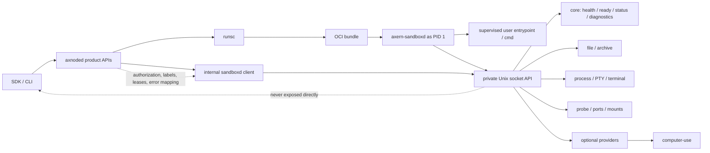

# Sandbox Daemon

`axern-sandboxd` is Axern's sandbox-local control plane for OCI workloads launched by `axnoded`. It runs as sandbox PID 1, supervises the original user entrypoint, exposes a private Unix-socket API, and gives Axern a runtime-neutral way to operate `runsc` sandboxes.

OCI runtimes still own lifecycle, isolation, namespaces, cgroups, mounts, and runtime boundaries. Axern-owned sandbox-local operations should converge on sandboxd instead of OCI runtime `exec`.

## Principles

- `axnoded` is the trusted broker. Sandboxd is never exposed directly to SDKs, users, service routing, host ports, tunnels, or external networks.
- Missing daemon readiness or missing baseline capabilities fail closed.
- Optional providers are discoverable, may be unavailable, and must fail only the operation that requested them.
- Managed proxy is a sandboxd-owned process capability for outbound LLM HTTP telemetry. It runs inside the sandbox process scope, injects only a local proxy token into the child process, and returns raw proxy reports through the process result. It is separate from Axern tunnel sessions, which connect sandboxes to caller-local upstreams through the relay stack.
- Runtime/service code uses typed `internal/runtime/sandboxd` clients. Do not hand-roll daemon HTTP, endpoint strings, label parsing, or error mapping in service handlers.

## Runtime Contract



The diagram is the stable boundary model: SDKs and CLIs use Axern product APIs; `axnoded` brokers authorization and error mapping; OCI runtimes own isolation; and sandboxd owns sandbox-local control over its private Unix socket.

`axnoded` preserves the original OCI process metadata and rewrites the OCI process so sandboxd becomes PID 1:

```text
Original process:
  argv: /user-entrypoint arg...
  cwd:  /work
  env:  USER_ENV=...

Daemon process:
  argv: /mnt/axern-sandboxd --entrypoint-json /mnt/axern-entrypoint.json --socket /mnt/axern-sandboxd.sock
  cwd:  /

Supervised user process:
  argv/cwd/env/user/terminal: restored from axern-entrypoint.json
```

Bundle-local daemon state lives under `bundle/axern/sandboxd` and is mounted in the guest at `/mnt` using these stable guest paths:

- `/mnt/axern-sandboxd`
- `/mnt/axern-entrypoint.json`
- `/mnt/axern-sandboxd.sock`

Packaged nodes install the static daemon binary at `/usr/local/libexec/axnoded/axern-sandboxd`. Verification can override it with `AXERN_SANDBOXD_BINARY`.

## Entrypoint Contract

Entrypoint metadata is strict structured JSON:

```json
{
  "args": ["/user-entrypoint", "arg"],
  "cwd": "/work",
  "env": ["KEY=VALUE"],
  "user": { "uid": 0, "gid": 0 },
  "terminal": false
}
```

Rules:

- Preserve args, cwd, env, user, and terminal intent only when sandboxd can faithfully enforce them.
- Keep daemon runtime configuration separate from user process env.
- Fail container creation clearly when daemon injection, metadata generation, or private mount setup cannot be completed.

## Lifecycle Contract

| Operation    | Contract                                                                                                               |
| ------------ | ---------------------------------------------------------------------------------------------------------------------- |
| create       | Runtime starts sandboxd; `axnoded` waits for daemon control readiness and records internal socket/capability metadata. |
| wait         | Runtime wait observes sandboxd follow-exit so user process exit status remains the container result.                   |
| kill         | Runtime kill targets PID 1; sandboxd forwards termination to the supervised process group.                             |
| delete       | Runtime deletes the OCI container and bundle-local daemon state.                                                       |
| process/exec | Uses sandboxd process APIs when `process` capability is present.                                                       |
| terminal/PTY | Uses sandboxd process session APIs for PTY allocation, stdin, resize, streams, signals, and final status.              |
| file/archive | Uses sandboxd file APIs; missing readiness, socket metadata, or capability fails closed.                               |

Short-lived successful workloads may exit before readiness observes the daemon. Clean runtime exit before readiness is valid for short commands; startup failure or non-zero exit before readiness remains a create failure.

Long-running stream/session cleanup must close stdin, request graceful termination, wait for daemon process status, and escalate to kill before releasing local streams.

Session cleanup uses an independently bounded runtime wait, not the access-side Wait result: a disconnected or revoked caller can finish its wait while the process still runs. Failure to confirm termination is returned to the session owner; closing access does not terminate the Allocation or its explicit background processes.

Daemon shutdown performs the same cleanup for daemon-owned child processes: sandboxd closes open stdin pipes, sends graceful termination to active process groups, escalates to kill after the configured grace period, shuts down the HTTP server, and removes the private Unix socket.

On Linux, one waiter owns child creation/registration, group signaling, `wait4`, and OS handle release under the same short critical section. Registration cannot race reaping, and an already-reaped command cannot signal a reused PID. Unregistered adopted children are reaped without caching a result by PID. Process groups are not containment: a descendant can leave its original group; runsc Allocation teardown remains the final sandbox-wide cleanup boundary. Non-Linux tooling signals the direct OS process handle and does not claim the Linux PID 1 group guarantee.

Registry shutdown closes Start admission before collecting active processes. Signal, timeout, and shutdown share the waiter authority; retained exit records (up to 256) confer no signal authority. Up to 64 processes can be active. Output capture is bounded to 1 MiB per stream; each output subscription has a 256-event queue and each process admits at most 64 subscriptions. A lagging subscription receives an explicit overflow error and closes, rather than blocking process completion. After child exit, output draining has a one-second grace before local pipe/PTY closure. Closing stdin can interrupt a blocked writer without waiting for its write lock. A canceled Wait only cancels that wait; explicit background processes remain Allocation-owned, while interactive session owners perform graceful termination and bounded escalation when closing their sessions.

Use `make -C runtime/axnoded test-process-race` on Linux to check the waiter, registry, private process HTTP API, and runtime client. The existing Go CI job runs this focused race gate in addition to the full node unit suite.

## API Contract

Sandboxd listens on a private Unix socket. The API is an internal Axern contract, versioned by `protocolVersion` (`1` today). JSON request bodies are strict: unknown fields, trailing JSON values, and bodies larger than 1 MiB are rejected.

Endpoint constants live in `internal/sandboxd/wire/protocol.go` and are shared by the daemon server and `axnoded` runtime client. Keep that file as the endpoint source of truth; this document tracks only capability groups.

| Capability Group   | Contract                                                                                                       |
| ------------------ | -------------------------------------------------------------------------------------------------------------- |
| core               | health, readiness, status, capability discovery, and diagnostics                                               |
| file/archive       | stat, list, read, exists, write, mkdir, remove, copy, move, chmod, touch, archive upload, and archive download |
| process/PTY        | process create/list/status, signal, stdin, stdin close, stream, wait, terminal allocation, and resize          |
| probes/diagnostics | probe execution plus ports and mounts inspection                                                               |
| computer_use       | status, screenshot, display geometry, mouse actions, and keyboard actions                                      |

`/diagnostics` is the authoritative readiness snapshot for `axnoded`: it reports control readiness, protocol version, status, provider summary, and process summary. `/diagnostics?detail=full` adds process snapshots, ports, mounts, and optional Computer Use status. `/readyz`, `/status`, and `/capabilities` remain narrower debug surfaces.

Operator access to this snapshot goes through `NodeOperator.GetAllocationDiagnostics` and `axctl allocation diagnostics`. That RPC returns a product-level summary plus optional raw diagnostics JSON; it must remain a brokered root-only operator API, not a public SDK or sandbox-daemon socket exposure.

Public capability discovery goes through `NodeSandbox.CapabilityStatus`. Capability ownership, provider states, and product error shapes live in [Sandboxd Capabilities](sandboxd-capabilities.md). This document owns only the daemon API boundary and sandbox-local lifecycle.

Process execution uses one identity model:

- omitted `user`: inherit daemon identity.
- present `user`: resolve `/etc/passwd` and `/etc/group`, apply uid/gid/groups, and set HOME, USER, LOGNAME, and SHELL defaults.
- request env applies after daemon base env and resolved user env.
- omitted cwd with a resolved user home uses that home when the base cwd is root-like; explicit cwd always wins.
- PTY and non-PTY processes share identity, cwd, env, wait, and signal rules.

## Security Contract

Sandboxd can run processes, read/write files, control PTYs, and optionally drive desktop automation. Treat it as sandbox-local infrastructure.

- Listen only on the private Unix socket.
- Create the socket with owner-only permissions (`0600`).
- Reject loose or oversized JSON before provider dispatch.
- Keep SDKs and CLIs on Axern product APIs, never raw daemon endpoints.
- Route product traffic through `axnoded` for exact Allocation identity, leases, node-local authorization, and error mapping.
- Broker any future VNC or noVNC transport through Axern authorization policy rather than raw daemon endpoints.
