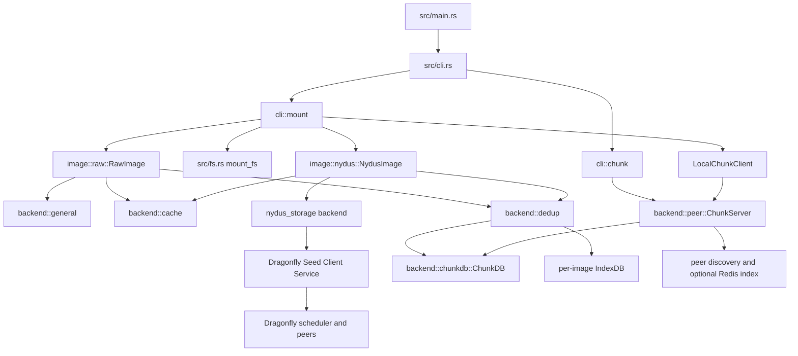
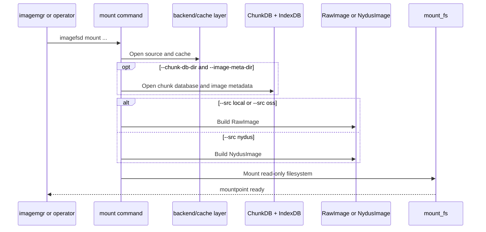
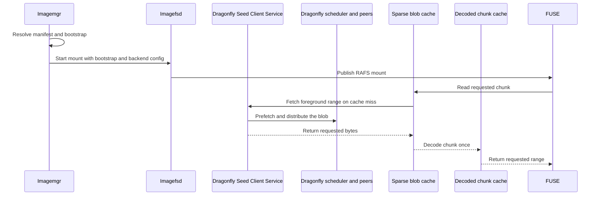
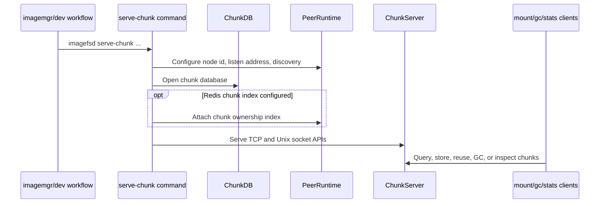

# Imagefsd Architecture

`imagefsd` is the read-only image data plane used by `imagemgr` for raw-image
and Nydus rootfs flows. It exposes FUSE mounts for images and can share chunks
through a node-local or peer-aware chunk server.

Use this document when changing mount internals, dedup behavior, chunk serving,
or the CLI contract consumed by `runtime/imagemgr`.

## Implementation Map

## Mount Flow

Mount ownership stays split by source type:

- `--src local` wraps an existing local raw file.
- `--src oss` uses `GeneralBackend` with a Nydus backend config, so the path is
  not OSS-only even though the flag name is historical.
- `--src nydus` builds a RAFS filesystem from a bootstrap and backend config.

## Nydus Data Plane

Nydus metadata and blob data have separate ownership. `imagemgr` resolves the
image manifest and extracts the RAFS bootstrap. The mounted `imagefsd` process
owns compressed blob reads and the node-local sparse cache.

- `--nydus-readahead-workers` bounds demand-triggered background range reads;
  `--nydus-readahead-window-bytes` caps each hint. Zero workers keeps fully lazy
  imagefsd behavior and is the production default with Dragonfly prefetch.
- Mounting does not queue whole blobs. A successful foreground miss schedules
  only the following bounded window, starting at the next cache-chunk boundary.
- Background remote I/O does not own the foreground in-flight slot. The paths
  only contend during the short final cache commit, so startup-critical reads
  cannot wait behind a long readahead request.
- The byte-bounded decoded chunk cache coalesces concurrent misses by checksum
  and retains only a small per-mount working set. `ChunkDB` remains the durable,
  cross-mount chunk cache; successful persistence releases the decoded entry,
  while queue or storage failures remain retryable on later reads. Decoded
  memory is not an image cache replacement.
- Registry authentication is resolved by the Nydus registry backend and
  forwarded through the Dragonfly Seed Client Service HTTP proxy.
- Direct registry fallback is a reliability path, not a successful Dragonfly
  performance sample. Production validation must report proxy errors and
  fallback separately.
- Mount processes use `OTEL_EXPORTER_OTLP_ENDPOINT` by default. An explicit
  `--otel-endpoint` overrides the environment.

## Dedup And Chunk Reuse

- Dedup is enabled only when `--chunk-db-dir` and `--image-meta-dir` are both
  configured.
- `ChunkDB` is global content-addressed chunk storage.
- `IndexDB` is per-image offset-to-checksum metadata.
- Raw-image dedup identity depends on `--name`; changing that meaning is a
  compatibility change for `imagemgr`.
- Nydus mode requires `--name` at the CLI level, but the filesystem does not use
  it.
- A local chunk client can reuse chunks from the node-local chunk server before
  falling back to the configured backend.

## Chunk Server Flow

The operational chunk commands are:

- `serve-chunk`: expose local chunks over TCP and a Unix socket.
- `gc-chunk`: garbage-collect old or LRU chunks through the local socket path.
- `stats-chunk`: read lightweight `ChunkDB` stats directly.
- `stats-locality`: query locality summaries through the Unix socket.

## Compatibility Boundaries

- The filesystem is read-only.
- Raw and Nydus image implementations stay separate under `src/image`.
- Backend, cache, dedup, chunk database, and peer logic stay under
  `src/backend`.
- CLI flags used by `imagemgr` are cross-component contracts.
- FUSE behavior must be validated on Linux; macOS checks can cover build and
  unit logic only.
