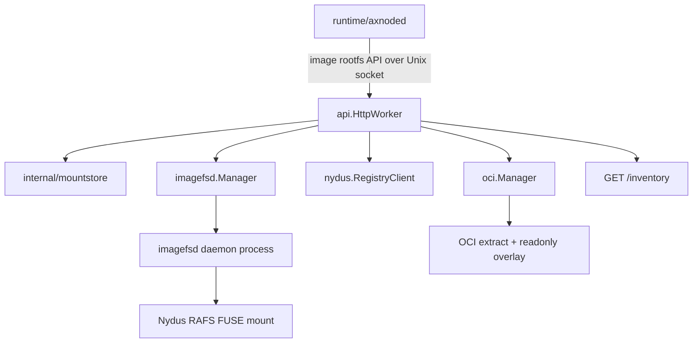
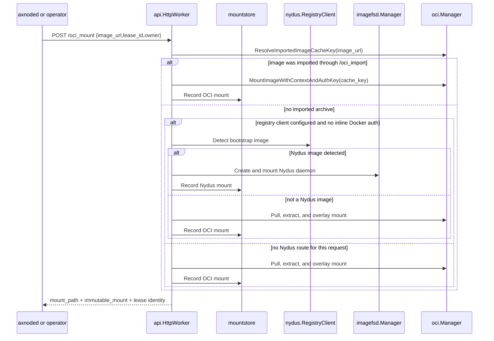

# Imagemgr Architecture

`imagemgr` is the node-local image orchestration daemon used by `axnoded`. It owns API-level mount routing and process orchestration, while image bytes, filesystem reads and OCI extraction stay in their owning packages.

Use this document when changing mount routing, daemon lifecycle, inventory, or the `axnoded` to `imagemgr` integration.

## Implementation Map

## Mount Families

| Entry point         | Primary owner                                  | Result                                                                                    |
| ------------------- | ---------------------------------------------- | ----------------------------------------------------------------------------------------- |
| `POST /nydus_mount` | `api` + `nydus` + `imagefsd`                   | Registry bootstrap mounted as a Nydus RAFS rootfs                                         |
| `POST /oci_mount`   | `api` + `oci`, optionally `nydus` + `imagefsd` | Imported or pulled OCI image exposed as a readonly overlay, unless Nydus routing succeeds |
| `POST /oci_import`  | `api` + `oci`                                  | Local Docker archive imported into the node-local OCI cache                               |

`api.HttpWorker` is the routing point. Keep request validation, daemon ID generation, mount record writes, and route selection there instead of moving mount policy into `axnoded` or lower-level packages.

## OCI Mount Routing

Important routing rules:

- Imported images skip Nydus detection and use the local OCI cache.
- Request-scoped Docker config JSON applies only to the OCI pull path.
- If an image is detected as Nydus but the Nydus mount fails, the API returns that error instead of silently falling back to OCI.
- `POST /oci_umount` releases one durable lease. The final lease routes resource cleanup through `oci.Manager` or `imagefsd.Manager`; failed cleanup remains durable for reconciliation.

## Mount Ownership

OCI and Nydus resources share the mountstore lease contract. Their resource implementations remain owned by `oci` and `imagefsd`. Each owner returns one bounded flat immutable-mount descriptor; axnoded projection consumes that descriptor and must not reverse-engineer these implementations. Source health and identity stay with imagemgr lease reconciliation, while projection owns only its host OverlayFS and writable artifacts. Callers recover ownership by submitting their complete desired lease set to `POST /reconcile_mount_leases`; reconciliation is scoped to that owner.

## Inventory And Cleanup

`GET /inventory` is the read-only node image summary. It combines:

- mount records from `internal/mountstore`
- imported and mounted OCI state from `oci.Manager`
- live daemon state from `imagefsd.Manager`
- retained ChunkDB and locality summaries from `imagefsd`

`POST /cleanup_daemon` removes a specific `imagefsd` daemon by daemon ID. Prefer normal unmount endpoints for mounted rootfs cleanup because they also release the owning mount records and route through the correct package owner.

## Change Routing

- API request or response changes: update `api/types.go`, tests, and `README.md` examples together.
- `imagefsd` daemon invocation changes: update this document, `runtime/imagefsd/docs/architecture.md`, and launch validation.
- Socket, `.dev/`, or rootfs routing changes: update `.x/runtime-stack.md` and the affected subsystem docs together.
